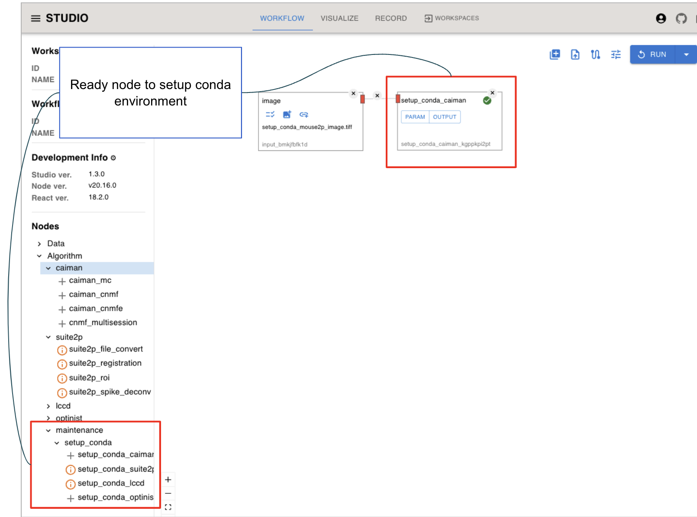
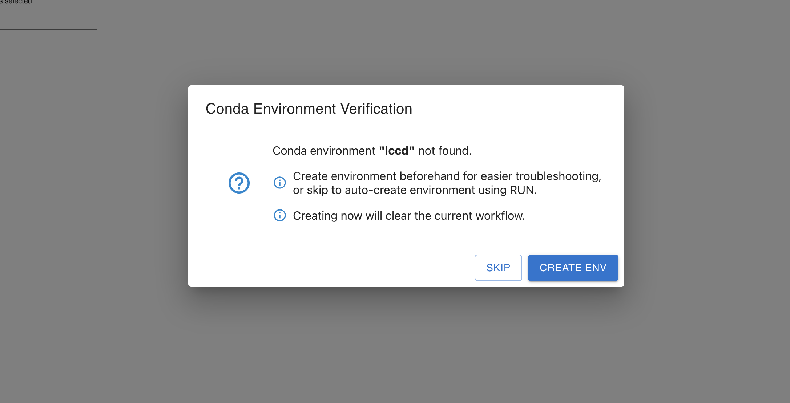
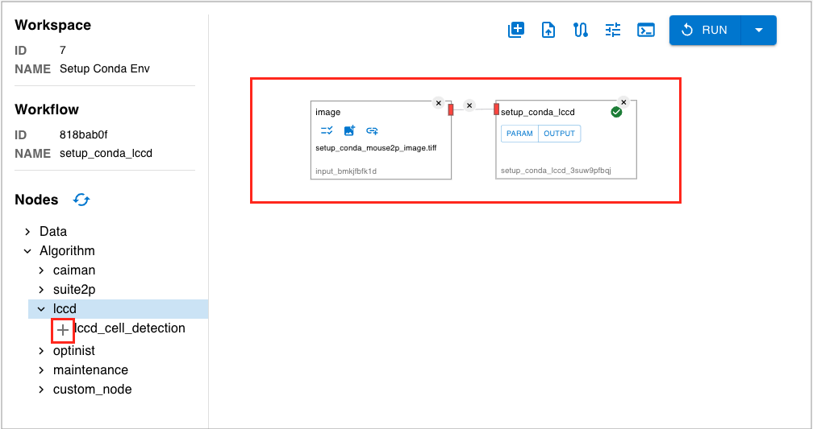

(debugging)=
Debugging
=================
This section describes the various debugging methods included in OptiNiSt.

(setup_conda_environment)=

### Setup Conda Environment

If the Conda environment used by each Node has not yet been created, there is a function to automatically generate it in advance.
By using this function, you can separate the normal Node processing from the Conda environment creation processing, making troubleshooting easier.

#### 1. Checking for an Existing Conda Environment

- If a Conda environment is not installed on the node, a message will indicate that Conda is not available.

<p align="center">
  
</p>

#### 2. Automatically Reproducing the Setup Conda Environment

- Clicking the **"i"** button will open a modal asking if you want to automatically set up the environment for the selected node.
- To proceed with the setup, click **"CREATE ENV"** to reproduce and configure the Conda environment automatically.
- If you do not wish to set up the environment, click **"SKIP"** to bypass this step.

<p align="left">
  
</p>

#### 3. Completion of Setup Conda Environment

- Once you select **"CREATE ENV"** and the automatic processing of the workflow for environment creation is completed, the **"i"** button will disappear.
- As long as you are using the same version of optinist, once the Conda environment for each node is created, it will not need to be rebuilt.

<p align="left">
  
</p>

#


<!-- ## 3. IPython notebooks

OptiNiSt provides several ipynb notebooks in the notebooks folder: caiman.ipynb, suite2p.ipynb, lccd.ipynb. These may be used for assessing where in the code

### Parameter conversion notebook
In the upgrade to OptiNiSt version 2, the parameter input structure was reorganised. Workflows created in  OptiNiSt version 1 and reproduced in version 2, as well as [workflow.yaml](ImportWorkflowYaml) produced and saved in version 1 and imported in version 2, will not work.

To reproduce a version 1 Workflow, a conversion script is provided, in the form of a IPython notebook. Follow this procedure:
1. Download workflow from Record tab
2. Open notebooks/yaml-converter.ipynb
3. Setup environment following instructions at the top of yaml-converter.ipynb
4. Convert files using the section at the bottom of yaml-converter.ipynb
```python
input_file = ".yaml"
output_file = ".yaml" # any name you want
convert_workflow_file(input_file, output_file)
``` -->

## OptiNiSt wiki FAQ

For responses to common error messages, check the [OptiNiSt Wiki FAQ](https://github.com/oist/optinist/wiki/FAQ) page, and existing issues on [OptiNiSt git](https://github.com/oist/optinist/issues). Please create an new issue describing anything not covered on these pages.
