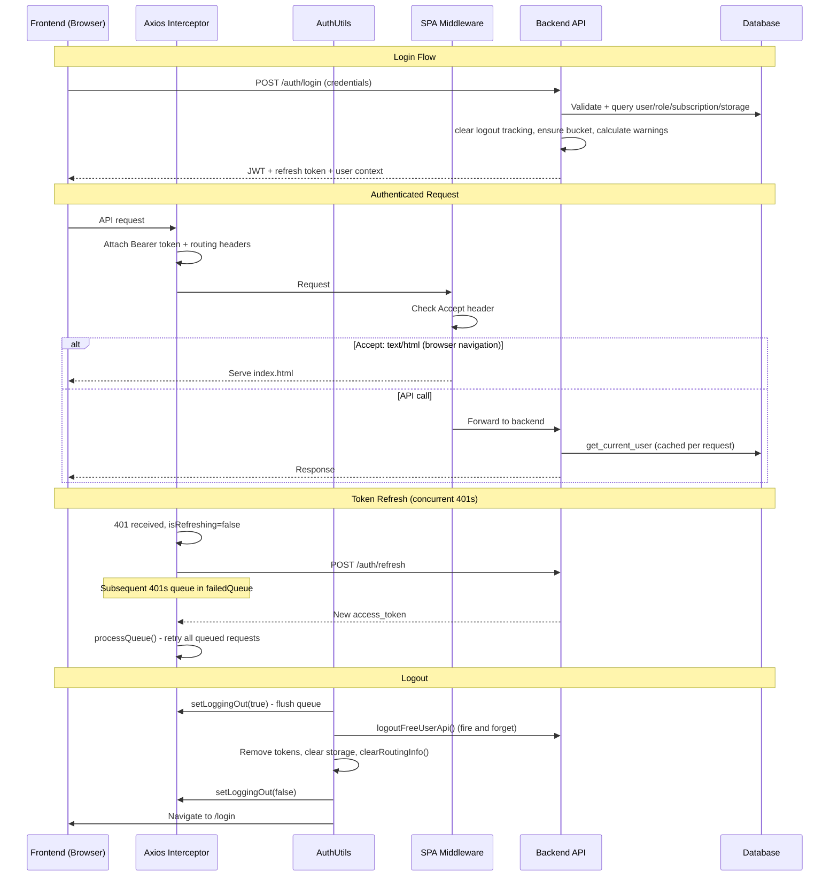

# Authentication and SPA Routing: Token Lifecycle, Subscription Context, and Frontend Routing

## Executive Summary

- **Token refresh queue** prevents duplicate refresh API calls by queuing concurrent 401 responses behind a single refresh operation
- **Logout coordination** uses a shared `isLoggingOut` flag between axios interceptors and auth utils to prevent token refresh during logout
- **Subscription-enriched auth** joins user, role, subscription, and storage tables in a single query so the frontend receives complete user context on every authenticated request
- **Subscription status calculation** determines FREE/PREMIUM/LIMIT_GRACE/EXPIRED status with a 30-day grace period, embedded directly in the auth dependency layer
- **SPA routing middleware** intercepts browser navigation requests (`Accept: text/html`) and serves `index.html`, enabling deep-linking and browser refresh on client-side routes
- **Login-time safety checks** clear free-user logout tracking, verify S3 bucket existence, and calculate limit warnings before returning the JWT

---

## Key Architectural Principles

1. **Single Token Refresh Serialization**
   - Only one token refresh call executes at a time; concurrent 401 responses queue behind it
   - `isRefreshing` flag gates entry; `failedQueue` array holds waiting requests
   - Eliminates redundant refresh API calls under concurrent request failures

2. **Logout-Refresh Mutual Exclusion**
   - `setLoggingOut(true)` flushes the failed queue and blocks new refresh attempts
   - Prevents race condition where a refresh could succeed after tokens are removed
   - Dynamic import (`getSetLoggingOut()`) with caching avoids circular dependency between `axios.ts` and `AuthUtils.ts`

3. **Auth Dependency as Single Source of User Context**
   - `__get_current_user_record()` performs one query with 4 outer joins (role, subscription, plans, storage)
   - Enrichment split into two functions: `_enrich_user_with_basic_attributes()` (role, storage) and `_enrich_user_with_subscription_status()` (status calculation)
   - Request-scoped caching avoids redundant DB queries within the same request

4. **SPA Routing via ASGI Middleware**
   - Pure ASGI middleware (not `BaseHTTPMiddleware`) for performance
   - `Accept` header check (`text/html`) distinguishes browser navigation from API calls
   - Explicit skip list for static assets, docs, health, and images

5. **Login as Recovery Point**
   - Login clears free-user logout tracking to prevent cleanup job from deleting re-logged-in user data
   - Verifies S3 bucket existence as a recovery mechanism
   - Calculates limit warnings proactively so the frontend can display them immediately

---

## Architecture Overview

### Responsibility Matrix

| Responsibility                    | Frontend (Axios) | Frontend (AuthUtils) | Backend Auth Dependency | SPA Middleware | Login Router     |
|-----------------------------------|------------------|----------------------|-------------------------|----------------|------------------|
| Token storage (save/remove)       | No               | Yes - Exclusive      | No                      | No             | No               |
| Token refresh (401 handling)      | Yes - Exclusive  | No                   | No                      | No             | No               |
| Logout coordination flag          | Yes - setter     | Yes - caller         | No                      | No             | No               |
| User context enrichment           | No               | No                   | Yes - Exclusive         | No             | No               |
| Subscription status calculation   | No               | No                   | Yes - Exclusive         | No             | No               |
| Request-scoped user caching       | No               | No                   | Yes - Exclusive         | No             | No               |
| SPA route interception            | No               | No                   | No                      | Yes - Exclusive| No               |
| Login-time recovery checks        | No               | No                   | No                      | No             | Yes - Exclusive  |
| Free-user logout tracking (clear) | No               | No                   | No                      | No             | Yes - Exclusive  |

---

## Implementation Details

### Backend Auth Functions

#### __get_current_user_record()

**File:** `studio/app/common/core/auth/auth_dependencies.py`
**Purpose:** Query complete user context in a single database call with 4 outer joins
**Input:** `db` (Session), `uid` (Firebase UID string)
**Output:** Row tuple containing `UserModel`, `role_id`, `data_usage`, `subscription_plan_name`, `storage_usage_bytes`, `storage_quota_bytes`, `subscription_expiration`, `subscription_plan_id`
**Joins:** `UserRoleModel`, `UserSubscription`, `SubscriptionPlans`, `UserStorageUsage`

#### _enrich_user_with_basic_attributes()

**File:** `studio/app/common/core/auth/auth_dependencies.py`
**Purpose:** Set role, storage, and plan name attributes on the user model from query results
**Input:** User model, role_id, data_usage, subscription_plan_name, storage_usage_bytes, storage_quota_bytes
**Output:** None (mutates user in place with `role_id`, `data_usage`, `subscription_plan_name`, `storage_usage_bytes`, `storage_quota_bytes`, `storage_usage_percent`)

#### _enrich_user_with_subscription_status()

**File:** `studio/app/common/core/auth/auth_dependencies.py`
**Purpose:** Calculate subscription status and days remaining based on expiration date and grace period
**Input:** User model, `subscription_expiration` (datetime), `subscription_plan_id` (int), `subscription_plan_name` (str)
**Output:** None (mutates user with `subscription_status` and `subscription_days_remaining`)

Status transitions use `SubscriptionPlanIds` (FREE=1, PREMIUM=2) and `SubscriptionPeriods.GRACE_PERIOD_DAYS` (30):

| Condition | Status | Days Remaining |
|-----------|--------|----------------|
| Plan is FREE | `Free` | None |
| Premium, days_remaining > 0 | `Premium` | Actual days |
| Premium, days_remaining >= -30 | `LimitGrace` | 30 + days_remaining |
| Premium, days_remaining < -30 | `Expired` | None |

#### get_current_user()

**File:** `studio/app/common/core/auth/auth_dependencies.py`
**Purpose:** Authenticate user from JWT/Firebase token and return enriched User schema with request-scoped caching
**Input:** Response, Request, optional ExToken header, Bearer credential, Session
**Output:** `User` schema with all subscription/storage fields populated
**Calls:** `extract_uid_from_firebase_credential()` or `extract_uid_from_jwt_token()` -> `__get_current_user_record()` -> `_enrich_user_with_basic_attributes()` -> `_enrich_user_with_subscription_status()`

---

### Login Router

#### login()

**File:** `studio/app/common/routers/auth.py`
**Purpose:** Authenticate user credentials, perform login-time recovery checks, and return JWT
**Input:** `user_data` (UserAuth schema with email/password), `db` (Session)
**Output:** `Token` schema (access_token + refresh_token)
**Calls:** `auth.authenticate_user()` -> `clear_logged_out_status()` -> `clear_free_user_logged_out_at()` -> `ensure_user_bucket_exists()` -> `calculate_limit_warning()`

Login-time operations (all wrapped in try/except to not block login):

| Step | Function | Source File | Purpose |
|------|----------|-------------|---------|
| 1 | `clear_logged_out_status()` | `studio/app/common/core/middleware/user_activity_middleware.py` | Prevent cleanup job from deleting re-logged-in user data |
| 2 | `clear_free_user_logged_out_at()` | `studio/app/common/core/middleware/user_activity_middleware.py` | Clear logout timestamp for free-tier tracking |
| 3 | `ensure_user_bucket_exists()` | `studio/app/common/core/cloud/cloud_utils.py` | Recovery: create S3 bucket if missing |
| 4 | `calculate_limit_warning()` | `studio/app/common/core/cloud/cloud_utils.py` | Check storage quota and subscription expiration |

---

### SPA Routing Middleware

#### SPARoutingMiddleware

**File:** `studio/app/common/core/middleware/spa_routing_middleware.py`
**Purpose:** Pure ASGI middleware that intercepts browser navigation and serves `index.html` for SPA routes

#### _should_serve_spa()

**File:** `studio/app/common/core/middleware/spa_routing_middleware.py`
**Purpose:** Determine if a request is browser navigation that should be handled by the SPA
**Input:** ASGI scope dictionary
**Output:** `bool` - True if `Accept` header contains `text/html` AND path is not a skip path
**Skip paths:** `/static/`, `/images/`, `/docs`, `/openapi`, `/health`

#### _serve_index_html()

**File:** `studio/app/common/core/middleware/spa_routing_middleware.py`
**Purpose:** Return `index.html` from build directory, or fallback to `no-built-pages.html`
**Input:** ASGI scope
**Output:** Jinja2 `TemplateResponse` from `DIRPATH.FRONTEND_DIRS.BUILD`

---

### Frontend: Token Refresh Queue

#### Response Interceptor (401 Handler)

**File:** `frontend/src/utils/axios.ts`
**Purpose:** Handle 401 errors with single-flight token refresh and request queuing
**Input:** AxiosError with 401 status
**Output:** Retried request with new token, or rejection if refresh fails
**Key state:** `isRefreshing` (boolean), `isLoggingOut` (boolean), `failedQueue` (Array of {resolve, reject})
**Calls:** `refreshTokenApi()` -> `saveToken()` -> `processQueue()`
**Guard conditions:** Skip if `isLoggingOut`; skip if request targets `/auth/refresh`; skip if `_retry` flag already set

#### setLoggingOut()

**File:** `frontend/src/utils/axios.ts`
**Purpose:** Coordinate logout with token refresh by setting flag and flushing queue
**Input:** `value` (boolean)
**Output:** None (side effects: sets `isLoggingOut`, flushes `failedQueue` on true, resolves `logoutCompletePromise` on false)

---

### Frontend: Auth Utils

#### logout()

**File:** `frontend/src/utils/auth/AuthUtils.ts`
**Purpose:** Coordinated async logout: signal interceptor, notify backend, clear all state, navigate to login
**Input:** None
**Output:** None (navigates to `/login`)
**Calls:** `getSetLoggingOut()` -> `setLoggingOut(true)` -> `logoutFreeUserApi()` -> token removal -> `routingService.clearRoutingInfo()` -> `setLoggingOut(false)` -> navigate

Cleared state during logout:

| Storage | Key | Purpose |
|---------|-----|---------|
| localStorage | `access_token` | JWT access token |
| localStorage | `refresh_token` | JWT refresh token |
| localStorage | `ExToken` | External token |
| localStorage | `dismissedAlerts` | UI alert dismissal state |
| sessionStorage | `storage-refreshed-on-login` | One-time storage refresh flag |

#### getSetLoggingOut()

**File:** `frontend/src/utils/auth/AuthUtils.ts`
**Purpose:** Cached dynamic import of `setLoggingOut` from `axios.ts` to avoid circular dependency
**Input:** None
**Output:** `setLoggingOut` function reference (cached after first call)

---

### Frontend: Layout Auth Check

#### checkAuth()

**File:** `frontend/src/components/Layout/index.tsx`
**Purpose:** Validate token, fetch user, refresh storage, with multiple token revalidation points to detect concurrent logout
**Input:** None (reads from localStorage and Redux store)
**Output:** None (dispatches `getMe()`, refreshes storage, navigates)
**Token revalidation points:** Before `getMe()`, after `getMe()`, after storage refresh, before navigation

#### refreshStorageWithTimeout()

**File:** `frontend/src/components/Layout/index.tsx`
**Purpose:** Refresh workspace storage data with AbortController timeout and retry logic
**Input:** None
**Output:** `boolean` - true on success, false on timeout or all retries exhausted
**Constants:** `STORAGE_REFRESH_TIMEOUT_MS` (10000), `STORAGE_REFRESH_MAX_RETRIES` (2)
**Calls:** `refreshAllWorkspacesStorageApi()` with abort signal

---

## Edge Case Handling

### 1. Concurrent 401 Errors During Token Refresh

**Problem:** Multiple API calls receive 401 simultaneously, triggering parallel refresh attempts.

**Solution:** Request queueing with single-flight refresh:
- First 401 sets `isRefreshing=true` and calls `refreshTokenApi()`
- Subsequent 401s push to `failedQueue` and wait
- On success, `processQueue()` resolves all queued requests with the new token
- On failure, `processQueue()` rejects all queued requests; triggers `logout()` if refresh returns 400/401

### 2. Logout During Active Token Refresh

**Problem:** User logs out while a token refresh is in progress; refresh could succeed and restore tokens.

**Solution:** Mutual exclusion via `isLoggingOut` flag:
- `logout()` calls `setLoggingOut(true)` which flushes `failedQueue` and resets `isRefreshing`
- Axios interceptor checks `isLoggingOut` before attempting refresh; rejects immediately if true
- `setLoggingOut(false)` called after token removal, before navigation

### 3. Token Removal During Async Layout Operations

**Problem:** User logs out while Layout component is executing `getMe()` or storage refresh; navigation to dashboard could occur with stale state.

**Solution:** Multiple token revalidation checkpoints in `checkAuth()`:
- Check before `dispatch(getMe())`
- Check after `getMe()` completes
- Check after `refreshStorageWithTimeout()` completes
- Check before navigating to dashboard
- Each check exits gracefully if token is missing, deferring to the logout flow

### 4. Subscription Expiration During Active Session

**Problem:** User's premium subscription expires while they are using the application.

**Solution:** Grace period calculation in `_enrich_user_with_subscription_status()`:
- Status transitions: Premium (days > 0) -> LimitGrace (days >= -30) -> Expired
- 30-day grace period (`SubscriptionPeriods.GRACE_PERIOD_DAYS`) after expiration
- Days remaining recalculated on every authenticated request via `get_current_user()`
- Frontend receives updated status in user context and can display warnings

### 5. Browser Refresh on SPA Route

**Problem:** Direct browser navigation to `/workspaces` or `/dashboard` hits backend without auth headers, returning 404 or 401.

**Solution:** SPA middleware intercepts based on `Accept` header:
- Browser sends `Accept: text/html` for navigation
- `_should_serve_spa()` detects this and serves `index.html`
- React Router handles the route client-side
- API calls send `Accept: application/json` and pass through to backend normally

---

## Monitoring and Metrics

Auth and SPA routing do not currently publish custom CloudWatch metrics. Monitoring is log-based:

| Log Event | Source | Level | Trigger |
|-----------|--------|-------|---------|
| Login limit warning | `studio/app/common/routers/auth.py` | WARNING | User has storage/subscription warning at login |
| Bucket recovery | `studio/app/common/routers/auth.py` | WARNING | S3 bucket created/recovered during login |
| Authentication error | `studio/app/common/core/auth/auth_dependencies.py` | ERROR | JWT/Firebase token validation failure |
| Pydantic validation error | `studio/app/common/core/auth/auth_dependencies.py` | ERROR | User schema validation failure |

For background sync metrics (`ExperimentsSynced`, `SyncErrors`, `SyncErrorRate`, `PersistentSyncFailure`), see [BACKGROUND_JOB_ARCHITECTURE.md](BACKGROUND_JOB_ARCHITECTURE.md).

---

## Configuration

### Backend Environment Variables

| Variable | Purpose | Default |
|----------|---------|---------|
| `RDS_HOST` | Database endpoint (via RDS Proxy) | Required |
| `RDS_USER` | Database username | Required |
| `RDS_PASSWORD` | Database password | Required |
| `RDS_DATABASE` | Database name | Required |
| `S3_DEFAULT_BUCKET_NAME` | Fallback S3 bucket when user has no assigned bucket | Required |

### Firebase / Auth Environment Variables

| Variable | Purpose | Default |
|----------|---------|---------|
| `USE_FIREBASE_TOKEN` | `True` → authenticate with `Authorization: Bearer <Firebase ID token>`. `False` → use the locally-signed `ExToken` JWT and bypass Firebase | `True` (`auth_config.py`); `studio/config/.env.example` sets `False` for local dev |
| `USE_FIREBASE_EMAIL` | Send verification / reset mail via the Firebase Identity Toolkit REST API | `True` |
| `IS_STANDALONE` | Tolerates a missing `firebase_config.json` | `True` locally |
| `FRONTEND_URL` | Only used in the `else` branch of `auth_email_service.py` commented "Development/Testing: Just log the link", where it builds `action_code_settings`. On the live path, `sendOobCode` is posted with no `continueUrl`, so the real action-link target comes from the **Firebase console email template**, not this variable | `http://localhost:3000`, set by `FRONTEND_URL` in `app/const.py` |
| `SECRET_KEY` | Signs the app-level JWT that wraps the Firebase refresh token, and the `ExToken` | Required |
| `REFRESH_TOKEN_EXPIRE_MINUTES` | Lifetime of the app-level refresh JWT | `1440` |

All set in `studio/config/.env.example`; `app_setup.sh` overrides `USE_FIREBASE_TOKEN` to `True` on AWS. `INITIAL_FIREBASE_UID` is set on the ECS task definitions in Terraform (`public_service.tf`, `background_service.tf`, `compute.tf`) but, as of this writing, read by nothing in `studio/`. Re-check with `grep -rn INITIAL_FIREBASE_UID studio/` before relying on that.

For the Terraform-side secrets (`firebase_config_json`, `firebase_private_json`, `optinist_admin_uid`, `test_users[].firebase_uid`) and how they flow into Secrets Manager, see [TERRAFORM_ARCHITECTURE.md](TERRAFORM_ARCHITECTURE.md#how-firebase-configuration-flows).

### Frontend Constants

| Constant | Value | File | Purpose |
|----------|-------|------|---------|
| `STORAGE_REFRESH_TIMEOUT_MS` | `10000` | `frontend/src/components/Layout/index.tsx` | AbortController timeout for storage refresh |
| `STORAGE_REFRESH_MAX_RETRIES` | `2` | `frontend/src/components/Layout/index.tsx` | Max retry attempts for storage refresh |

### Subscription Constants

| Constant | Value | File | Purpose |
|----------|-------|------|---------|
| `SubscriptionPeriods.GRACE_PERIOD_DAYS` | `30` | `studio/app/common/core/subscription/constants.py` | Days after expiration before status becomes Expired |
| `SubscriptionPlanIds.FREE` | `1` | `studio/app/common/core/subscription/constants.py` | Database plan ID for free tier |
| `SubscriptionPlanIds.PREMIUM` | `2` | `studio/app/common/core/subscription/constants.py` | Database plan ID for premium tier |

### SPA Middleware Skip Paths

| Path Prefix | Reason |
|-------------|--------|
| `/static/` | Static assets served directly |
| `/images/` | Image assets served directly |
| `/docs` | OpenAPI documentation page |
| `/openapi` | OpenAPI JSON schema |
| `/health` | Health check endpoint |

---

## Key Functions Reference

### Backend Auth (`studio/app/common/core/auth/auth_dependencies.py`)

| Function | Purpose |
|----------|---------|
| `get_current_user()` | Authenticate user from JWT and return enriched User schema with request-scoped caching |
| `__get_current_user_record()` | Single query with 4 outer joins for complete user context |
| `_enrich_user_with_basic_attributes()` | Set role, storage, plan name on user model |
| `_enrich_user_with_subscription_status()` | Calculate FREE/PREMIUM/LIMIT_GRACE/EXPIRED status |
| `get_admin_user()` | Verify current user has admin role |
| `get_user_remote_bucket_name()` | Resolve S3 bucket for current user |

### Login Router (`studio/app/common/routers/auth.py`)

| Function | Purpose |
|----------|---------|
| `login()` | Authenticate, clear logout tracking, verify bucket, calculate warnings |
| `refresh()` | Refresh access token from refresh token |

### SPA Middleware (`studio/app/common/core/middleware/spa_routing_middleware.py`)

| Function | Purpose |
|----------|---------|
| `SPARoutingMiddleware.__call__()` | ASGI entry point: serve SPA or pass through |
| `_should_serve_spa()` | Check Accept header and skip paths |
| `_serve_index_html()` | Serve `index.html` or `no-built-pages.html` fallback |

### Frontend Auth (`frontend/src/utils/auth/AuthUtils.ts`)

| Function | Purpose |
|----------|---------|
| `logout()` | Coordinated async logout with interceptor signaling |
| `getSetLoggingOut()` | Cached dynamic import to avoid circular dependency |
| `saveToken()` / `getToken()` / `removeToken()` | Access token localStorage management |
| `saveRefreshToken()` / `getRefreshToken()` / `removeRefreshToken()` | Refresh token localStorage management |
| `isPublicRoute()` | Check if pathname matches public route patterns |

### Frontend Axios (`frontend/src/utils/axios.ts`)

| Function | Purpose |
|----------|---------|
| `setLoggingOut()` | Set logout flag, flush failed queue |
| `waitForLogoutComplete()` | Await logout completion promise |
| `handleUnauthorizedError()` | 401 handler with single-flight refresh and queue |
| `handlePremiumRoutingError()` | 503 handler with free-tier fallback |
| `processQueue()` | Resolve or reject all queued requests |

### Frontend Layout (`frontend/src/components/Layout/index.tsx`)

| Function | Purpose |
|----------|---------|
| `checkAuth()` | Token validation with 4 revalidation points |
| `refreshStorageWithTimeout()` | Storage refresh with AbortController timeout and retry |

### Related Documents

| Document | Covers |
|----------|--------|
| [BACKGROUND_JOB_ARCHITECTURE.md](BACKGROUND_JOB_ARCHITECTURE.md) | Background sync jobs, cleanup jobs, scheduler configuration |
| [ALB_ROUTING_ARCHITECTURE.md](ALB_ROUTING_ARCHITECTURE.md) | Secure routing IDs, ALB rule matching, premium routing |
| [FIREBASE_AUTH_ARCHITECTURE.md](FIREBASE_AUTH_ARCHITECTURE.md) | Firebase setup, credential files, UID to database linkage, console and access management, runbooks |
