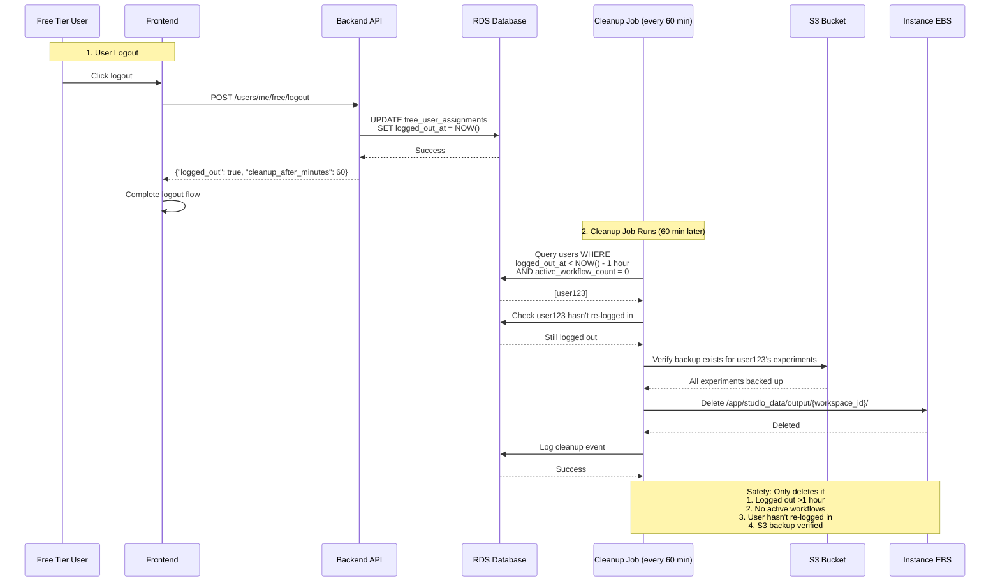

# EBS Storage Architecture: Local Cache with S3 Backup

## Executive Summary

- **EBS provides fast local storage** for Snakemake workflow execution with S3 as durable backup
- **Background sync job** validates experiments in S3, updates DB status, and triggers proactive download on API instances every 5 minutes
- **Data cleanup job** removes local data for logged-out users (1-hour grace period)
- **Workflow protection** ensures cleanup only happens when `active_workflow_count = 0`
- **S3 verification** guarantees backup exists before any local deletion

---

## Key Architectural Principles

These are the fundamental principles that the EBS implementation satisfies:

1. **Multi-Instance Data Accessibility**
   - Public visitors have no sticky session and can be routed to ANY instance by ALB
   - Published experiment data must be accessible from all instances simultaneously
   - Solution: Background job validates S3, triggers proactive download via ALB; remaining instances use on-demand download

2. **User Rebalancing Requires Data Portability**
   - Free Manager Lambda can migrate users between instances at any time
   - Users must be able to access their data immediately after migration
   - Solution: S3 as source of truth, local EBS as cache

3. **Storage Durability and Backup**
   - S3 is the source of truth for all user data (durable backup)
   - Local storage can be lost (instance termination)
   - Solution: All data uploaded to S3, verified before local deletion

4. **Performance Requirements**
   - Snakemake workflow execution requires fast file I/O
   - Users expect immediate access to experiments and uploaded files
   - Solution: Local EBS provides fast I/O, S3 sync happens in background

5. **Cost Constraints**
   - Free-tier storage costs for 10 users (2 instances):
     - **With proper cleanup:** $35-51/month (EFS + EBS + S3)
     - **Current state (no cleanup):** $86-96/month (accumulated garbage data)
   - Solution: Automated cleanup on logout reduces EBS usage, eliminates EFS costs

---

## Architecture Overview

### Data Flow

```
┌──────────────────────────────────────────────────────────┐
│ 1. User Publishes Experiment                             │
│    → S3 upload                                           │
│    → DB: local_sync_status='pending'                     │
└──────────────────────────────────────────────────────────┘
                         ↓
┌──────────────────────────────────────────────────────────┐
│ 2. Background Sync (every 5 min)                         │
│    → Validate in S3 (ListObjectsV2)                      │
│    → DB: local_sync_status='synced'                      │
│    → Trigger proactive download on API instance via ALB  │
└──────────────────────────────────────────────────────────┘
                         ↓
┌──────────────────────────────────────────────────────────┐
│ 3. Public Access                                         │
│    → Check sync status → Return 200/202/503              │
└──────────────────────────────────────────────────────────┘

┌──────────────────────────────────────────────────────────┐
│ 4. User Logout                                           │
│    → DB: logged_out_at=NOW()                             │
└──────────────────────────────────────────────────────────┘
                         ↓
┌──────────────────────────────────────────────────────────┐
│ 5. Cleanup Job (every 60 min)                            │
│    → Verify: logged_out >1hr, workflows=0, S3 exists    │
│    → Delete local EBS data                               │
└──────────────────────────────────────────────────────────┘
```

### Public Dataview Access Flow

```mermaid
sequenceDiagram
    participant User as Logged-in User
    participant Visitor as Public Visitor
    participant API1 as API Instance 1 (EBS)
    participant API2 as API Instance 2 (EBS)
    participant BG as Background Service
    participant S3 as S3 Bucket
    participant DB as RDS Database

    Note over User,API1: 1. Publish Flow
    User->>API1: POST /dataview/publish/123/on
    API1->>S3: Upload experiment files
    API1->>DB: SET publish_status=1,<br/>local_sync_status='pending'
    API1-->>User: Success

    Note over BG,S3: 2. Background Validation + Proactive Download (every 5 min)
    BG->>DB: Query WHERE local_sync_status='pending'
    DB-->>BG: [exp123, exp456]
    BG->>S3: Validate exp123 exists (ListObjectsV2)
    BG->>DB: SET local_sync_status='synced'
    BG->>API1: POST /system-internal/sync-experiment (via ALB)
    Note over API1: Downloads thumbnails + metadata from S3<br/>(single ALB-selected instance; others use startup sync or on-demand)

    Note over Visitor,API2: 3. Visitor Access (ALB routes to any API instance)
    Visitor->>API2: GET /api/public/dataview/.../exp123
    API2->>DB: Check publish_status & local_sync_status

    alt Files exist locally (proactive download or startup sync)
        API2->>API2: Read from local EBS
        API2-->>Visitor: 200 Display experiment
    else Files missing locally (status='synced' but no local files)
        API2->>S3: On-demand download
        API2-->>Visitor: 200 Display experiment
    else Sync Pending (local_sync_status='pending')
        API2-->>Visitor: 202 Accepted - "Publishing in progress..."
        Note over Visitor: Frontend shows loading state<br/>Auto-retries every 30 seconds
    else Sync Error (local_sync_status='error')
        API2-->>Visitor: 503 Service Unavailable - "Temporarily unavailable"
        Note over Visitor: Frontend shows error with retry button
    end

    Note over Visitor,S3: Solution: No EFS cost, eventual consistency (5 min)
```

### Data Cleanup Flow on Logout



### Safety Guarantees

| Guarantee                | Mechanism                                        |
|--------------------------|--------------------------------------------------|
| No data loss             | S3 backup verified before local deletion         |
| No workflow interruption | Cleanup only when `active_workflow_count = 0`    |
| No user disruption       | 1-hour grace period after logout                 |
| Eventual consistency     | Published experiments available within 5 minutes |
| Graceful degradation     | Frontend handles 202/503 responses               |
| Re-login detection       | Cleanup aborts if user logs back in during run   |

---

## Implementation Details

### Workflow Tracking

**File:** `studio/app/common/core/workflow/workflow_tracking.py`
**Purpose:** Track active workflow count per user to prevent cleanup during execution
**Input:** `user_id` (from JWT)
**Output:** Incremented/decremented `active_workflow_count` in `free_user_assignments` or `premium_user_assignments`
**Calls:** `increment_workflow_count()` -> `decrement_workflow_count()`

Supporting files:
- `studio/app/common/core/workflow/workflow_runner.py` - Calls increment/decrement around workflow execution
- `studio/app/common/core/snakemake/snakemake_executor.py` - Calls increment/decrement around Snakemake execution

### Background Sync (Validation + Proactive Download)

**File:** `studio/app/common/core/background/sync_job.py`
**Purpose:** Validate pending experiments exist in S3, trigger proactive download on API instances
**Input:** Published experiments with `local_sync_status='pending'` or `'error'`
**Output:** Updated `local_sync_status` ('synced' or 'error'), proactive download triggered via ALB
**Calls:** `run()` -> `_run_validation_logic()` -> `_validate_experiment()` -> `_trigger_proactive_download()`

Key behaviors:
- **Periodic validation:** Validates pending experiments via `ListObjectsV2` (50 per run, 10 concurrency). No file downloads on background instance
- **Proactive download trigger:** After validation, triggers download on an API instance via ALB (`POST /system-internal/sync-experiment`)
- **Startup sync:** One-time two-phase download at container startup via `run_startup_sync()` -- thumbnails first (10 concurrency), then metadata (3 concurrency)
- Uses persistent retry tracking across runs (max 9 attempts before alerting)

### Logout Integration

**File:** `studio/app/common/routers/users_me.py`
**Purpose:** Record logout timestamp to trigger cleanup after grace period
**Input:** User JWT token (from `/api/users/me/free/logout` POST)
**Output:** Updated `logged_out_at` timestamp in `free_user_assignments` table

Frontend integration:
- `frontend/src/api/users/UsersMe.ts` - `logoutFreeUserApi()` calls the endpoint
- `frontend/src/utils/auth/AuthUtils.ts` - Integrated API call (fire-and-forget, non-blocking)

### Frontend 202/503 Response Handling

**File:** `frontend/src/components/Dataview/WorkflowDetailsView.tsx`
**Purpose:** Display appropriate UI states for sync status responses

| Status | UI Display | Behavior |
|--------|-----------|----------|
| 202 (Pending) | Hourglass icon + info alert | Auto-retry every 30s (max 10 retries) |
| 503 (Error) | Error icon + error alert | Manual retry button |
| 200 (Synced) | Normal experiment display | Standard workflow view |

---

## Edge Case Handling

### 1. S3 Validation Failures

**Problem:** S3 validation may fail due to transient network issues or service errors.

**Solution:** Exponential backoff retry (3 attempts per run with 1s, 2s delays):
- Persistent retry tracking across runs (max 9 total attempts = 3 attempts/run x 3 runs)
- Marks `local_sync_status='error'` after exhausting retries within a run
- Alerts operators when persistent failure threshold is reached

### 2. Instance Termination During Cleanup

**Problem:** An EC2 instance may be terminated while user data still exists on its EBS volume.

**Solution:** Orphaned data detection on every cleanup run:
- Verifies EC2 instance state before cleanup
- Automatically cleans orphaned DB assignments from terminated instances
- Only processes users with `active_workflow_count = 0`

### 3. Re-login During Cleanup

**Problem:** User may log back in while the cleanup job is processing their data.

**Solution:** Re-login check before each user's data deletion:
- Cleanup job calls `_check_user_relogin()` before deleting data
- Second check after deletion but before marking as cleaned
- If user logged back in since cleanup started, skip that user

### 4. Concurrent Publish/Unpublish

**Problem:** Two requests may attempt to publish/unpublish the same experiment simultaneously.

**Solution:** Optimistic locking with `version` field:
- Automatic retry on concurrent modification (max 3 attempts)
- Returns 409 Conflict if retries exhausted
- Prevents lost updates and race conditions

---

## Monitoring and Metrics

All metrics published to CloudWatch namespace `OptiNiSt/BackgroundJobs`.

### Sync Job Metrics

| Metric Name | Description | Unit | Trigger |
|-------------|-------------|------|---------|
| `ExperimentsSynced` | Experiments successfully validated in S3 | Count | Each sync run |
| `SyncErrors` | Experiments that failed validation | Count | Each sync run |
| `SyncErrorRate` | Percentage of failed validations | Percent | Each sync run (alerts if >50%) |

### Cleanup Job Metrics

| Metric Name | Description | Unit | Trigger |
|-------------|-------------|------|---------|
| `DataCleanupCount` | Users whose data was successfully cleaned | Count | Each cleanup run |
| `CleanupErrors` | Users whose cleanup could not complete safely — unexpected exception, or data retained because its S3 backup could not be verified | Count | Each cleanup run |
| `CleanupKept` | Users deliberately kept (no local data on this instance, or user returned) — not an error | Count | Each cleanup run |

> No CloudWatch alarm currently references the `OptiNiSt/BackgroundJobs` namespace;
> these metrics are the intended signals for future alarms.

---

## Configuration

### Sync Job (`SyncStatusConstants`)

| Variable | Purpose | Default |
|----------|---------|---------|
| `SYNC_INTERVAL_MINUTES` | How often the sync job runs | `5` |
| `MAX_SYNC_PER_RUN` | Default query limit when no explicit limit is passed | `10` |
| `VALIDATION_LIMIT` | Max experiments validated per run | `50` |
| `VALIDATION_CONCURRENCY` | Concurrent S3 validation requests | `10` |
| `THUMBNAIL_CONCURRENCY` | Concurrent thumbnail downloads (startup sync) | `10` |
| `METADATA_CONCURRENCY` | Concurrent metadata downloads (startup sync) | `3` |
| `MAX_PERSISTENT_RETRIES` | Total retry attempts before alerting | `9` |

### Cleanup Job (`SyncStatusConstants`)

| Variable | Purpose | Default |
|----------|---------|---------|
| `CLEANUP_INTERVAL_MINUTES` | How often the cleanup job runs | `60` |
| `LOGOUT_GRACE_PERIOD_MINUTES` | Wait time after logout before cleanup | `60` |
| `MAX_USERS_PER_RUN` | Max users to clean per run | `50` |

---

## Key Functions Reference

### Sync Job (`studio/app/common/core/background/sync_job.py`)

| Function | Purpose |
|----------|---------|
| `run()` | Main sync job entry point -- validates pending experiments in S3 |
| `run_startup_sync()` | One-time sync at container startup (thumbnails then metadata) |
| `_run_validation_logic()` | Queries pending experiments and validates concurrently |
| `_validate_experiment()` | Validates single experiment in S3 with exponential backoff |
| `_trigger_proactive_download()` | Triggers download on API instance via ALB POST |
| `_check_persistent_failure()` | Alerts if experiment exceeds max retry threshold |
| `_publish_metrics()` | Publishes `ExperimentsSynced`, `SyncErrors`, `SyncErrorRate` to CloudWatch |

### Cleanup Job (`studio/app/common/core/background/cleanup_job.py`)

| Function | Purpose |
|----------|---------|
| `run()` | Main cleanup job entry point -- cleans data for logged-out users |
| `_get_users_for_cleanup()` | Queries users logged out >1hr with no active workflows |
| `_cleanup_user_data()` | Deletes workspace data from local EBS after S3 verification |
| `_verify_s3_backup_exists()` | Confirms S3 backup before local deletion |
| `_check_user_relogin()` | Detects re-login to abort cleanup for that user |
| `_verify_no_active_workflows()` | Double-checks no workflows started during cleanup |
| `_handle_orphaned_data()` | Cleans DB assignments for terminated instances |
| `_publish_metrics()` | Publishes `DataCleanupCount`, `CleanupErrors`, `CleanupKept` to CloudWatch |

### Workflow Tracking (`studio/app/common/core/workflow/workflow_tracking.py`)

| Function | Purpose |
|----------|---------|
| `increment_workflow_count()` | Increments `active_workflow_count` on workflow start |
| `decrement_workflow_count()` | Decrements `active_workflow_count` on completion/failure |
| `get_active_workflow_count()` | Returns current count for a user |

---

## Testing

### Test Coverage

| Component | Tests | File |
|-----------|-------|------|
| Workflow Tracking | 13 | `test_workflow_tracking.py` |
| Sync Job | 23 | `test_sync_job.py` |
| Cleanup Job | 11 | `test_cleanup_job.py` |
| Cleanup Re-login | 8 | `test_cleanup_job_relogin.py` |
| Dataview Publish | 10 | `test_dataview_publish.py` |
| Logout Endpoint | 5 | `test_users_me_logout.py` |
| CLI Scripts | 18 | `test_cli_scripts.py` |
| **Total** | **88** | **7 files** |

### Key Test Scenarios

**Backend:**
- Workflow count increment/decrement
- Exponential backoff on S3 validation failures
- S3 backup verification before cleanup
- Orphaned data cleanup from terminated instances
- Optimistic locking on concurrent publish/unpublish
- Re-login detection during cleanup
- 202/503 responses based on sync status

**Frontend:**
- Logout API call integration
- 202 response auto-retry (30s intervals)
- 503 response manual retry
- Graceful error handling

### CI/CD Integration

**File:** `.github/workflows/tests.yml`

**Triggers:** Push/PR events

**Note:** Test suite can be run locally with `pytest` in the studio directory

---

## AWS Resources

| Resource | Purpose |
|----------|---------|
| EBS Volumes | Fast local storage for Snakemake workflow I/O |
| S3 Bucket | Durable backup and source of truth for all user data |
| ALB | Routes public visitors to any API instance; proactive download target |
| RDS | Stores `local_sync_status`, `logged_out_at`, `active_workflow_count` |
| CloudWatch | Metrics namespace `OptiNiSt/BackgroundJobs` for sync and cleanup monitoring |
| EC2 Instances | API instances with EBS-backed local storage |
