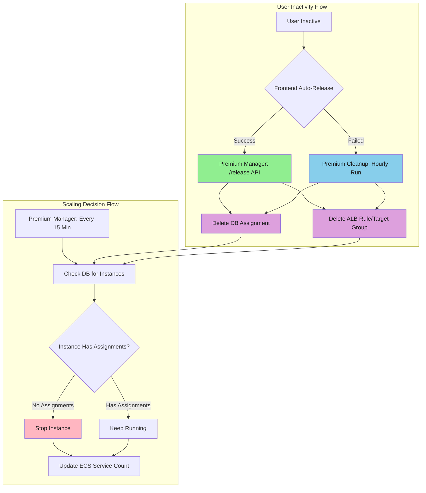
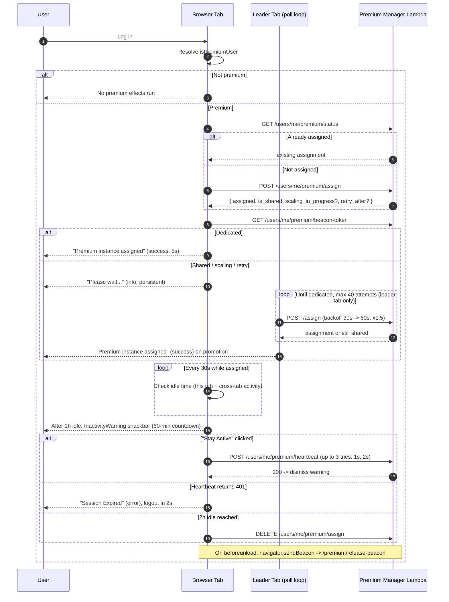

# Premium Manager: Scaling, Cleanup, and Frontend Lifecycle

## Executive Summary

- **Premium Manager Lambda** handles compute and capacity decisions (scaling, instance start/stop), plus infrastructure cleanup (ghost ECS registrations, orphaned EC2 instances) on a 15-minute schedule, and serves real-time user assign/release/heartbeat APIs
- **Premium Cleanup Lambda** handles data and resource hygiene (stale assignments, orphaned ALB resources, instance state reconciliation, standby-pool capacity) on a 60-minute schedule
- **Separation of concerns**: only Manager starts or stops instances; only Cleanup mutates assignment rows and ALB resources. No direct inter-Lambda communication — coordination is through clean DB state
- **Conservative scaling** keeps `max(1, active_users + 1)` instances running and requires `idle_instances >= 2` before stopping any
- **Frontend integration** provides auto-assignment on login, inactivity monitoring (1h warning, 2h release), heartbeat-based activity tracking, and leader-tab polling while on a shared instance

> **Sister document:**
> This file focuses on the **system architecture** — Manager / Cleanup
> Lambda split, frontend lifecycle, and operational diagnostics (log
> playbook). For the **assignment flow** — 5-tier priority cascade,
> standby pool, migration, and release paths — see
> [PREMIUM_USER_ASSIGNMENT.md](./PREMIUM_USER_ASSIGNMENT.md).

---

## Key Architectural Principles

These are the fundamental principles that guide the separation:

1. **Single Responsibility for Scaling**
   - Premium Manager has exclusive control over EC2 instance states (start/stop)
   - Premium Cleanup NEVER starts or stops instances
   - Prevents conflicting scaling decisions and race conditions

2. **Data Hygiene vs Compute Management**
   - Premium Cleanup removes stale database records and orphaned ALB resources
   - Premium Manager makes scaling decisions based on clean data
   - Note: Some overlap exists -- Manager also cleans up failed standby DB entries and ghost ECS registrations during its 15-min monitoring cycle

3. **Scheduled Monitoring for Cost Optimization**
   - Premium Manager checks every 15 minutes for idle instances
   - Conservative scaling algorithm: keeps `active_users + 1` instances running, requires `idle_instances >= 2` before scaling down
   - Ensures instances scale down even if frontend logout fails

4. **Coordination Through Clean Data**
   - Cleanup runs hourly to remove stale assignments (configurable via `PREMIUM_IDLE_TIMEOUT_HOURS`, default 2h, currently set to 3h in Terraform)
   - Manager's 15-minute monitoring uses cleaned data for scaling decisions
   - No direct coordination needed - unidirectional data flow

---

## Architecture Overview



### Key Constraints Satisfied

1. **No Race Conditions** - Only manager stops/starts instances
2. **Cost Optimization** - Idle instances stopped within 15 minutes
3. **Data Accuracy** - Cleanup ensures DB reflects reality
4. **Fault Tolerance** - Cleanup acts as safety net when frontend fails

### Responsibility Matrix

| Responsibility                   | Premium Manager          | Premium Cleanup        |
|----------------------------------|--------------------------|------------------------|
| Stop/start instances             | Yes - Exclusive          | No                     |
| Update ECS service count         | Yes - Exclusive          | No                     |
| Delete stale DB assignments      | No                       | Yes - Exclusive        |
| Delete orphaned ALB resources    | No                       | Yes - Exclusive        |
| Reconcile instance states (DB)   | No                       | Yes - Exclusive        |
| Cleanup failed standby DB entries| Yes                      | No                     |
| Cleanup ghost ECS registrations  | Yes                      | No                     |
| Cleanup orphaned EC2 instances   | Yes                      | No                     |
| User assignment/release (API)    | Yes - Real-time          | No                     |
| Activity update (API)            | Yes - Real-time          | No                     |
| Shared-to-dedicated migration    | Yes                      | No                     |
| Scheduled monitoring             | Yes - Every 15 min       | Yes - Every 60 min     |
| Manual actions (test cleanup)    | No                       | Yes                    |
| Manual actions (user migration)  | No                       | Yes                    |

---

## Premium User Lifecycle

This section is the end-to-end view of what a single user sees and what the system does across one session, from login to release. It is the UX counterpart to the backend-heavy sections that follow -- the box-level flows under "Implementation Details" and the deep dive in "Premium Frontend Architecture" are the reference versions of the individual pieces called out here.

Premium state is mounted for **all authenticated users** (`PremiumAssignmentProvider` wraps `AuthedLayout`), but every effect inside it gates on `isPremiumUser` before doing anything. Non-premium users therefore take the "inert provider" path with no API calls, no timers, and no toasts.

`isPremiumUser` resolves to true when:

```
currentUser.subscription_plan_name === PlanName.PREMIUM
  AND subscription_status === PREMIUM
```

Note: `LIMIT_GRACE` is excluded — grace period users are moved to the free
tier (auto-logout on transition) while retaining their 200 GB data quota.

### Sequence Overview

High-level flow between the user's browser, the leader tab's background polling, and the premium Lambda:



### Detailed ASCII Flow

The authoritative reference. Branches are explicit; toast text matches the strings emitted by `PremiumNotificationManager`.

```
┌────────────────────────────────────────────────────────────────────────┐
│ 1. User logs in; AuthedLayout mounts PremiumAssignmentProvider         │
│    - Provider mounts for EVERY authenticated user                      │
│    - All internal effects gate on isPremiumUser before running         │
└────────────────────────────────────────────────────────────────────────┘
                                   │
                                   ▼
                ┌──────────────────────────────────┐
                │ isPremiumUser ?                  │
                │  (plan=PREMIUM AND status in     │
                │   {PREMIUM, LIMIT_GRACE})        │
                └──────────────────────────────────┘
                        │                   │
                     NO │                   │ YES
                        ▼                   ▼
         ┌──────────────────────┐   ┌──────────────────────────────────┐
         │ Inert path:          │   │ 2. Leader election starts        │
         │  - no API calls      │   │    (localStorage-backed,         │
         │  - no timers         │   │     2s heartbeat, 5s timeout)    │
         │  - no toasts         │   │ 3. useEffect fires:              │
         │  Provider is mounted │   │    autoAssignOnLogin()           │
         │  but does nothing    │   └──────────────────────────────────┘
         └──────────────────────┘                   │
                                                    ▼
                ┌───────────────────────────────────────────────────────┐
                │ 4. hasAttemptedAutoAssignment flag check              │
                │    (useRef backed by sessionStorage:                  │
                │     "premium_hasAttempted")                           │
                │    - Set immediately to prevent re-entry              │
                │    - Cleared only on user-id change or logout         │
                └───────────────────────────────────────────────────────┘
                                   │
                                   ▼
                ┌───────────────────────────────────────────────────────┐
                │ 5. GET /users/me/premium/status                       │
                └───────────────────────────────────────────────────────┘
                        │                                     │
             assignment exists                        no assignment
                        │                                     │
                        ▼                                     ▼
     ┌─────────────────────────────────┐   ┌─────────────────────────────────┐
     │ 6a. Adopt existing assignment   │   │ 6b. POST /users/me/premium/     │
     │     - convert PremiumAssignment │   │       assign                    │
     │       -> PremiumAssignmentResult│   │     Lambda returns one of:      │
     │     - set assignmentResult      │   │      - dedicated (is_shared=F)  │
     │     - GET beacon-token          │   │      - shared    (is_shared=T)  │
     │     - persist attempted flag    │   │      - not assigned +           │
     │                                 │   │        scaling_in_progress      │
     │                                 │   │      - not assigned +           │
     │                                 │   │        retry_after              │
     │                                 │   │      - hard error               │
     │                                 │   │     Then GET beacon-token       │
     │                                 │   │       (stored in ref for        │
     │                                 │   │        sendBeacon on unload)    │
     └─────────────────────────────────┘   └─────────────────────────────────┘
                        │                                     │
                        └──────────────────┬──────────────────┘
                                           ▼
                ┌───────────────────────────────────────────────────────┐
                │ 7. Branch on result                                   │
                └───────────────────────────────────────────────────────┘
        ┌──────────────────┬───────────────────┬──────────────────────┐
        │                  │                   │                      │
     DEDICATED          SHARED           RETRYABLE ERROR         HARD ERROR
  (assigned=true,   (assigned=true,      (assigned=false,      (assigned=false,
   is_shared=false)  is_shared=true)      retry_after          no retry_after,
                                          OR scaling_in_        no scaling_in_
                                          progress)             progress)
        │                  │                   │                      │
        ▼                  ▼                   ▼                      ▼
┌──────────────┐   ┌──────────────┐   ┌──────────────────┐   ┌──────────────────┐
│ success toast│   │ info toast   │   │ info toast       │   │ warning toast    │
│ "Premium     │   │ "Please wait │   │ (same "Please    │   │ "Premium         │
│  instance    │   │  while your  │   │  wait..." copy   │   │  assignment      │
│  assigned    │   │  dedicated   │   │  -- suppressed   │   │  issue: {err}.   │
│  successfully│   │  premium     │   │  error path via  │   │  Falling back to │
│  You now have│   │  resource is │   │  isRetryableError│   │  shared          │
│  dedicated   │   │  being       │   │  flag; NO        │   │  resources."     │
│  compute     │   │  prepared."  │   │  warning toast   │   │                  │
│  resources." │   │              │   │  is shown)       │   │ auto-dismiss 10s │
│              │   │ persist:true │   │                  │   │                  │
│ 5s dismiss   │   │              │   │ persist:true     │   │ assignmentResult │
└──────────────┘   └──────────────┘   └──────────────────┘   │ stays null;      │
        │                  │                   │             │ polling does NOT │
        │                  └─────────┬─────────┘             │ start            │
        │                            │                       └──────────────────┘
        │                            ▼
        │               ┌─────────────────────────────────────┐
        │               │ 8. Leader tab begins polling loop   │
        │               │    (non-leader tabs skip step 8)    │
        │               │                                     │
        │               │    POST /premium/assign repeatedly  │
        │               │    - initial delay: 30 000 ms       │
        │               │    - backoff multiplier: 1.5        │
        │               │    - error backoff: 2.0             │
        │               │    - cap: 60 000 ms                 │
        │               │    - max attempts: 40               │
        │               │                                     │
        │               │    On response:                     │
        │               │     - dedicated -> go to step 9     │
        │               │     - still shared/retry -> loop    │
        │               │     - attempts >= 40 -> stop and    │
        │               │       set error: "No premium        │
        │               │       instance available after      │
        │               │       extended wait. Please try     │
        │               │       again later or contact        │
        │               │       support."                     │
        │               └─────────────────────────────────────┘
        │                                │
        │                                ▼
        │               ┌─────────────────────────────────────┐
        │               │ 9. Promotion shared -> dedicated    │
        │               │    - update assignmentResult        │
        │               │    - reset poll state (attempts=0,  │
        │               │      interval=30s)                  │
        │               │    - notification manager fires     │
        │               │      success toast (same copy as    │
        │               │      step 7 dedicated branch)       │
        │               └─────────────────────────────────────┘
        │                                │
        └────────────────┬───────────────┘
                         ▼
   ┌──────────────────────────────────────────────────────────────────────┐
   │ 10. Steady state: inactivity monitor running                         │
   │     - setInterval 30 000 ms                                          │
   │     - idle = now - max(local lastActivity,                           │
   │                        localStorage "premium_last_activity")         │
   │     - recordActivity() writes both and sends heartbeat to server     │
   │     - heartbeat retries up to 3 total attempts with 1s then 2s       │
   │       delays between attempts (no 3rd delay; final failure surfaces) │
   │     - any activity in any tab dismisses an open InactivityWarning    │
   └──────────────────────────────────────────────────────────────────────┘
                         │
              ┌──────────┼───────────┐
              ▼          ▼           ▼
         < 1h idle    >= 1h      >= 2h idle
              │          │           │
              │          ▼           ▼
              │  ┌───────────────┐  ┌─────────────────────────────────┐
              │  │ InactivityWar │  │ autoReleaseOnLogout()           │
              │  │ ning snackbar │  │  - if beacon token present:     │
              │  │ (top/center,  │  │      navigator.sendBeacon to    │
              │  │  severity=    │  │      /premium/release-beacon    │
              │  │  warning)     │  │  - else:                        │
              │  │ 60-min        │  │      DELETE /premium/assign     │
              │  │ countdown,    │  │  - clear assignmentResult,      │
              │  │ 1-min updates │  │    warning, beacon token        │
              │  │               │  └─────────────────────────────────┘
              │  │ "Stay Active":│
              │  │  recordActiv- │
              │  │  ity() then   │
              │  │  dismiss      │
              │  │               │
              │  │ 401 from      │
              │  │ heartbeat ->  │
              │  │ severity=     │
              │  │ error,        │
              │  │ "Session      │
              │  │  Expired",    │
              │  │ performLogout │
              │  │ after 2s      │
              │  └───────────────┘
              │
              ▼
   (loop continues)

   ───────────────────────────────────────────────────────────────────────
   Cross-cutting: browser close (window 'beforeunload')
   ───────────────────────────────────────────────────────────────────────
     If isPremiumUser && currentUser && beacon token is cached:
        navigator.sendBeacon(
          BASE_URL + "/users/me/premium/release-beacon",
          Blob({ token }, "text/plain"))
     - Fire-and-forget; survives tab close
     - Backend path differs from the authed DELETE: no session required,
       token is the authorization material
```

### What Each Step Maps To

| Step | Code reference |
|------|----------------|
| `isPremiumUser` resolution | `PremiumAssignmentContext.tsx` -- subscription_plan_name + subscription_status check |
| Auto-assign trigger | `PremiumAssignmentContext.tsx` -- `useEffect` on `isPremiumUser && currentUser` |
| `hasAttemptedAutoAssignment` | `useRef` seeded from `sessionStorage["premium_hasAttempted"]`; cleared on user-id change or logoutGeneration change |
| Status then assign then beacon-token | `autoAssignOnLogin()` in `PremiumAssignmentContext.tsx` |
| Shared vs dedicated branch | `is_shared` field on `PremiumAssignmentResult` |
| Retryable vs hard error | `isRetryableError = !result.assigned && (result.scaling_in_progress || result.retry_after != null)` |
| Toast strings and variants | `PremiumNotificationManager.tsx` |
| Leader-tab election | `frontend/src/utils/crossTabSync.ts` -- localStorage key `"premium_poll_leader"`, 2s heartbeat, 5s timeout |
| Poll config | constants in `PremiumAssignmentContext.tsx`: `INITIAL_POLL_INTERVAL_MS=30000`, `MAX_POLL_INTERVAL_MS=60000`, `MAX_POLL_ATTEMPTS=40`, `BACKOFF_MULTIPLIER=1.5`, `ERROR_BACKOFF_MULTIPLIER=2` |
| Polling gate | `shouldPoll()` in `PremiumAssignmentContext.tsx`: polls while premium+leader+assignment exists and the assignment is not dedicated-and-healthy. Re-enables polling while `instanceUnreachable` is true so a backend reassignment to shared or to a new instance is still caught |
| Unreachable detection + probe config | `unreachableMachineReducer` and constants in `frontend/src/contexts/premium/unreachableConstants.ts`: `INITIAL_PROBE_DELAY_MS=30000`, `MAX_PROBE_DELAY_MS=300000`, `PROBE_BACKOFF_MULTIPLIER=2`, `MAX_FAILED_PROBES=5`, `DEDICATED_HANDOFF_GRACE_MS=15000` (single-shot suppression of the first 5xx after a shared → dedicated transition or dedicated reassignment, to avoid false-positive unreachable popups during ALB target-group warm-up) |
| Inactivity thresholds | `INACTIVITY_WARNING_MINUTES=60`, `INACTIVITY_RELEASE_MINUTES=120` and `WARNING_UPDATE_INTERVAL_MS=60000` from `frontend/src/const/Subscription.ts`; the snackbar countdown is their difference |
| Heartbeat retry | `HEARTBEAT_MAX_RETRIES=3`, `HEARTBEAT_RETRY_DELAY_MS=1000`; delay between attempts is `DELAY * (attempt + 1)` |
| 401 session-expired UI | `InactivityWarning.tsx` -- AxiosError + status 401 path, 2 s setTimeout then `performLogout()` |
| beforeunload beacon | `PremiumAssignmentContext.tsx` beforeunload effect; endpoint `/users/me/premium/release-beacon` |
| Cross-tab activity sync | `frontend/src/utils/crossTabSync.ts` -- localStorage key `"premium_last_activity"` |

### Reverse Reference: Symptom -> State -> Cause

The flows above read top-to-bottom: login in, state out. When debugging, developers usually start from the other end -- a user is seeing X right now, so what state must the system be in, and what conditions put it there? This subsection is that reverse index.

**First, clarify what "shared" means.** A premium user can occupy one of four distinct states. The toast copy collapses the last three into a single "please wait" message, but they are different at the data layer and worth keeping separate when debugging.

| State (DB `premium_user_assignments` row) | What the user sees | What it means |
|---|---|---|
| `instance_id = i-xxxx, is_shared = false` | Dedicated success toast | Normal dedicated: the user is the sole premium assignment on that EC2 instance |
| `instance_id = i-xxxx, is_shared = true` | Persistent "please wait..." info toast; leader tab polling | Routed to a **real premium EC2 instance that is already hosting at least one other premium user** (the Lambda picked the least-loaded running instance). Not the non-premium ASG. Uniqueness is per-user, not per-instance -- multiple users can share the same premium EC2 |
| `instance_id = "autoscaling-pool"` (sentinel) | Persistent "please wait..." info toast; leader tab polling | Fallback marker used when no running premium instance was available at assign time and scaling has been triggered. Routes via a shared ALB target group; will be migrated to a real instance once one comes up |
| No row | Either (a) no premium effects at all (inert provider path), or (b) a transient `warning` toast "Premium assignment issue: {err}. Falling back to shared resources." that auto-dismisses after 10s, then nothing; `assignmentResult` stays null either way | (a) user is not premium, so the assignment flow never ran; (b) `/assign` returned a hard error (no `retry_after`, no `scaling_in_progress`), so `isRetryableError` is false and polling does not start |

Two premium users **can** share the same dedicated-class EC2 -- the uniqueness constraint is `(user_id)`, not `(instance_id)`. The `is_shared` flag records whether that happened at assign time; it does not guarantee exclusivity once set to false.

**Symptom -> state -> cause table.** Read left to right when debugging. "Implied state" is what you can conclude from the symptom alone; "upstream cause" is what put the system there.

| Observed symptom | Implied state | Upstream cause |
|---|---|---|
| No toasts, no premium effects, no network calls to `/premium/*` | Inert provider path | `isPremiumUser` is false -- either `subscription_plan_name != PREMIUM`, or `subscription_status` is not `PREMIUM` (includes `LIMIT_GRACE`, `EXPIRED`, `FREE`) |
| Console warn "Conditions not met for auto-assignment" | Provider mounted but gate failed | `currentUser` null at mount time, or `isPremiumUser` flipped false between mount and the useEffect firing |
| Success toast "Premium instance assigned successfully..." at login | `/assign` returned `assigned=true, is_shared=false` on first call, OR `/status` found an existing dedicated assignment | A dedicated instance had zero active assignments at assign time and was picked up; or the user already had a live assignment from a prior session that survived in DB (cleanup hadn't run) |
| Persistent info toast "Please wait while your dedicated premium resource is being prepared." from login, no success toast follows | `assignmentResult.assigned=true && is_shared=true`, OR response was 202 with `retry_after`, OR `/assign` returned an `autoscaling-pool` assignment | No premium instance had spare capacity at assign time: either (a) all running instances already have users so the least-loaded was picked (is_shared=true on a real instance), (b) scaling was initiated and the Lambda returned 202+retry_after, or (c) launching instances exist and response is 202 |
| Info toast is showing AND the tab is the leader AND poll attempts are incrementing | Leader-tab polling loop is live: re-POSTing `/assign` on exponential backoff | User is on shared / autoscaling-pool / retry state; poll will promote to dedicated once any premium instance frees up or finishes launching |
| Info toast is showing AND no polling is happening in any tab | Shared state with polling suppressed | Either (a) `assignmentResult` is null so the `state.assignmentResult != null` gate blocks polling -- this is the hard-error path, or (b) no tab has won leader election (storage unavailable / all tabs closed simultaneously) |
| Dedicated assignment in DB, warning snackbar "Your dedicated premium instance is temporarily unreachable. Retrying..." | `instanceUnreachable=true`, `isUnreachableTerminal=false`. Half-open probe armed on leader tab with exponential backoff | `handlePremiumRoutingError()` fired on a premium-routed request. The circuit flipped `premiumAssigned=false`, broadcast `PREMIUM_INSTANCE_UNREACHABLE` to peer tabs, and will re-arm `premiumAssigned=true` ahead of the next user-driven request |
| Same snackbar upgraded to "unresponsive after multiple attempts. Please reload the page or contact support" with a Retry action | `instanceUnreachable=true`, `isUnreachableTerminal=true`. Probe budget exhausted at `MAX_FAILED_PROBES=5` | Five consecutive probes returned 5xx. Auto-re-arm is disabled; only `retryUnreachableProbe()` (Retry button) or a backend reassignment can clear the state |
| Snackbar was showing, disappeared without a reload | `instanceUnreachable` cleared | Either (a) a real request returned 2xx that passed `shouldEmitPremiumReachable()` (unrotated routing ID AND matching `x-served-by-instance`) and axios emitted `premiumReachable`, or (b) polling observed a backend reassignment (new `instance_id` or drop to `is_shared=true`) |
| Info toast persists for more than ~30 minutes with no promotion | Polling capped out, or backend has no capacity to give | `MAX_POLL_ATTEMPTS=40` at capped 60s interval is roughly 30-40 minutes of wall time. Upstream: premium ASG cannot scale further (instance quota, scaling lock stuck, ghost ECS registrations consuming slots) |
| Error toast "No premium instance available after extended wait..." | Polling loop stopped after exceeding 40 attempts | Same as above, but the loop has now given up; user will not auto-retry without a new login or re-mount |
| Warning toast "Premium assignment issue: {err}. Falling back to shared resources." | `/assign` returned `assigned=false` with **no** `retry_after` and no `scaling_in_progress` | Hard error from Lambda: scaling lock held + no launching instances, or an exception inside `assign_premium_user()`. `isRetryableError` is false so `assignmentResult` stays null and polling never starts |
| Two users on the same EC2 instance (DB shows same `instance_id`) with different `is_shared` values | Expected. One user was assigned first and became the dedicated owner (`is_shared=false`); a later user found no idle instance and was placed on the same one with `is_shared=true` | Premium ASG was at capacity when the second user logged in; Manager's 15-min monitor will scale up if `running < active_users + 1` |
| User row has `instance_id = "autoscaling-pool"` | User is routed via the shared ALB target group, not a per-user target group | Lambda saw `running_instances == 0 && launching_instances == 0` (or a migration-retry scenario). Scaling was triggered; a follow-up `/assign` (either from polling or from the migration path) will move them to a real instance |
| InactivityWarning snackbar appears | `now - max(local lastActivity, cross-tab lastActivity) >= 1h` inside the 30s-tick inactivity monitor | User has been idle for at least one hour **in every tab**; cross-tab sync would have cleared the warning otherwise |
| InactivityWarning appears even though the user was typing | Cross-tab activity sync failed | `localStorage["premium_last_activity"]` not being written (storage disabled / quota / private-mode). Record-activity path does run locally, so only the *multi-tab* case is vulnerable |
| "Session Expired" error snackbar with 2s auto-logout | Heartbeat hit 401 inside `recordActivity()` path | Server session expired (cookie gone / revoked / backend logout). Frontend state catches the AxiosError, switches Alert to error, and calls `performLogout()` |
| Heartbeat retries visible in network tab (1s then 2s gaps) then final 5xx | Final heartbeat failure | Premium Lambda `/heartbeat` unavailable or ALB is routing the user to a dead instance; `heartbeatFailing` state is set |
| User is released but never saw a toast | `autoReleaseOnLogout()` fired silently -- either 2h-idle trigger or `beforeunload` beacon | Frontend inactivity monitor hit 2h threshold, or user closed the tab (sendBeacon is fire-and-forget, no UI). If neither, the backend cleanup Lambda (3h `PREMIUM_IDLE_TIMEOUT_HOURS`) removed a stale row |
| User logs back in after a crash and immediately gets dedicated | `/status` returned an existing assignment on the fresh tab | Assignment survived in DB because no release path ran (sendBeacon missed / 2h not reached / cleanup 3h window not elapsed). `hasAttemptedAutoAssignment` was in sessionStorage on the old tab only, so the new tab re-runs status and adopts the row |
| On a fresh tab `hasAttemptedAutoAssignment` is false but no re-assign fires on refresh | Flag survived via `sessionStorage` within the same tab | Refresh preserves sessionStorage; re-open in a new tab resets it. If you want to force re-attempt, change user id or bump logoutGeneration |
| Both tabs appear to poll simultaneously | Leader-election race or stale leader token | `localStorage` events dropped (rare); or system clock skew made the 5s timeout misfire. Each tab re-elects every `storage` event -- the losing tab will drop within 2s |

A small caveat on one field: `scaling_in_progress` exists on the frontend `PremiumAssignmentResponse` type and is checked inside `isRetryableError`, but the backend `/assign` endpoint does not populate it in the JSON body today -- it is an internal CloudWatch-metric-backed lock used by the scheduled monitor (`is_premium_scaling_in_progress()` in `premium_manager.py`). In practice, `retry_after` is what drives the retryable branch for `/assign` callers.

---

## Implementation Details

### 1. Premium Manager

**File:** `infrastructure/terraform/premium_manager_package/premium_manager.py`

#### Handler Routing

The `handler()` function routes events based on type:

| Event Type | Route | Description |
|---|---|---|
| `{"action": "migrate_shared_users"}` | `_handle_migrate_shared_users()` | Async migration under MySQL `GET_LOCK` |
| `{"action": "fix_shared_flags"}` | `fix_incorrect_is_shared_flags()` | One-time data cleanup |
| `{"action": "cleanup_all_dynamic"}` | `cleanup_all_dynamic_instances()` | Tear down all dynamically-provisioned premium instances (dev scheduler before environment stop) |
| CloudWatch Scheduled Event | `handle_scheduled_monitoring()` | 15-min monitoring cycle |
| `GET` (API Gateway) | `get_premium_user_status()` | Status check |
| `POST action=assign` | `assign_premium_user()` | User assignment |
| `POST action=release` | `release_premium_user()` | User release |
| `POST action=update_activity` | `handle_activity_update()` | Heartbeat/activity update |

#### Scheduled Monitoring

Runs every 15 minutes. Step numbering matches the comments in the source. Some step numbers (8, 10) bundle related sub-operations:

```
1.   Check scaling lock (skip run if another operation in progress)
2.   Set scaling lock
3.   Get current state (active users, total users, running + idle instance counts)
4.   Publish CloudWatch metrics
5.   scale_down_if_possible()              - Stop idle instances
6.   update_premium_service_desired_count() - Sync ECS desired count to running count
7.   cleanup_failed_standby_instances()    - Remove DB rows for terminated standbys
8a.  register_orphaned_stopped_instances() - Re-register stopped instances missing from DB
8b.  terminate_aged_stopped_instances()    - Terminate standbys stopped longer than PREMIUM_STOPPED_MAX_AGE_HOURS
9.   cleanup_excess_standby_instances()    - Trim standby pool to PREMIUM_STANDBY_POOL_SIZE
10a. finalize_expired_pending_releases()   - Tear down ALB resources for assignments past soft-release grace
10b. cleanup_ghost_ecs_registrations()     - Deregister ECS container instances whose EC2 is gone
11.  cleanup_orphaned_ec2_instances()      - Stop premium-tagged EC2 not in the ECS cluster (10-min launch-age grace)
12.  fix_incorrect_is_shared_flags() then
     process_shared_instance_optimization() - Promote shared users to dedicated, or fire invoke_migration_async() if none free
```

The scaling lock is always cleared in the `finally` block, even on error.

#### Scale-Down (`scale_down_if_possible`)

**File:** `infrastructure/terraform/premium_manager_package/premium_manager.py`
**Purpose:** Scale down premium instances by stopping idle ones
**Input:** None (reads state from DB and EC2)
**Output:** Stops idle EC2 instances, deregisters from ECS
**Calls:** get_dynamic_max_capacity() -> count_active_premium_users()
-> get_all_premium_instances_with_states()

Key scaling constraint:

```python
# Keep active_users + 1 instances; require 2 idle before
# stopping any; always retain at least 1 idle after
min_running_needed = max(1, active_users + 1)
```

Guards:
- Requires `idle_instances >= 2` before scaling down
- Always retains at least 1 idle instance after scale-down
- Only stops instances with ZERO assigned users
- Deregisters from ECS before stopping to prevent ghost
  registrations

> For the scale-up / scale-down asymmetry comparison, see
> [PREMIUM_USER_ASSIGNMENT.md → 5. Scaling System (scale-up and scale-down)](./PREMIUM_USER_ASSIGNMENT.md#5-scaling-system-scale-up-and-scale-down).

#### ECS Service Desired Count Sync (`update_premium_service_desired_count`)

**File:** `infrastructure/terraform/premium_manager_package/premium_manager.py`
**Purpose:** Keep the ECS service's `desiredCount` in sync with the actual
number of premium EC2 instances that should be running ECS tasks.
**Input:** None (reads state from ECS and EC2 APIs)
**Output:** Calls `ecs.update_service()` when `desiredCount` diverges from the
computed target; no-op when already in sync.
**Calls:** `ecs.describe_services()` → `_list_premium_ecs_registered_ec2_ids()`
→ `_list_premium_ec2_instances_running()` → `ecs.update_service()`

**Why manual control instead of ECS Auto Scaling:**
The premium tier uses Lambda-driven scaling (`scale_premium_instances_if_needed`,
`scale_down_if_possible`) rather than ECS Application Auto Scaling. The ECS
Auto Scaling target is commented out in `compute.tf`. Because EC2 instance
start/stop decisions are made by the Lambda based on user assignment demand
(not task-level metrics), the ECS service's `desiredCount` must be
explicitly synchronized after every scaling action to match reality.

**Desired count formula:**

```
desiredCount = registered_count + booting_count
```

| Component | Definition |
|---|---|
| `registered_count` | Number of EC2 instances currently registered as ECS container instances in the premium cluster (via `_list_premium_ecs_registered_ec2_ids()`) |
| `booting_count` | Number of running premium EC2 instances that are **not yet** registered in ECS but were launched less than `ORPHAN_GRACE_PERIOD_MINUTES` (10 min) ago |

The boot grace period prevents a race condition: when a stopped standby
instance is started (Tier 3) or a new instance is created (Tier 5), there
is a gap between the EC2 reaching `running` state and the ECS agent
registering with the cluster. If `desiredCount` were dropped during this
gap, ECS would cancel the pending task placement and never re-fire it once
the agent registers — leaving the instance with no premium task and the
user stuck on the waiting popup. The 10-minute grace is symmetric with
`cleanup_orphaned_ec2_instances()`, which uses the same threshold before
treating an unregistered instance as orphaned.

**Call sites (5 locations):**

| # | Caller | Context |
|---|---|---|
| 1 | `handle_scheduled_monitoring()` step 6 | After `scale_down_if_possible()` in the 15-min cycle |
| 2 | `scale_down_if_possible()` | After stopping idle instances and converting to standby |
| 3 | `scale_premium_instances_if_needed()` (success path) | After starting stopped instances or creating new ones |
| 4 | `scale_premium_instances_if_needed()` (lock-held path) | When scaling was blocked by an existing lock |
| 5 | `_handle_migrate_shared_users()` | Before each migration attempt in the retry loop, to ensure ECS has the correct task count for readiness checks |

**Idempotency:** The function compares `running_premium_count` to the
current `desiredCount` and only issues `update_service` when they differ,
so repeated calls within the same cycle are safe.

#### Terraform Configuration

```hcl
resource "aws_cloudwatch_event_rule" "premium_manager_schedule" {
  schedule_expression = "rate(15 minutes)"
  description         = "Trigger premium manager every 15 minutes for monitoring and scaling"
}
```

### 2. Premium Cleanup

**File:** `infrastructure/terraform/premium_cleanup_package/premium_cleanup.py`

#### Handler Routing

The `handler()` function supports both scheduled and manual invocations:

| Event Type | Route | Description |
|---|---|---|
| `{"action": "cleanup_test_users", "user_emails": [...]}` | `cleanup_test_user_assignments()` | Manual test user cleanup |
| `{"action": "get_user_assignment", "user_email": "..."}` | `get_user_assignment()` | Look up user assignment |
| `{"action": "migrate_user", "user_email": "...", "target_instance_id": "..."}` | `migrate_user()` | Migrate user to different instance |
| `{"action": "get_instance_users", "instance_id": "..."}` | `get_assigned_users_for_instance()` | List users on a specific instance |
| `{"action": "reconcile"}` | `reconcile_instance_states()` | Manual full-fleet reconciliation |
| `{"action": "reconcile_instance", "instance_id": "..."}` | `reconcile_single_instance()` | Targeted reconciliation for one instance (invoked from the EC2 state-change EventBridge rule) |
| Scheduled (default) | Normal cleanup flow | 5-step cleanup process |

#### Scheduled Cleanup Flow

All 5 steps run sequentially on each hourly invocation:

1. `cleanup_stale_assignments()` -- remove idle assignments
2. `cleanup_orphaned_alb_resources()` -- delete orphaned ALB
3. `cleanup_duplicate_alb_rules()` -- remove duplicate rules
4. `reconcile_instance_states()` -- sync DB with AWS
5. `ensure_standby_pool_capacity()` -- monitor standby health

Note: `cleanup_stale_assignments()` uses the
`@with_transaction` decorator which automatically injects a
database connection and manages commit/rollback.

#### Stale Assignment Timeout

The timeout is configurable via the `PREMIUM_IDLE_TIMEOUT_HOURS` environment variable:
- **Code default:** 2 hours (`DEFAULT_STALE_ASSIGNMENT_TIMEOUT_HOURS = 2`)
- **Terraform override:** 3 hours (`PREMIUM_IDLE_TIMEOUT_HOURS = "3"`)
- **Production behavior:** Assignments idle for >3 hours are cleaned up

---

## Flow Diagrams

### User Logout and Scaling Flow

```
┌──────────────────────────────────────────────────────────┐
│ 1. User Inactive (frontend auto-release: 2h)             │
└──────────────────────────────────────────────────────────┘
                         ↓
┌──────────────────────────────────────────────────────────┐
│ 2. Frontend Auto-Release (or Cleanup as Safety Net)      │
│    → Deletes assignment from premium_user_assignments    │
│    → Deletes ALB rule and target group                   │
└──────────────────────────────────────────────────────────┘
                         ↓
┌──────────────────────────────────────────────────────────┐
│ 3. Premium Manager Monitoring (Every 15 Minutes)         │
│    → Queries DB for instances with assigned users        │
│    → Finds instances with NO assigned users              │
└──────────────────────────────────────────────────────────┘
                         ↓
┌──────────────────────────────────────────────────────────┐
│ 4. Scaling Decision (scale_down_if_possible)             │
│    → Conservative: Keep max(1, active_users + 1)         │
│    → Require idle_instances >= 2 before scaling down     │
│    → Stop instances with 0 assignments                   │
└──────────────────────────────────────────────────────────┘
                         ↓
┌──────────────────────────────────────────────────────────┐
│ 5. Update ECS Service Count                              │
│    → ECS desired_count = number of running instances     │
└──────────────────────────────────────────────────────────┘
```

### Cleanup Lambda Flow (Safety Net)

```
┌──────────────────────────────────────────────────────────┐
│ Premium Cleanup Lambda (Runs Every Hour)                  │
└──────────────────────────────────────────────────────────┘
                         ↓
┌──────────────────────────────────────────────────────────┐
│ 1. cleanup_stale_assignments() [@with_transaction]       │
│    → Find assignments where last_activity > 3 hours      │
│    → Delete from premium_user_assignments table          │
│    → Delete associated ALB rules/target groups           │
│    → Skip deletion of shared autoscaling target group    │
└──────────────────────────────────────────────────────────┘
                         ↓
┌──────────────────────────────────────────────────────────┐
│ 2. cleanup_orphaned_alb_resources()                      │
│    → Find ALB rules with no matching DB entry            │
│    → Delete orphaned target groups and rules             │
└──────────────────────────────────────────────────────────┘
                         ↓
┌──────────────────────────────────────────────────────────┐
│ 3. cleanup_duplicate_alb_rules()                         │
│    → Group ALB rules by routing_id                       │
│    → Keep rule matching database entry                   │
│    → Delete all duplicate rules                          │
└──────────────────────────────────────────────────────────┘
                         ↓
┌──────────────────────────────────────────────────────────┐
│ 4. reconcile_instance_states()                           │
│    → Query AWS for actual instance states                │
│    → Update DB to match reality                          │
│    → Fix discrepancies (e.g., terminated instances)      │
└──────────────────────────────────────────────────────────┘
                         ↓
┌──────────────────────────────────────────────────────────┐
│ 5. ensure_standby_pool_capacity() [Read-Only]            │
│    → Check if standby pool has minimum capacity          │
│    → Log warnings if capacity is low                     │
│    → Does NOT create or terminate instances              │
└──────────────────────────────────────────────────────────┘
```

### Premium Manager Monitoring Flow (Every 15 Minutes)

```
┌──────────────────────────────────────────────────────────┐
│ Premium Manager Monitoring (Every 15 Minutes)            │
└──────────────────────────────────────────────────────────┘
                         ↓
┌──────────────────────────────────────────────────────────┐
│ 1-2. Check/Set Scaling Lock (CloudWatch metrics-based)   │
│    → Skip if another operation is in progress            │
└──────────────────────────────────────────────────────────┘
                         ↓
┌──────────────────────────────────────────────────────────┐
│ 3-4. Get State & Publish Metrics                         │
│    → Count active users, running instances, idle         │
│    → Publish to OptiNiSt/PremiumManager/{env_prefix}     │
└──────────────────────────────────────────────────────────┘
                         ↓
┌──────────────────────────────────────────────────────────┐
│ 5-6. Scaling                                             │
│    → scale_down_if_possible() (deregisters ECS first)    │
│    → update_premium_service_desired_count()              │
└──────────────────────────────────────────────────────────┘
                         ↓
┌──────────────────────────────────────────────────────────┐
│ 7-9. Standby pool hygiene                                │
│    → cleanup_failed_standby_instances()                  │
│    → register_orphaned_stopped_instances()               │
│    → terminate_aged_stopped_instances()                  │
│    → cleanup_excess_standby_instances()                  │
└──────────────────────────────────────────────────────────┘
                         ↓
┌──────────────────────────────────────────────────────────┐
│ 10. Pending-release + ghost ECS cleanup                  │
│    → finalize_expired_pending_releases()                 │
│      tears down ALB resources for soft-released users    │
│    → cleanup_ghost_ecs_registrations()                   │
└──────────────────────────────────────────────────────────┘
                         ↓
┌──────────────────────────────────────────────────────────┐
│ 11. cleanup_orphaned_ec2_instances()                     │
│    → Stop premium-tagged EC2 not in ECS                  │
│    → 10-minute launch-age grace for booting instances    │
└──────────────────────────────────────────────────────────┘
                         ↓
┌──────────────────────────────────────────────────────────┐
│ 12. Shared-instance optimization                         │
│    → fix_incorrect_is_shared_flags() (safety net)        │
│    → process_shared_instance_optimization() promotes     │
│      users to dedicated when instances are ready         │
│    → invoke_migration_async() if none ready              │
└──────────────────────────────────────────────────────────┘
                         ↓
┌──────────────────────────────────────────────────────────┐
│ Finally: Clear Scaling Lock                              │
└──────────────────────────────────────────────────────────┘
```

---

## Edge Case Handling

### 1. Frontend Logout Fails (Browser Closed, Network Error)

**Problem:** User closes browser before logout API completes.

**Solution:** Premium Cleanup acts as safety net:
- Runs hourly to find assignments with `last_activity > PREMIUM_IDLE_TIMEOUT_HOURS` (currently 3 hours)
- Deletes stale assignments and ALB rules
- Manager's next monitoring run (within 15 min) stops idle instances


### 2. Concurrent Scaling Operations

**Problem:** Multiple triggers could cause manager to run concurrently.

**Solution:** CloudWatch metrics-based locking:

#### Scaling Lock Check (`is_premium_scaling_in_progress`)

**File:** `infrastructure/terraform/premium_manager_package/premium_manager.py`
**Purpose:** Check if a scaling operation is already running
**Input:** None (reads CloudWatch metric)
**Output:** True if lock set within last 15 minutes

#### Scaling Lock Management (`set_premium_scaling_lock`)

**File:** `infrastructure/terraform/premium_manager_package/premium_manager.py`
**Purpose:** Set or clear the scaling lock via CloudWatch
**Input:** `in_progress` (bool) -- True to set, False to clear
**Output:** Publishes CloudWatch metric (0 or 1)

**Behavior:**
- Monitoring checks lock before starting
- Skips run if lock is set (another operation in progress)
- Lock automatically clears after 15 minutes
  (metric window expiry)
- `finally` block always clears the lock, even on error


### 3. Instance State Discrepancies (DB vs AWS)

**Problem:** DB shows instance as "running" but AWS shows "terminated".

**Solution:** Premium Cleanup reconciliation:

#### Instance State Reconciliation (`reconcile_instance_states`)

**File:** `infrastructure/terraform/premium_cleanup_package/premium_cleanup.py`
**Purpose:** Sync DB instance states with actual AWS states
**Input:** None (reads from AWS EC2 and database)
**Output:** Updates DB records; cleans terminated entries
**Calls:** get_all_premium_instances_with_states()

**Frequency:** Runs hourly to keep DB accurate


### 4. Ghost ECS Container Instances

**Problem:** EC2 instances stopped/terminated outside normal flow leave orphaned ECS registrations that confuse the ECS scheduler.

**Solution:** Premium Manager's `cleanup_ghost_ecs_registrations()`:
- Finds premium container instances with disconnected agents or stopped/terminated EC2
- Stopped/terminated/unmapped instances are deregistered immediately; a running EC2 with a disconnected agent is tagged `optinist:agent-disconnected-at` on first sighting and deregistered only after `_AGENT_DISCONNECT_GRACE_SECONDS = 300` (5 minutes), with the tag cleared if the agent reconnects
- Runs every 15 minutes as part of scheduled monitoring


### 5. Orphaned EC2 Instances

**Problem:** EC2 instances tagged as premium are running but not registered in ECS (wasting resources and inflating desiredCount).

**Solution:** Premium Manager's `cleanup_orphaned_ec2_instances()`:
- Finds premium-tagged EC2 instances not in the ECS cluster
- `launch_time`-age grace (`ORPHAN_GRACE_PERIOD_MINUTES = 10` minutes) to avoid stopping still-booting instances; symmetric with the `booting_count` window in `update_premium_service_desired_count()`
- Stops orphaned instances (and registers them as standby for later aged termination)

> This and the ghost-CI cleanup (Edge Case 4) are independent timers measured from different events — agent-disconnect (300s) vs instance launch (10 min) — and both run in the same 15-minute cycle, so a single run can deregister a ghost container instance and stop the orphaned EC2 behind it.


### 6. Race Condition Between Manager and Cleanup

**Problem:** Could manager and cleanup conflict when operating on same instance?

**Solution:** Clear division of labor minimizes race conditions:
- **Manager** = Touches instance states (start/stop) and ECS registrations
- **Cleanup** = Touches database records and ALB resources
- Cleanup uses `@with_transaction` decorator with `SELECT FOR UPDATE` to prevent concurrent DB modifications


### 7. Shared Instance Users

**Problem:** Users may be assigned to shared instances when no dedicated instance is available.

**Solution:** `process_shared_instance_optimization()` in the manager's 15-min cycle:
- Finds users with `is_shared = true` assignments
- Attempts migration to dedicated instances if available
- If no instances ready, triggers `invoke_migration_async()` which runs `_handle_migrate_shared_users()` under a distributed MySQL lock (`GET_LOCK`)


---

## Monitoring and Metrics

### CloudWatch Metrics Published

**By Premium Manager** (every 15 minutes):

| Metric Name | Description | Unit |
|-------------|-------------|------|
| `ActivePremiumUsers` | Users with active assignments | Count |
| `IdlePremiumUsers` | Total premium users - active users | Count |
| `RunningInstances` | EC2 instances in "running" state | Count |
| `IdleInstances` | Running instances with 0 assigned users (see [Idle instance](./PREMIUM_USER_ASSIGNMENT.md#idle-instance) in the Glossary) | Count |
| `ScalingInProgress` | Lock to prevent concurrent operations | None (0 or 1) |

**Namespace:** `OptiNiSt/PremiumManager/{env_prefix}` where `env_prefix` is the Terraform `environment` variable (e.g. `staging`, `prod`).

### CloudWatch Logs

**Premium Manager:**
- `/aws/lambda/{env_prefix}-premium-manager`
- Retention: 30 days

**Premium Cleanup:**
- `/aws/lambda/{env_prefix}-premium-cleanup`
- Retention: 30 days

---

## Configuration

### Environment Variables

**Premium Manager:**
```bash
# Environment
ENV_PREFIX                    # Prefix applied to dynamic resource names and metric namespace

# Network / ALB
VPC_ID                        # VPC ID for target group creation
SUBNET_IDS                    # Comma-separated subnet IDs
SECURITY_GROUP_ID             # ECS security group
ALB_ARN                       # Application Load Balancer ARN
ALB_LISTENER_ARN              # ALB HTTPS listener ARN
ALB_DNS_NAME                  # ALB DNS name (used for internal API callbacks)
AUTOSCALING_TARGET_GROUP_ARN  # Shared autoscaling target group ARN

# Compute
PREMIUM_INSTANCE_IDS          # Comma-separated base EC2 instance IDs
PREMIUM_LAUNCH_TEMPLATE_ID    # Launch template for creating dynamic instances
PREMIUM_INSTANCE_TYPE         # EC2 instance type for dynamically-created premium instances
CLUSTER_NAME                  # ECS cluster name
PREMIUM_SERVICE_NAME          # ECS service name for premium tier

# Database
RDS_HOST                      # Database endpoint (via RDS Proxy)
RDS_USER                      # Database username
RDS_PASSWORD                  # Database password
RDS_DATABASE                  # Database name

# Security
ROUTING_SECRET_KEY            # HMAC secret for generating routing IDs
INTERNAL_API_SECRET           # Secret for internal API authentication

# Capacity tuning
PREMIUM_STANDBY_POOL_SIZE     # Standby instances to maintain (Terraform: 1)
PREMIUM_EXTRA_CAPACITY        # Extra capacity buffer for scaling (Terraform: 1)
PREMIUM_STOPPED_MAX_AGE_HOURS # Terminate stopped standby instances older than this (Terraform: 4)

# Set in Terraform but only read by Cleanup Lambda:
# PREMIUM_IDLE_TIMEOUT_HOURS  # (Terraform: 3, not read by Manager code)
```

**Premium Cleanup:**
```bash
# Environment
ENV_PREFIX                    # Prefix applied to dynamic resource names

# Network / ALB
VPC_ID                        # VPC ID
SUBNET_IDS                    # Comma-separated subnet IDs
SECURITY_GROUP_ID             # ECS security group
ALB_ARN                       # Application Load Balancer ARN
ALB_LISTENER_ARN              # ALB HTTPS listener ARN

# Compute
PREMIUM_INSTANCE_IDS          # Comma-separated base EC2 instance IDs
PREMIUM_LAUNCH_TEMPLATE_ID    # Launch template ID
CLUSTER_NAME                  # ECS cluster name
PREMIUM_SERVICE_NAME          # ECS service name

# Database
RDS_HOST                      # Database endpoint (via RDS Proxy)
RDS_USER                      # Database username
RDS_PASSWORD                  # Database password
RDS_DATABASE                  # Database name

# Cleanup tuning
PREMIUM_IDLE_TIMEOUT_HOURS    # Hours before stale assignment cleanup (code default: 2, Terraform: 3)
```

### Triggers

| Lambda          | Trigger              | Frequency        | EventBridge Rule                       |
|-----------------|----------------------|------------------|----------------------------------------|
| Premium Manager | Scheduled monitoring | Every 15 minutes | `{env_prefix}-premium-manager-schedule` |
| Premium Manager | User assign/release  | On-demand (API)  | N/A                                    |
| Premium Cleanup | Scheduled cleanup    | Every 60 minutes | `{env_prefix}-premium-cleanup-schedule` |
| Premium Cleanup | EC2 state change     | On EC2 terminate | `{env_prefix}-premium-ec2-state-change` |

---

## AWS Resources

All resource names are prefixed with the Terraform `environment` variable (shown here as `{env_prefix}`, e.g. `staging-premium-manager`).

- **Premium Manager Lambda:** `{env_prefix}-premium-manager` (timeout: 600s)
- **Premium Cleanup Lambda:** `{env_prefix}-premium-cleanup` (timeout: 300s)
- **EventBridge Rules:**
  - `{env_prefix}-premium-manager-schedule` (rate(15 minutes))
  - `{env_prefix}-premium-cleanup-schedule` (rate(1 hour))
  - `{env_prefix}-premium-ec2-state-change` (EC2 terminate events targeting Cleanup with `action=reconcile_instance`)
- **CloudWatch Log Groups:**
  - `/aws/lambda/{env_prefix}-premium-manager` (30 day retention)
  - `/aws/lambda/{env_prefix}-premium-cleanup` (30 day retention)

---

## Key Functions Reference

**In Premium Manager:**

| Function | Description |
|---|---|
| `handler()` | Main entry point, routes events by type |
| `handle_scheduled_monitoring()` | 15-min monitoring cycle (10 operations) |
| `scale_premium_instances_if_needed()` | Scale up by starting stopped or creating new instances when `running_count < active_users` |
| `_create_running_instances_locked()` | Create running instances under distributed lock (called by `scale_premium_instances_if_needed()`) |
| `scale_down_if_possible()` | Conservative scale-down: requires `running_count > max(1, active_users + 1)` AND `idle_instances >= 2` |
| `update_premium_service_desired_count()` | Sync ECS `desiredCount` to `registered + booting` instance count ([details](#ecs-service-desired-count-sync-update_premium_service_desired_count)) |
| `assign_premium_user()` | Real-time user assignment (API) - 5-tier priority: dedicated > shared > standby > autoscaling pool > stopped > new |
| `release_premium_user()` | Real-time user release (API) |
| `handle_activity_update()` | Heartbeat/activity timestamp update (API) |
| `get_premium_user_status()` | Get user assignment status (API) |
| `cleanup_failed_standby_instances()` | Remove DB entries for terminated standbys |
| `cleanup_ghost_ecs_registrations()` | Deregister orphaned ECS container instances |
| `cleanup_orphaned_ec2_instances()` | Stop premium EC2 not in ECS cluster |
| `process_shared_instance_optimization()` | Migrate shared users to dedicated |
| `invoke_migration_async()` | Trigger async migration Lambda invocation |
| `_handle_migrate_shared_users()` | Migration loop under distributed lock |
| `create_running_instance()` | Create and start a new premium instance |
| `start_standby_instance()` | Start a stopped standby instance |
| `convert_idle_instances_to_standby_immediate()` | Stop idle instances to standby |
| `publish_premium_metrics()` | Publish CloudWatch monitoring metrics |
| `is_premium_scaling_in_progress()` | Check CloudWatch-based scaling lock |
| `set_premium_scaling_lock()` | Set/clear CloudWatch-based scaling lock |
| `migrate_user_to_dedicated_instance()` | Migrate user between instances |

**In Premium Cleanup:**

| Function | Description |
|---|---|
| `handler()` | Main entry, routes scheduled vs manual actions |
| `cleanup_stale_assignments()` | Remove idle assignments (>3h, `@with_transaction`) |
| `cleanup_orphaned_alb_resources()` | Delete ALB rules with no DB entry |
| `cleanup_duplicate_alb_rules()` | Remove redundant rules with same routing_id |
| `reconcile_instance_states()` | Sync DB with AWS reality |
| `ensure_standby_pool_capacity()` | Monitor standby health (read-only) |
| `cleanup_test_user_assignments()` | Manual: clean up test user assignments |
| `get_user_assignment()` | Manual: look up user assignment by email |
| `migrate_user()` | Manual: migrate user to specific instance |
| `get_assigned_users_for_instance()` | List users assigned to a specific instance |
| `check_instance_readiness()` | Check if instance has running ECS task |

---

## Premium Frontend Architecture

The frontend components handle premium user experience including instance assignment, inactivity monitoring, and user notifications.

### Component Overview

```
┌───────────────────────────────────────────────────────────────────────┐
│                           App.tsx                                     │
├───────────────────────────────────────────────────────────────────────┤
│                                                                       │
│  ┌───────────────────────────────────────────────────────────────┐    │
│  │         PremiumAssignmentProvider (Context)                    │    │
│  │   → Single source of truth for premium state                  │    │
│  │   → Auto-assignment on login                                  │    │
│  │   → Inactivity monitoring (1hr warning, 2hr release)          │    │
│  │   → Heartbeat management with retry logic                     │    │
│  │   → Browser close/refresh handling (sendBeacon)               │    │
│  │   → Exponential backoff polling for dedicated instance        │    │
│  │   → Leader tab election for polling                           │    │
│  │   → Unreachable-instance detection + half-open probe recovery │    │
│  ├───────────────────────────────────────────────────────────────┤    │
│  │                                                               │    │
│  │  ┌─────────────────────────┐  ┌─────────────────────────────┐│    │
│  │  │ PremiumAssignment       │  │ PremiumNotificationManager ││    │
│  │  │ Manager                 │  │                             ││    │
│  │  │                         │  │ → Success notifications     ││    │
│  │  │ → Cleanup on unmount    │  │ → Preparation info toast    ││    │
│  │  │ → Debug logging         │  │ → Error notifications       ││    │
│  │  │                         │  │ → Unreachable warning +     ││    │
│  │  │                         │  │   terminal Retry action     ││    │
│  │  └─────────────────────────┘  └─────────────────────────────┘│    │
│  │                                                               │    │
│  │  ┌───────────────────────────────────────────────────────────┐│    │
│  │  │                InactivityWarning                           ││    │
│  │  │   → Shows after 1 hour of inactivity                      ││    │
│  │  │   → Minute-resolution countdown timer                     ││    │
│  │  │   → "Stay Active" button sends heartbeat (with retry)     ││    │
│  │  │   → Session expired state (401 -> auto-logout)            ││    │
│  │  └───────────────────────────────────────────────────────────┘│    │
│  │                                                               │    │
│  └───────────────────────────────────────────────────────────────┘    │
│                                                                       │
└───────────────────────────────────────────────────────────────────────┘
```

### PremiumAssignmentContext

**File:** `frontend/src/contexts/PremiumAssignmentContext.tsx`

The context provider serves as the single source of truth for premium assignment state, eliminating duplicate API calls from multiple hook instances.

#### State Management

```typescript
interface PremiumAssignmentState {
  isAssigning: boolean
  isReleasing: boolean
  assignmentResult: PremiumAssignmentResult | null
  statusResult: PremiumStatusResult | null
  routingInfo: RoutingInfo | null
  error: string | null
  isPremiumUser: boolean
  showInactivityWarning: boolean
  lastActivityTime: number
  heartbeatFailing: boolean
}

interface UnreachableMachineState {
  instanceUnreachable: boolean
  unreachableSince: number | null
  failedProbes: number
  isUnreachableTerminal: boolean
}
```

`UnreachableMachineState` is held in a separate `useReducer` (`unreachableMachineReducer`) and spread into the context value alongside `PremiumAssignmentState`. It is orthogonal to `heartbeatFailing`: a single 5xx can set both and they are not redundant (heartbeat failing tracks the session heartbeat path; `instanceUnreachable` tracks dedicated-instance reachability for any routed request).

#### Context Value (Exported Functions)

```typescript
// Functions exposed via usePremiumAssignment() hook:
assign, release, getStatus, updateRoutingInfo,
autoReleaseOnLogout, dismissInactivityWarning, recordActivity,
retryUnreachableProbe
// Plus PremiumAssignmentState and UnreachableMachineState fields via spread
```

Note: `autoAssignOnLogin()` is internal only -- triggered by a `useEffect` when `isPremiumUser && currentUser`, not exposed via context.

#### Key Features

| Feature | Description |
|---------|-------------|
| **Auto-assignment** | Automatically assigns premium instance on login |
| **Inactivity monitoring** | Checks every 30 seconds for user activity |
| **Warning at 1 hour** | Shows InactivityWarning component |
| **Auto-release at 2 hours** | Releases instance after extended inactivity |
| **Heartbeat with retry** | `recordActivity()` makes up to 3 attempts with linear backoff between them (1s after attempt 1, 2s after attempt 2; a 3rd failure surfaces without a further delay) |
| **Browser close handling** | Uses `navigator.sendBeacon` on `beforeunload` event |
| **Polling with backoff** | If on shared instance, polls for dedicated with exponential backoff (1.5x multiplier, 30s initial, 60s max, 40 attempts max, leader tab only). Also polls while `instanceUnreachable` is true so backend reassignment (to shared or to a new instance) is caught during a degraded period |
| **Unreachable detection and recovery** | Listens for `premiumUnreachable` / `premiumReachable` events from `RoutingService`. Tracks a degraded -> probing -> terminal lifecycle with exponential probe backoff (30s initial, 5min cap, `MAX_FAILED_PROBES=5`); surfaces a warning snackbar via `PremiumNotificationManager`. Cross-tab synced via `crossTabSync` and persisted to `localStorage` with a 1h TTL for new-tab hydration |

#### Auto-Assignment Flow

```
┌──────────────────────────────────────────────────────────┐
│ 1. Premium user logs in                                  │
│    isPremiumUser = true (from subscription state)        │
└──────────────────────────────────────────────────────────┘
                         ↓
┌──────────────────────────────────────────────────────────┐
│ 2. autoAssignOnLogin() triggered via useEffect           │
│    → Check hasAttemptedAutoAssignment flag                │
│    → Set flag immediately                                │
└──────────────────────────────────────────────────────────┘
                         ↓
┌──────────────────────────────────────────────────────────┐
│ 3. Check existing assignment                             │
│    GET /users/me/premium/status                          │
│    If already assigned -> update state and return        │
└──────────────────────────────────────────────────────────┘
                         ↓
┌──────────────────────────────────────────────────────────┐
│ 4. Request new assignment                                │
│    POST /users/me/premium/assign                         │
│    → Lambda assigns to dedicated or shared instance      │
└──────────────────────────────────────────────────────────┘
                         ↓
┌──────────────────────────────────────────────────────────┐
│ 5. Update state with result                              │
│    → assignmentResult stored                             │
│    → Notification manager shows appropriate toast        │
│    → If is_shared, start polling with backoff            │
└──────────────────────────────────────────────────────────┘
```

#### Inactivity Monitoring

**File:** `frontend/src/contexts/PremiumAssignmentContext.tsx`
**Purpose:** Detect idle premium users and release instances
**Input:** `lastActivityTime` from context state
**Output:** Shows warning at 1h; auto-releases at 2h
**Mechanism:** `useEffect` with 30-second `setInterval`

Key thresholds:
- **1 hour idle:** Sets `showInactivityWarning: true`
- **2 hours idle:** Calls `autoReleaseOnLogout()`

Note: The frontend inactivity timeout (2 hours) is separate
from the backend cleanup timeout (3 hours). The frontend
acts as the primary mechanism; the backend cleanup is a
safety net.

The `last_activity` column in `premium_user_assignments` is updated by:

| # | Path | Function | Timing |
|---|---|---|---|
| 1 | Heartbeat API | `handle_activity_update()` → `update_user_activity_timestamp()` | On each `recordActivity()` call from frontend (user interaction / "Stay Active" click) |
| 2 | API middleware | `_update_premium_user_activity_sync()` | On each authenticated API request from a premium user |
| 3 | Schema default | `ON UPDATE CURRENT_TIMESTAMP` | Implicit; any row modification auto-updates the column |

### PremiumNotificationManager

**File:** `frontend/src/components/Premium/PremiumNotificationManager.tsx`

Handles user notifications for premium assignment events using notistack.

#### Notification Types

| Event | Variant | Message | Behavior |
|-------|---------|---------|----------|
| Dedicated instance assigned | `success` | "Premium instance assigned successfully!" | Persistent so a transient warning popup during the dedicated ALB warm-up cannot visually overwrite the toast; user must click the default close "X" inherited from `SnackbarProvider` |
| No dedicated instance yet | `info` | "Please wait while your dedicated premium resource is being prepared." | Persistent |
| Assignment error (non-scaling) | `warning` | "Premium assignment issue: {error}" | Auto-dismiss |
| Scaling/retry errors | (suppressed) | N/A | Silently ignored |
| Dedicated instance unreachable (non-terminal) | `warning` | "Your dedicated premium instance is temporarily unreachable. Retrying..." | Persistent; replaced on transition to terminal |
| Dedicated instance unreachable (terminal, probe budget exhausted) | `warning` | "Your dedicated premium instance is unresponsive after multiple attempts. Please reload the page or contact support." | Persistent; includes a Retry action that calls `retryUnreachableProbe()` |

Note: Scaling/retry errors are not filtered by substring. The manager sets an `isRetryableError` flag when the `/assign` response has `!assigned && (scaling_in_progress || retry_after != null)`; when that flag is true the warning toast is skipped entirely and the persistent "Please wait..." info toast covers the state instead.

### InactivityWarning

**File:** `frontend/src/components/Premium/InactivityWarning.tsx`

Displays a warning when premium users have been inactive for 1 hour.

#### Component Behavior

- **Appears:** After 1 hour of inactivity
- **Position:** Snackbar with Alert (severity="warning")
- **Countdown:** Minute-resolution countdown (updates every 60 seconds)
- **"Stay Active" button:** Calls `recordActivity()` (heartbeat with retry) and dismisses warning
- **Session expired state:** If heartbeat returns 401, switches to `severity="error"` showing "Session Expired" and auto-redirects to logout after 2 seconds

### Premium API Functions

**File:** `frontend/src/api/premium/PremiumAssignmentApi.ts`

| Function | Endpoint | Purpose |
|----------|----------|---------|
| `getRoutingInfo()` | GET /users/me/routing-info | Get ALB routing headers |
| `assignPremiumInstance()` | POST /users/me/premium/assign | Request instance assignment |
| `releasePremiumInstance()` | DELETE /users/me/premium/assign | Release current assignment |
| `getPremiumStatus()` | GET /users/me/premium/status | Get current assignment status |
| `sendPremiumHeartbeat()` | POST /users/me/premium/heartbeat | Update activity timestamp |
| `getBeaconTokenApi()` | GET /users/me/premium/beacon-token | Get token for sendBeacon release |
| `logPremiumUiEvent()` | POST /users/me/premium/ui-event | Fire-and-forget UI event log (CloudWatch timing correlation); errors swallowed |

The browser-close path also calls `POST /users/me/premium/release-beacon` directly via `navigator.sendBeacon` -- it has no wrapper function since it must run without axios during `beforeunload`.

> For the `X-Routing-ID` / `X-User-Tier` header protocol and the
> backend generation/validation flow, see
> [ALB_ROUTING_ARCHITECTURE.md](./ALB_ROUTING_ARCHITECTURE.md).
> `getRoutingInfo()` in the table above is the frontend-side wrapper.

### Frontend Files Summary

| File | Purpose |
|------|---------|
| `frontend/src/contexts/PremiumAssignmentContext.tsx` | State management, auto-assignment, inactivity, polling |
| `frontend/src/components/Premium/PremiumAssignmentManager.tsx` | Cleanup on unmount, debug logging |
| `frontend/src/components/Premium/PremiumNotificationManager.tsx` | User notifications via notistack |
| `frontend/src/components/Premium/InactivityWarning.tsx` | Inactivity warning UI with countdown |
| `frontend/src/api/premium/PremiumAssignmentApi.ts` | API client functions (7 endpoints; `release-beacon` is called directly via `navigator.sendBeacon`) |
| `frontend/src/contexts/__tests__/PremiumHeartbeatRetry.test.ts` | Tests for heartbeat retry logic |
| `frontend/src/contexts/__tests__/PremiumPollingBackoff.test.ts` | Tests for polling backoff behavior |
| `frontend/src/hooks/__tests__/useSleepDetection.test.ts` | Tests for sleep/wake detection |
| `frontend/src/contexts/__tests__/PremiumInstanceUnreachable.test.ts` | Unit tests for the unreachable reducer and helper guards (`shouldPoll`, `shouldHydrateFromSnapshot`, probe backoff) |
| `frontend/src/contexts/__tests__/PremiumUnreachableIntegration.test.tsx` | Integration tests covering the full unreachable -> probe -> recovery lifecycle through the provider |

---

## Appendix A: Log Playbook

This appendix is written for an AI agent (or on-call engineer) reading logs to answer "did this premium flow work, and if not, where did it break." It lists the **expected log sequence** for each common scenario and the **specific strings that signal a problem**. Every string is quoted from source; placeholders are shown as `${...}`.

Two log sources matter:

- **Browser console** -- emitted by `PremiumAssignmentContext.tsx`, `PremiumAssignmentManager.tsx`, `InactivityWarning.tsx`, `RoutingService.ts`. Visible via DevTools or exported session recordings.
- **CloudWatch Logs** -- `/aws/lambda/{env_prefix}-premium-manager` and `/aws/lambda/{env_prefix}-premium-cleanup` log groups. Emitted via `print()` from Python. (Below, the groups are referred to as `premium_manager` and `premium_cleanup` for brevity.)

Every table below uses this 4-level classification:

- **Healthy** -- expected in the happy path, do not flag.
- **Noisy-but-fine** -- shows up in normal operation due to benign races (reservation loss, lock contention, localStorage unavailable). A single occurrence is not a signal.
- **Watch** -- one occurrence is fine; pattern or frequency matters. Repeated for the same user/instance/minute = investigate.
- **Problem** -- indicates a real fault. One occurrence should be triaged.

### A.1 Healthy Sequences (what a correct flow looks like)

#### A.1.1 Premium user logs in, dedicated instance available

Backend (`premium_manager` log group), in order:

```
Premium manager received event: ${event_json}
=== PREMIUM USER ASSIGNMENT START ===
Target user: ${user_id}
Assignment context: Running instances: ${N} ...
=== STARTING ASSIGNMENT LOGIC ===
[1/${N}] Evaluating instance ${i-xxx}
Checking readiness for instance ${i-xxx}...
Readiness result: True
Checking assigned users for instance ${i-xxx}...
Found 0 assigned users: []
Found available instance ${i-xxx}, attempting reservation...
Reserved dedicated instance: ${i-xxx}
Using dedicated running instance ${i-xxx} for user ${user_id}
```

Frontend (browser console): `PremiumAssignmentManager.tsx` emits

```
Premium instance assigned successfully: ${instance_id}
```

as an `info` log whenever `assignmentResult.assigned` is true. Note: this fires for **both** dedicated and shared assignments (the log does not discriminate on `is_shared`). Use the presence of the leader-tab polling logs (see A.1.2) to tell the two apart.

**Verdict:** if you see this sequence end-to-end with no error lines between `Reserved dedicated instance` and the assignment manager's success log, the flow worked.

#### A.1.2 Premium user logs in, no dedicated instance available (sharing path)

Backend:

```
=== PREMIUM USER ASSIGNMENT START ===
...
[1/${N}] Evaluating instance ${i-xxx}
Found ${K} assigned users: [...]
Tracking as least loaded: ${i-xxx} (${K} users)
...
Dedicated instance search results: Available dedicated: None, Least loaded: ${i-xxx}
No dedicated instances available
```

Followed by either a shared assignment or a scaling trigger (both are healthy). Frontend behaviour:

- **Shared assignment** (`assigned=true, is_shared=true`): same success log as A.1.1 (`Premium instance assigned successfully: ${instance_id}`) — the assignment manager does not differentiate shared vs dedicated in its log.
- **Retryable (202 with `retry_after`)**: no dedicated log fires by default. `PremiumAssignmentManager.tsx` *does* have a branch that emits `Premium capacity scaling in progress, will retry automatically`, but it only fires when `assignmentResult.scaling_in_progress` is true in the response body — and the backend `/assign` endpoint does not populate that flag today (see the caveat at the end of the Lifecycle section). In practice you will not see this line; the retryable state is recognised from `retry_after` alone.

Regardless of which branch, the leader tab will begin polling. Per-poll browser logs:

```
Still on temporary instance, will retry with backoff...
```

And on eventual promotion:

```
Premium instance now available: ${instance_id}
```

**Verdict:** the "Still on temporary instance..." line can appear up to `MAX_POLL_ATTEMPTS = 40` times per user session and is healthy until it stops. Absence of a terminating "Premium instance now available" or "Max poll attempts reached" means the loop is still in flight.

#### A.1.3 Scheduled monitoring cycle (every 15 min)

Expected baseline:

```
Premium monitoring triggered by event: ${event_json}
Monitoring: ${X} active users, ${Y} total users, ${Z} running instances, ${W} idle instances
Scale-down analysis: ${total} total, ${occupied} occupied, ${idle} idle, ${active_users} active users, ${total_premium_users} total premium users (max capacity: ${max})
Published metrics: active_users=${X}, idle_users=${Y}, running_instances=${Z}, idle_instances=${W}
```

Plus at least one of:

- `No idle instances found to stop` -- nothing to scale down
- `No scale-down: running=${Z}, min_needed=${M}, idle=${W}` -- constraints prevent action
- `Stopping ${K} idle instances: ${ids} (min running needed: ${M})` -- active scale-down

**Verdict:** each monitoring invocation must log `Premium monitoring triggered by event:` followed by the metrics line. If the metrics line is missing, something threw between them.

#### A.1.4 Cleanup Lambda run (hourly, `premium_cleanup` log group)

```
Starting cleanup of assignments idle for >${N}h
[either] No stale assignments found
[or]     Found ${K} stale assignments to clean
         Cleaning stale assignment for user ${user_id}     (xK)
         Cleaned assignment for user ${user_id}            (xK)
         Cleanup complete: ${K}/${K} assignments cleaned
Scanning for orphaned ALB resources...
Found ${P} premium user ALB rules
Found ${Q} active assignments in database
[either] No orphaned ALB resources found
[or]     Found ${R} orphaned ALB rules to clean up
         Deleting orphaned rule (priority ${prio}): ${arn}  (xR)
         Orphaned resource cleanup complete: ${rules_deleted} rules, ${tgs_deleted} target groups deleted
Scanning for duplicate ALB rules by routing_id...
Duplicate cleanup complete: ${duplicates_deleted} rules, ${target_groups_deleted} target groups deleted
```

**Verdict:** `${K}/${K}` equality (cleaned == found) is the healthy signal. `${K}/${K-n}` means some per-user deletions failed -- scan for `Error cleaning assignment for user ${user_id}:` lines above the summary.

#### A.1.5 Release: user logs out (soft release grace path)

```
Soft-released user ${user_id} from instance ${i-xxx} (grace period ${N}s)
```

Or, if the user had already released / is in `pending_release`:

```
No active assignment to release for user ${user_id} (may already be pending_release or removed)
```

Followed, when the last user of an instance leaves:

```
No premium users remaining, converting idle instances to standby immediately
Immediately converted ${K} idle instances to standby after user logout
```

#### A.1.6 Release: browser close (sendBeacon path)

No frontend log (beacon is fire-and-forget before the tab unloads). Backend logs look identical to A.1.5 but via the `/release-beacon` endpoint rather than `DELETE /assign`.

#### A.1.7 Dedicated instance unreachable then recovers

Fires when a premium-routed request returns 5xx while the user has a dedicated assignment. All traces use `logPremiumUiEvent()`, which POSTs to `/users/me/premium/ui-event` -- search the `premium_manager` backend log group for `Premium UI event:` lines with the matching `user_id`.

Expected sequence on a single unreachable -> recovery cycle (oldest first):

```
Premium UI event: ... event=instance_unreachable details={'instance_id': '${i-xxx}', 'url': '${path}', 'status': 503}
Premium UI event: ... event=instance_unreachable_popup_shown details={'instance_id': '${i-xxx}', 'terminal': False}
Premium UI event: ... event=instance_probe_armed details={'instance_id': '${i-xxx}', 'failed_probes': 0, 'delay_ms': 30000}
Premium UI event: ... event=instance_reachable details={'instance_id': '${i-xxx}', 'duration_ms': ${N}}
Premium UI event: ... event=instance_unreachable_popup_dismissed details={'instance_id': '${i-xxx}', 'reason': 'reachable'}
```

Browser console (axios interceptor): `Using free tier while premium instance provisions` fires once per 5xx that routed to the free-tier fallback.

Progressive-degradation sequence when probes keep failing:

```
event=instance_unreachable                         (initial detection)
event=instance_unreachable_popup_shown terminal=False
event=instance_probe_armed failed_probes=0 delay_ms=30000
event=instance_probe_failure failed_probes=1 is_terminal=False
event=instance_probe_armed failed_probes=1 delay_ms=60000
event=instance_probe_failure failed_probes=2 is_terminal=False
...
event=instance_probe_failure failed_probes=5 is_terminal=True
event=instance_unreachable_popup_shown terminal=True      (snackbar variant swap)
```

After terminal, auto-re-arm is disabled. Only a Retry click or a backend reassignment clears the state:

```
event=instance_unreachable_manual_retry details={'instance_id': '${i-xxx}'}   (user clicked Retry)
```

**Verdict:** a single `instance_unreachable` followed within seconds by `instance_reachable` is a blip (cold-start, ALB reroute, or task restart-in-place). The **problem** pattern is (a) `instance_probe_failure` climbing to `failed_probes=5` and staying terminal, or (b) repeated unreachable/reachable cycles for the same `instance_id` within minutes -- points to flapping at the target-group or task layer.

**Instance identity validation (issue #566 fix):** Recovery detection uses `shouldEmitPremiumReachable()` in `axios.ts`, which performs a three-way check: (1) request carried premium routing headers, (2) response `x-routing-id` was not rotated, and (3) response `x-served-by-instance` matches the expected instance hash stored in `routingService.premiumInstanceId`. Condition (3) prevents a false `premiumReachable` when the dedicated instance is down and ALB falls back to the shared backend — the shared backend returns the same `x-routing-id` (it's UID-based) but a different `x-served-by-instance` (it's a different EC2). The expected instance hash is received from `/premium/assign` and `/premium/status` responses (`instance_id_hash` field) and persisted in localStorage via `routingService.setPremiumInstanceId()`.

#### A.1.7a Warm-up suppression: `instance_unreachable_warmup_suppressed`

Within `DEDICATED_HANDOFF_GRACE_MS` (15s) of a shared → dedicated transition or a dedicated reassignment to a different `instance_id`, the **first** 5xx on a premium-routed request is suppressed: the unreachable state machine does not flip, the warning popup is not shown, and the user keeps reading the success toast. The grace is single-shot — a second 5xx within the same window is treated normally and will flip to unreachable.

The trace looks like:

```
Premium UI event: ... event=instance_unreachable_warmup_suppressed details={'instance_id': '${i-xxx}', 'url': '${path}', 'status': 503}
```

Followed (in the healthy case) by an `instance_reachable` event the next time the user makes a successful premium-routed request.

**Expected:** zero or one `instance_unreachable_warmup_suppressed` per migration. **Investigate** if you see two or more for the same `instance_id` (the grace is single-shot, so the second event means the new dedicated instance is genuinely flapping during warm-up, not just doing a one-shot ALB target-health blip).

### A.2 Heartbeat Retry: Is `Attempt 3/3` a Problem?

This is the most-asked question and deserves its own subsection.

**The retry mechanism.** `recordActivity()` in `PremiumAssignmentContext.tsx` makes **up to 3 attempts** to `POST /users/me/premium/heartbeat`. Between attempts it waits `HEARTBEAT_RETRY_DELAY_MS * (attempt + 1)` = **1s after attempt 1, 2s after attempt 2, no delay after attempt 3** (the third failure surfaces the error). Constants: `HEARTBEAT_MAX_RETRIES=3`, `HEARTBEAT_RETRY_DELAY_MS=1000`.

**What actually gets logged** (browser console):

| Outcome | Log emitted |
|---|---|
| Attempt 1 succeeds | *(no log)* |
| Attempt 1 fails, attempt 2 succeeds | `Heartbeat attempt 1 failed, retrying...` (once) |
| Attempts 1+2 fail, attempt 3 succeeds | `Heartbeat attempt 1 failed, retrying...` then `Heartbeat attempt 2 failed, retrying...` |
| All 3 attempts fail | Both retrying lines above **plus** `Heartbeat failed after retries: ${error}`; `heartbeatFailing` state set |

Note the log template is literal: it says `attempt N failed, retrying...`, not `Attempt N/3`. There is no log with the exact phrase "Attempt 3/3" -- the final failure is announced by the `Heartbeat failed after retries:` string.

**Why 3 attempts.** The heartbeat flies over the ALB into the per-user premium target group, which can briefly deregister during scaling, cold-start, or target health transitions. Empirically those blips resolve within 1-2 seconds. Three attempts with 1s/2s linear backoff covers ~3 seconds of transient failure before declaring the session broken -- long enough to survive the common flakes, short enough that the user's "Stay Active" click still feels responsive. Single-attempt heartbeats were tried first and produced false-positive session expirations during routine scaling; five-plus attempts introduced user-visible latency on the warning snackbar.

**Triage rules.**

| Pattern | Verdict |
|---|---|
| `Heartbeat attempt 1 failed, retrying...` for a user, no follow-up error | **Healthy.** Transient recovered on attempt 2. Ignore. |
| `Heartbeat attempt 2 failed, retrying...` followed by no error | **Noisy-but-fine.** Recovered on attempt 3. Single occurrence is expected during ALB reroutes. |
| `Heartbeat failed after retries:` **once** for a user | **Watch.** All three failed. Check backend for coincident 5xx / target group health event. If isolated, treat as transient. |
| `Heartbeat failed after retries:` **repeatedly** for the same user over minutes | **Problem.** Likely the per-user target group is gone, the instance is dead, or the session is revoked. Expect the user to eventually see `Session Expired` (401 path) or be auto-released at 2h idle. |
| `Heartbeat failed after retries:` for **many different users** at the same time | **Problem.** Backend/ALB incident. Check `premium_manager` CloudWatch for 5xx and `Error in scheduled monitoring:` concurrent with the failures. |

### A.3 Noisy-but-Fine Strings (do not alert on these)

| Log | Source | Why it's fine |
|---|---|---|
| `Heartbeat attempt ${N} failed, retrying...` (N in {1,2}) | `PremiumAssignmentContext.tsx` | See A.2 |
| `Failed to reserve ${i-xxx} (another user claimed it)` | `premium_manager.py` | Concurrent assign race; the other user won, this call falls through to next instance |
| `Scaling already in progress, skipping this run` | `premium_manager.py` scheduled monitor | Concurrency guard; the previous run is still finishing |
| `Failed to acquire lock '${lock_name}' (held by another session)` | `premium_manager.py` | Advisory-lock contention; retried on next run |
| `No assignment found for user ${user_id}: ${error}` (on hard release) | `premium_manager.py` | User already had no assignment; idempotent release |
| `No active assignment to release for user ${user_id} (may already be pending_release or removed)` | `premium_manager.py` | Same as above for the soft-release path |
| `Failed to (load\|save\|clear) ${x} from localStorage: ...` | `RoutingService.ts` | Private mode / quota / SSR; routing headers still work from memory |
| `Using free tier while premium instance provisions` | `axios.ts` | Single occurrence accompanies one `instance_unreachable` UI event; the circuit breaker will probe for recovery. Investigate only if the paired `instance_reachable` never arrives (see A.1.7) |
| `Premium-(un)?reachable listener threw: ${e}` | `RoutingService.ts` | One listener crashed during dispatch; the pool continues delivering to others |
| `Agent disconnected on ${i-xxx}, starting grace period` and its "within grace period" follow-up | `premium_manager.py` ghost ECS cleanup | 5-min grace before deregistering ECS container instance |
| `Orphan ${i-xxx} running ${N}m, within grace period` | `premium_manager.py` orphan cleanup | 10-min launch-age grace before stopping orphan EC2 |
| `Warning: Error closing database connection: ${e}` | both lambdas | Cleanup-path warning on teardown; does not affect the work already done |
| `Transaction rolled back due to error: ${e}` | `premium_manager.py` | Expected when a `@with_transaction` path encounters an exception and rolls back cleanly |
| `Conditions not met for auto-assignment: { isPremiumUser: false, ... }` | `PremiumAssignmentContext.tsx` | Non-premium user; the provider correctly short-circuits |

### A.4 Problem Strings (treat as signals)

Grouped by subsystem so you can scan quickly.

**Assignment / release path:**

| Log | Meaning |
|---|---|
| `Auto-assignment failed: ${error}` (browser) | Frontend threw inside `autoAssignOnLogin`. User will not retry until next login |
| `Error assigning premium user: ${error}` | Backend `/assign` threw. Response will be 5xx; frontend goes to hard-error warning toast |
| `Assignment failed - environment configuration error: ${error}` | Required env var (e.g. `VPC_ID`, `ALB_LISTENER_ARN`) missing. Deploy-time regression |
| `WARNING: Instance ${i-xxx} started but ECS not ready after 120s, cleaning up stale assignment` | Restart succeeded at EC2 level but the ECS task never reached running. Likely image pull / ENI issue on that instance |
| `Error: Failed to check existing assignment: ${error}` | DB query failed during assign; user will get hard error |

**Scheduled monitor:**

| Log | Meaning |
|---|---|
| `Error in scheduled monitoring: ${error}` | Monitor crashed mid-cycle. Scale-down / ghost cleanup skipped for this interval |
| `Error in removing lock: ${error}` | Scaling lock may still be set, which will cause the next run to print `Scaling already in progress, skipping this run` for 15-min windows indefinitely. Manually clear the CloudWatch metric if repeated |
| `WARNING: finalize_expired_pending_releases() failed` | Grace-period finalizer threw. Pending-release assignments pile up until next successful run |
| `WARNING: fix_incorrect_is_shared_flags() failed` | `is_shared` flag reconciliation failed. Affects scale-down accuracy |
| `Shared optimization error: ${error}` | Async migration of shared users failed |
| `Error scaling down premium instances: ${error}` | `scale_down_if_possible()` crashed. Cost will drift until next successful run |

**Polling / client-side loops:**

| Log | Meaning |
|---|---|
| `Max poll attempts (40) reached. Stopping polling.` | Leader tab gave up after ~30-40 minutes. Means the premium ASG could not free/launch a dedicated instance in that window. Check ASG quota, ghost registrations, scaling lock |
| `Error polling for premium instance: ${error}` | Single poll iteration threw. Loop continues with 2x error backoff; repeated means the API path is failing, not just capacity |

**Database & AWS:**

| Log | Meaning |
|---|---|
| `Database connection failed - environment configuration error: ${error}` | RDS env vars misconfigured (deploy regression) |
| `Database connection failed - connection error: ${error}` | RDS unreachable (security group, DNS, credentials, or instance down) |
| `All database queries failed, using development fallback` | Capacity-count code took its safety-net default. Scaling decisions this cycle are using a hardcoded number -- investigate before relying on scale outcomes |
| `Error publishing metrics: ${error}` | CloudWatch PutMetricData failed. Monitoring dashboards will have a gap |

**Ghost / orphan cleanup:**

| Log | Meaning |
|---|---|
| `Failed to deregister ghost container instance ${arn}: ${error}` | ECS deregister API failed for a specific ghost. Slot remains consumed. Single instance = investigate; repeats = cluster-wide issue |
| `Error cleaning up ghost ECS registrations: ${error}` | Whole cleanup routine crashed; no ghosts removed this cycle |
| `Error cleaning up orphaned EC2 instances: ${error}` | Orphan sweep crashed; stranded instances will keep billing until next successful run |

**Session / activity:**

| Log | Meaning |
|---|---|
| `Heartbeat failed after retries: ${error}` (browser) | See A.2. Problem if repeated for same user or many users |
| `Failed to record activity: ${error}` (browser, `InactivityWarning.tsx`) | The "Stay Active" click's heartbeat failed after all retries. User is about to see Session Expired (if 401) or is stranded on the warning (if network) |
| `Error updating activity for user ${user_id}: ${error}` | Backend heartbeat handler threw. Still returns 200 to keep the client happy; investigate if frequent |

### A.5 Watchlist Patterns (single = ok, frequency matters)

These strings are individually benign but tell you something when they accumulate.

| Pattern | Interpretation when repeating |
|---|---|
| `Inline migration not possible for user ${user_id}, falling back to async migration` for the same user across multiple 15-min runs | No empty instance ever becomes available -- capacity starvation, or the candidate-discovery query is missing results |
| `Shared users found but no instances ready, triggering async migration...` on every scheduled monitor run | Migration worker is not keeping up; users stuck on shared |
| `Teardown warnings for user ${user_id}: ${errors}` (ALB cleanup during finalize) repeatedly | ALB API throttling or specific rule-deletion permissions issue |
| `Reserved dedicated instance: ${i-xxx}` without a matching `Using dedicated running instance ${i-xxx} for user ${user_id}` shortly after | Reservation acquired but the code threw before converting to assignment -- leaks a slot |
| `Failed to register standby for ${i-xxx}: ${error}` | Standby-pool accounting drifting from reality; standby count metric will be wrong |
| `Fixed ${N} stale is_shared flags` with N > 0 on repeated cycles | Something upstream is setting `is_shared=true` on rows that should be `false` -- investigate the shared→dedicated promotion code path |
| `event=instance_unreachable` / `event=instance_reachable` cycling for the same `instance_id` within minutes | ALB target-group or ECS task is flapping on that instance. Check target-group health events and `premium_manager` ghost-cleanup output for agent-disconnect grace starts on the same `i-xxx` |
| `event=instance_probe_failure` reaching `is_terminal=True` for many users | Broader ALB or ECS incident -- the probe budget only exhausts when five consecutive routed requests 5xx, so this is rarely a single-user issue |

### A.6 "How to read a premium incident" checklist

When asked to diagnose a premium issue, walk this list in order:

1. **What is the user's actual assignment row?** Query `premium_user_assignments` for `user_id`. Record `instance_id`, `is_shared`, `status`, `last_activity_at`. Compare with the four states in the Symptom→State→Cause table.
2. **What did `/assign` return?** Grep `premium_manager` for `Target user: ${user_id}` within the suspected window. The surrounding `=== PREMIUM USER ASSIGNMENT START ===` block tells you whether the Lambda even ran, and which branch it took.
3. **Is the scheduled monitor alive?** Check that `Premium monitoring triggered by event:` appears every ~15 minutes. A gap means the EventBridge rule or the Lambda is broken; a presence-but-no-metrics-line means it's crashing mid-cycle.
4. **Is the scaling lock stuck?** If you see `Scaling already in progress, skipping this run` in every monitor invocation for more than two cycles in a row, the lock was not cleared by a previous run (look for `Error in removing lock:` upstream).
5. **For user-facing heartbeat issues**, apply the A.2 matrix: single retry log = ignore; repeated "failed after retries" for one user = check per-user ALB target; "failed after retries" across many users = backend incident.
6. **For "user keeps getting shared instance"**, look for (a) `No dedicated instances available` on each assign, (b) `Inline migration not possible for user ${user_id}`, and (c) whether the hourly cleanup is running -- a stuck standby row can make the monitor think capacity is taken.
7. **For "dedicated assignment exists but requests fail silently"**, grep `premium_manager` for `Premium UI event:` with `event=instance_unreachable` / `event=instance_probe_failure` for the user. An `instance_reachable` immediately after means the blip recovered; an escalation to `is_terminal=True` means the probe budget exhausted and the user is stuck until they click Retry or the backend reassigns them. Cross-reference with target-group health on the matching `instance_id` in the same window.
