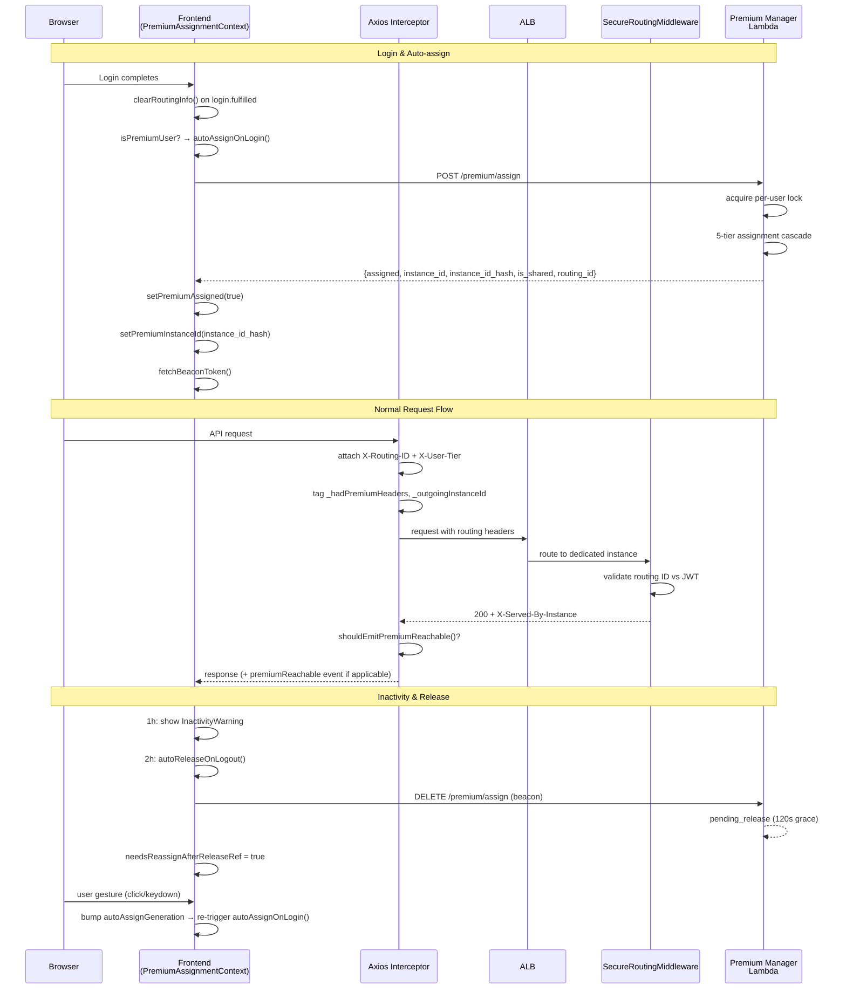
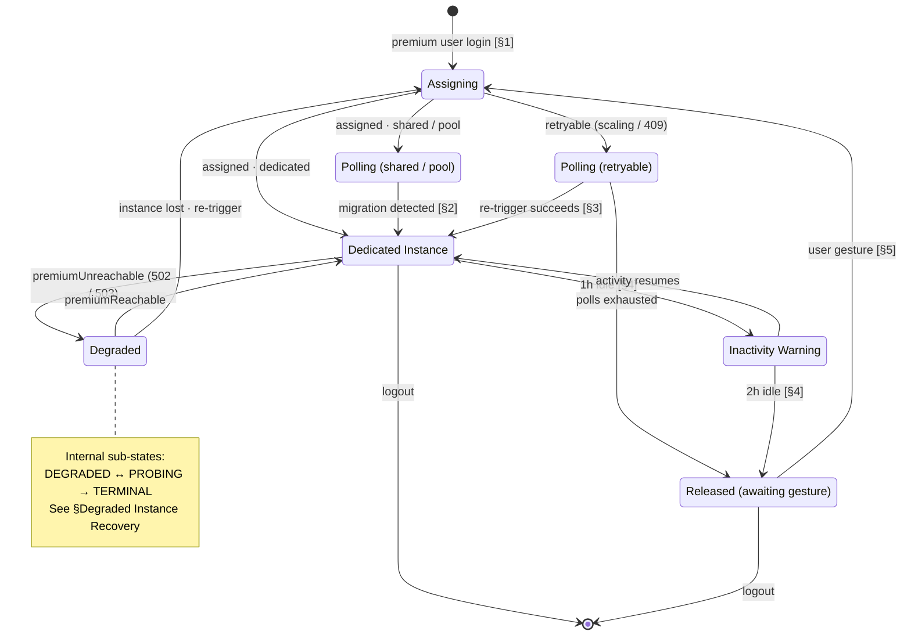
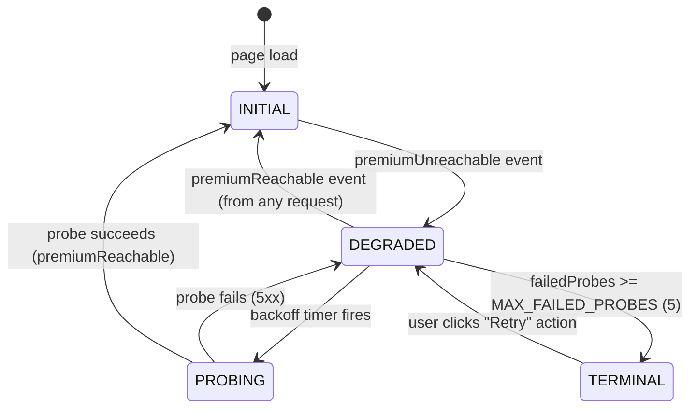

# Premium Routing Lifecycle

## Executive Summary

- **Premium Routing Lifecycle** covers the full end-to-end interaction between the frontend and backend for premium user instance assignment, routing, resilience, and release
- **Frontend assignment context** orchestrates auto-assign on login, status polling, migration detection, re-trigger after timeout, inactivity release, and cross-tab coordination
- **Concurrent assignment protection** uses per-user distributed locks (MySQL `GET_LOCK`) to prevent ALB corruption from simultaneous assign calls
- **Session boundary routing state management** ensures stale routing data is cleared on login and logout to prevent 403 loops and routing misdirection
- **Instance identity verification** uses `X-Served-By-Instance` (domain-separated HMAC) to detect ALB fallback to the shared backend
- **Degraded instance recovery** uses a half-open circuit breaker with exponential backoff to probe and re-arm premium routing after 503 failures

> **Sister documents:**
> - [PREMIUM_USER_ASSIGNMENT.md](./PREMIUM_USER_ASSIGNMENT.md) — Backend assignment flow (5-tier cascade, standby pool, migration, release paths)
> - [ALB_ROUTING_ARCHITECTURE.md](./ALB_ROUTING_ARCHITECTURE.md) — Routing ID generation, ALB rule matching, backend validation, 503 fallback mechanics
> - [PREMIUM_MANAGER_ARCHITECTURE.md](./PREMIUM_MANAGER_ARCHITECTURE.md) — Manager/Cleanup Lambda split, scheduled monitoring, scale-down
>
> This document focuses on the **frontend-backend interaction lifecycle** — the aspects that sit between the assignment flow and the routing architecture. It is the canonical reference for state transitions, guard conditions, and resilience mechanisms that span the frontend and backend.

---

## Terminology

| Term | Definition |
|------|-----------|
| **Auto-assign** | The automatic call to `POST /premium/assign` that fires on login for premium users |
| **Polling** | Periodic calls to `GET /premium/status` to detect migration from shared/pool to dedicated instance |
| **Re-trigger** | A mechanism that re-calls `POST /premium/assign` during polling when the original assign was retryable and no assignment exists |
| **Inactivity release** | Automatic release of premium instance after 2 hours of no user interaction |
| **Beacon release** | Release via `navigator.sendBeacon` on tab close or auto-release |
| **Pending release** | Server-side grace period (120s) after beacon release, allowing resumption |
| **Routing token** | `X-Routing-ID` header value — HMAC-SHA256(SECRET_KEY, UID)[:16] |
| **Instance identity** | `X-Served-By-Instance` header value — HMAC-SHA256("instance:" + SECRET_KEY, instance_id)[:16] |
| **Circuit breaker** | State machine in `PremiumAssignmentContext` that manages degraded/probing/terminal states when the dedicated instance is unreachable |
| **Tab leader** | The single tab (elected via `CrossTabLeaderElection`) responsible for polling and heartbeat; prevents thundering herd |
| **finalizeDedicatedAssignment** | Shared helper function that updates routing state, acquires beacon token, and resets polling cadence when a dedicated assignment is confirmed |

---

## Architecture Overview



---

## Responsibility Matrix

| Responsibility | Frontend (PremiumAssignmentContext) | Frontend (RoutingService) | Frontend (Axios Interceptor) | Frontend (UserSlice) | Backend (SecureRoutingMiddleware) | Backend (Premium Manager Lambda) |
|---|---|---|---|---|---|---|
| Auto-assign on login | Yes | — | — | — | — | — |
| Status polling & migration detection | Yes (leader tab only) | — | — | — | — | — |
| Re-trigger assign during polling | Yes | — | — | — | — | — |
| Inactivity detection & release | Yes | — | — | — | — | — |
| Reassignment after release | Yes | — | — | — | — | — |
| Cross-tab state coordination | Yes | — | — | — | — | — |
| Beacon token management | Yes | — | — | — | — | — |
| Cache routing headers | — | Yes (localStorage) | — | — | — | — |
| Gate header sending | — | Yes (`premiumAssigned`) | — | — | — | — |
| Store expected instance ID | — | Yes (`premiumInstanceId`) | — | — | — | — |
| Attach routing headers to requests | — | — | Yes | — | — | — |
| Detect ALB fallback | — | — | Yes (`shouldEmitPremiumReachable`) | — | — | — |
| 503 retry on free tier | — | — | Yes (`handlePremiumRoutingError`) | — | — | — |
| Clear routing state on login/logout | — | — | — | Yes (`clearRoutingInfo()`) | — | — |
| Generate routing ID | — | — | — | — | Yes | Yes |
| Generate instance hash | — | — | — | — | Yes | — |
| Validate routing ID vs JWT | — | — | — | — | Yes | — |
| Per-user assign lock | — | — | — | — | — | Yes |
| 5-tier assignment cascade | — | — | — | — | — | Yes |

---

## Frontend Assignment Lifecycle

The following state diagram shows the overall assignment lifecycle for a premium user. Each transition label references the subsection (§1–§5) where the detailed mechanics are described. The circuit breaker sub-states (DEGRADED / PROBING / TERMINAL) are documented separately in [§Degraded Instance Recovery](#1-state-machine).



### 1. Auto-assign on Login

**File:** `frontend/src/contexts/PremiumAssignmentContext.tsx`
**Function:** `autoAssignOnLogin()`

Auto-assign fires when a premium user's login completes and `hasAttemptedRef` is `false`. The function is wrapped in a `useEffect` with dependencies `[isPremiumUser, currentUser, autoAssignOnLogin, autoAssignGeneration]`.

**Flow:**

```
isPremiumUser && !hasAttemptedRef.current
  │
  ├─ Set hasAttemptedRef = true (synchronous, prevents re-entry)
  │
  ├─ Call getPremiumStatus()
  │   ├─ If assignment exists and is dedicated → finalize immediately
  │   └─ If no assignment or is shared → continue to assign
  │
  ├─ Call assignPremiumInstance()
  │   ├─ Success (assigned: true)
  │   │   ├─ setPremiumAssigned(true)
  │   │   ├─ setPremiumInstanceId(instance_id_hash)
  │   │   ├─ fetchBeaconToken()
  │   │   ├─ Persist SS_HAS_ATTEMPTED to sessionStorage
  │   │   └─ Start polling if is_shared
  │   │
  │   ├─ Success (assigned: false, scaling_in_progress)
  │   │   ├─ Mark as retryable
  │   │   └─ Start polling
  │   │
  │   └─ Failure
  │       └─ Do NOT persist SS_HAS_ATTEMPTED (allows retry on refresh)
  │
  └─ Error handling: catch and log, do not block login
```

**Guard conditions:**
- `hasAttemptedRef` (in-memory): prevents multiple calls within the same component lifecycle
- `SS_HAS_ATTEMPTED` (sessionStorage): persists across re-renders but not across tabs
- `autoAssignGeneration` (state): incremented after inactivity release to force `useEffect` re-fire

### 2. Status Polling and Migration Detection

**File:** `frontend/src/contexts/PremiumAssignmentContext.tsx`
**Effect:** `useEffect` with polling interval

Polling runs when the user has a shared/pool assignment or when the initial assign returned a retryable response. Only the **tab leader** polls (determined by `CrossTabLeaderElection`).

**Polling behavior:**

```
Every N seconds (exponential backoff: 1.5x, capped at 60s)
  │
  ├─ Capture releaseGenerationRef (stale closure detector)
  │
  ├─ Call getPremiumStatus()
  │
  ├─ Check releaseGenerationRef (abort if changed mid-flight)
  │
  ├─ If status.assignment exists and is dedicated:
  │   └─ finalizeDedicatedAssignment()
  │       ├─ setPremiumAssigned(true)
  │       ├─ setPremiumInstanceId(instance_id_hash)
  │       ├─ fetchBeaconToken()
  │       └─ Stop polling
  │
  ├─ If status.assignment is null and assignmentResult exists:
  │   └─ Re-trigger logic (see §3 below)
  │
  └─ Increment pollAttempts
      └─ If pollAttempts >= MAX_POLL_ATTEMPTS (40) and retryable:
          ├─ Reset hasAttemptedRef = false
          ├─ Clear SS_HAS_ATTEMPTED
          └─ Set needsReassignAfterReleaseRef = true
              (next user gesture will trigger fresh auto-assign)
```

### 3. Re-trigger Mechanism

**File:** `frontend/src/contexts/PremiumAssignmentContext.tsx`
**Constant:** `ASSIGN_RETRY_POLL_THRESHOLD = 3`

When polling detects `assignment: null` (the backend has no record of the user's assignment) and the original assign result exists, the polling loop periodically re-calls `assignPremiumInstance()` instead of only calling `getPremiumStatus()`.

This mechanism covers two scenarios:
- **Retryable assign:** The original assign returned `requires_retry: true` or `scaling_in_progress: true` (lock contention, Tier 5 scaling)
- **Instance loss:** The original assign succeeded (`assigned: true`) but the instance was subsequently stopped or terminated externally, causing the backend to delete the assignment row

**Trigger conditions (all must be true):**
1. `status.assignment` is null
2. The original assign result exists (`state.assignmentResult != null`)
3. `pollAttempts` is a multiple of `ASSIGN_RETRY_POLL_THRESHOLD` (3)
4. `retriggerCountRef.current < MAX_RETRIGGER_ATTEMPTS` (5)
5. `isRetriggeringRef.current === false` (no concurrent re-trigger in flight)

**On re-trigger success (assigned: true):**
- Call `finalizeDedicatedAssignment()` and stop polling

**On re-trigger failure:**
- Continue polling with backoff; increment `retriggerCountRef`

**Safety bounds:**
- Maximum 5 re-trigger attempts per unreachable period (`MAX_RETRIGGER_ATTEMPTS`)
- `retriggerCountRef` resets only when a confirmed `premiumReachable` event fires (i.e., `instanceUnreachable` transitions to `false`)
- After 5 attempts, the system falls back to status-only polling (no more `/assign` calls)
- `isRetriggeringRef` prevents overlapping assign calls
- `releaseGenerationRef` prevents stale closure resurrection: the poll callback captures the generation before its first `await` and bails on mismatch after each `await`, so a release event firing mid-flight cancels the re-trigger

### 4. Inactivity Detection and Auto-release

**File:** `frontend/src/contexts/PremiumAssignmentContext.tsx`
**Effect:** `checkInactivity` interval (every 30 seconds)

The inactivity monitor observes `lastActivity` across all tabs and fires on two thresholds, both from `PremiumTiming` in `const/Subscription.ts`:

| Threshold | Effect |
|-----------|--------|
| 1 hour | Surface the `InactivityWarning` snackbar, counting down the remaining 60 minutes |
| 2 hours | Call `autoReleaseOnLogout()` |

**What resets the inactivity clock:**

| Source | Mechanism |
|--------|-----------|
| Genuine user interaction (`pointerdown` / `keydown` / `scroll`) | A throttled listener calls `markLocalActivity()`, which advances `lastActivityTime` (frontend-local) and broadcasts it cross-tab. Throttled to once per minute to avoid state-update / broadcast spam. |
| Running workflow | While a pipeline run is in progress (`START_PENDING` / `START_SUCCESS`), each 30s `checkInactivity` tick treats the session as active, advancing the clock so the countdown only starts after the run finishes. Covers long unattended analyses with no direct input. |
| "Stay Active" button | `recordActivity()` — additionally sends a backend heartbeat and advances the clock. |

`markLocalActivity()` is frontend-local (no backend heartbeat): normal API traffic already keeps the backend's `last_activity` fresh, so the passive listener only needs to keep the frontend clock in sync with real activity.

> **Known degradation — stale `START_SUCCESS`.** The running-workflow guard keys off the Redux pipeline status, but the `START_SUCCESS → FINISHED` transition is only applied by `pollRunResult` polling, which is mounted only on the Workspace page (`useRunPipeline`). If the user starts a run and then navigates away before it completes, the frontend status stays `START_SUCCESS` until a reload or a new run, so `checkInactivity` keeps early-returning and the **frontend 2h soft-release never fires** for that session. This is not a permanent leak: the backend has an independent idle mechanism (`DEFAULT_IDLE_TIMEOUT_HOURS = 3` in `premium_manager.py`, driven by real-API-traffic `last_activity`), so a stuck session is reclaimed server-side — the instance is merely held up to ~3h instead of 2h before reconciliation. Combined with the soft-release nature, the impact is bounded. A more precise guard (gating on live `pollRunResult` freshness rather than on `START_SUCCESS` itself) is a possible follow-up.

**Release severity:** The 2h auto-release goes through the beacon endpoint (`POST /premium/release-beacon` → `release_premium_user(hard=False)`), which is a **soft release**: the assignment row is marked `pending_release`, ALB/TG stay intact for the grace period (`PENDING_RELEASE_GRACE_SECONDS`, 120s), and the EC2 instance is **not** stopped or terminated (no scale-down). So a false release is recoverable routing loss, not lost compute — a page refresh or the next gesture-triggered reassignment restores the same instance within the grace window. (A `hard=True` release, used by explicit logout/finalization, is what tears down ALB resources and scales down.)

**`autoReleaseOnLogout()` actions:**
1. Increment `releaseGenerationRef` (invalidates stale closures)
2. Call `DELETE /premium/assign` with beacon token
3. Clear `assignmentResult`, `beaconTokenRef`, warning state
4. Set `premiumAssigned = false`
5. Reset `hasAttemptedRef = false`
6. Set `needsReassignAfterReleaseRef = true`
7. Broadcast `PREMIUM_RELEASED` to peer tabs
8. Clear `SS_HAS_ATTEMPTED` from sessionStorage

**Cross-tab activity sync:**
- `recordActivity()` and `markLocalActivity()` both broadcast the new timestamp via `crossTabSync`
- `onActivityFromOtherTab()` listener updates `lastActivityTimeRef` so activity in any tab resets the inactivity timer for all tabs

> **Changing the thresholds:** `INACTIVITY_WARNING_MINUTES` and `INACTIVITY_RELEASE_MINUTES` are the only two places these live. The snackbar's countdown is derived as `release - warning`, so it cannot disagree with the auto-release time. The backend keeps its own idle reclaim (`DEFAULT_IDLE_TIMEOUT_HOURS` in `premium_manager.py`), which these do not move.

### 5. Reassignment After Release

**File:** `frontend/src/contexts/PremiumAssignmentContext.tsx`
**Ref:** `needsReassignAfterReleaseRef`

After inactivity auto-release, the user remains logged in but without premium compute resources. The reassignment mechanism works as follows:

1. `autoReleaseOnLogout()` sets `needsReassignAfterReleaseRef = true`
2. A DOM event listener (`pointerdown`/`keydown`) is installed, gated by `needsReassignAfterReleaseRef`
3. On the next user gesture:
   - `needsReassignAfterReleaseRef = false` (prevents repeated triggers)
   - `autoAssignGeneration` state is incremented
   - The `useEffect` dependency on `autoAssignGeneration` causes `autoAssignOnLogin()` to re-fire
4. `autoAssignOnLogin()` proceeds normally (check existing assignment, call `/assign`)

**Cross-tab coordination:**
- The `PREMIUM_RELEASED` broadcast handler in peer tabs calls `routingService.resetForRelease()` (clearing `routingToken`, `premiumAssigned`, and `premiumInstanceId` atomically) and sets `needsReassignAfterReleaseRef = true`
- Each tab independently waits for a user gesture before triggering reassignment

**Design rationale:**
- `needsReassignAfterReleaseRef` is separate from `hasAttemptedRef` to prevent the regression from PR #603 (6x duplicate `/assign` calls)
- DOM event listeners (not state changes) are used because state changes would trigger React re-renders; refs avoid the render cycle
- `autoAssignGeneration` forces the `useEffect` to re-fire because `isPremiumUser` and `currentUser` do not change when only the assignment is released

### 6. Cross-Tab Coordination

**File:** `frontend/src/contexts/PremiumAssignmentContext.tsx`

Cross-tab coordination uses three mechanisms:

| Mechanism | Purpose |
|-----------|---------|
| `CrossTabLeaderElection` | Only the leader tab polls for status and sends heartbeats, preventing thundering herd |
| `crossTabSync` broadcasts | State transitions are broadcast to peer tabs |
| `localStorage` events | Used by `CrossTabLeaderElection` for leader election and by `crossTabSync` for message passing |

**Broadcast events:**

| Event | Sender | Receiver Action |
|-------|--------|----------------|
| `PREMIUM_RELEASED` | Tab that fires auto-release | Clear assignment, reset flags, prime for gesture-triggered reassign |
| `PREMIUM_INSTANCE_UNREACHABLE` | Tab that detects 503 | Enter degraded state, show warning snackbar |
| `PREMIUM_INSTANCE_REACHABLE` | Tab where probe succeeds | Clear degraded state, dismiss warning |
| `PREMIUM_INSTANCE_PROBE_UPDATE` | Tab running probe | Sync probe count and backoff state |
| Activity heartbeat | Any tab with user interaction | Update `lastActivityTimeRef` in all tabs |

**Anti-echo rule:** Peer handlers apply state locally but do **not** re-broadcast, preventing echo loops.

---

## Concurrent Assignment Protection

### 1. Per-User Distributed Lock

**File:** `infrastructure/terraform/premium_manager_package/premium_manager.py`
**Function:** `assign_premium_user()` wrapper

When `POST /premium/assign` is called, the Lambda acquires a per-user distributed lock before executing the assignment logic:

```python
lock_name = f"assign_user_{user_id}"
with distributed_lock(lock_name, timeout=ASSIGN_LOCK_TIMEOUT_SECONDS) as acquired:
    if acquired:
        return _assign_premium_user_impl(user_id, event, user_uid)
    else:
        # Lock not acquired — check if winner completed
        existing = get_existing_user_assignment(user_id)
        if existing:
            return {statusCode: 200, body: existing}
        else:
            return {statusCode: 409, body: "retry"}
```

**Lock properties:**

| Property | Value |
|----------|-------|
| Lock backend | MySQL `GET_LOCK` (session-scoped) |
| Lock name | `assign_user_{user_id}` (per-user) |
| Lock timeout | 10 seconds (`ASSIGN_LOCK_TIMEOUT_SECONDS`) |
| Scope | Entire `_assign_premium_user_impl` |
| Connection | Dedicated MySQL connection (separate from application pool) |
| Release | Automatic via `RELEASE_LOCK` in `finally` block |

**Different users remain fully parallel** — the lock name includes the `user_id`, so concurrent assignments for different users do not contend.

### 2. 409 Conflict Handling

**File:** `studio/app/common/core/premium/premium_assignment_service.py`

When the Lambda returns 409 (lock timeout):

```python
return {
    "success": False,
    "message": "Another assignment in progress. Please retry.",
    "requires_retry": True,
    "retry_after": 5,  # seconds
}
```

The frontend receives `requires_retry: True` and enters the polling + re-trigger flow (see §3 above). The re-trigger mechanism periodically re-calls `/assign` during polling, which will either:
- Acquire the lock (previous invocation has completed) and perform a fresh assignment
- Find an existing assignment created by the previous invocation and return it

### 3. Rate Limiting

**File:** `studio/app/common/core/premium/premium_assignment_service.py`

The service layer applies a 30-second rate limit per user to prevent rapid assignment attempts. This is separate from the distributed lock:

| Scenario | Rate Limited? | Lock Acquired? |
|----------|---------------|----------------|
| Normal first assign | No | Yes |
| Rapid retry (<30s) | Yes (blocked) | N/A |
| 409 from lock contention | No (bypassed) | No |
| Lambda timeout | No (cache cleared on error) | N/A |

---

## Session Boundary Routing State Management

### 1. Login

**File:** `frontend/src/store/slice/User/UserSlice.ts`

On `login.fulfilled` / `proxyLogin.fulfilled`:

```
1. routingService.clearRoutingInfo()    ← Clears all stale routing state
2. saveToken(accessToken, refreshToken) ← Stores new auth tokens
3. (later) getMe.fulfilled → routingService.updateRoutingInfo(user) ← Sets tier
```

The `clearRoutingInfo()` call ensures that stale routing data from a previous session (possibly for a different user) is wiped before the new session begins. This prevents:
- Free users receiving 403 from stale premium routing IDs (#659)
- New premium users sending the previous user's routing ID

### 2. Logout

**File:** `frontend/src/store/slice/User/UserSlice.ts`

On logout:

```
1. setLoggingOut(true)                  ← Block token refresh during logout
2. Clear auth tokens from localStorage
3. routingService.clearRoutingInfo()    ← Wipes all routing state
4. logoutGeneration++                   ← Invalidates stale closures
5. setLoggingOut(false)
```

### 3. Tab Close

**File:** `frontend/src/contexts/PremiumAssignmentContext.tsx`

On `beforeunload`:

```
1. navigator.sendBeacon(DELETE /premium/assign, beaconToken)
2. (No clearRoutingInfo — browser is closing, localStorage will persist)
```

The stale localStorage data from the beacon path is handled by the login-time `clearRoutingInfo()` when the user next opens the app.

### 4. Page Reload (No Login/Logout)

On page reload (F5 / browser refresh), no session boundary event fires:
- `login.fulfilled` does not dispatch → `clearRoutingInfo()` is not called
- localStorage routing state survives (`routing_id`, `premium_assigned`, `routing_tier`, `premium_instance_id`)
- In-memory `routingInfo` is lost (null until the next `/users/me` response)

This means `getRoutingHeaders()` will immediately attach routing headers from localStorage, even if the dedicated instance is no longer available (e.g., after a system restart where the ALB target group has no healthy targets).

Two safeguards address this:
1. **`requiresPremiumRouting()` considers localStorage state** — The 503 fallback gate (`handlePremiumRoutingError`) activates when either `routingInfo.requires_premium_routing` is true OR `premiumAssigned && routingToken` are set from localStorage. This ensures the fallback fires on the first 503 after page reload, stripping routing headers and retrying on the shared backend. (Introduced in [PR #716](https://github.com/arayabrain/araya-optinist/pull/716) for [#715](https://github.com/arayabrain/araya-optinist/issues/715))
2. **System-information endpoints skip routing** — `/is_standalone` (the first endpoint called on app load) sets `_retryWithoutPremium: true` at the call site, ensuring it always reaches the shared backend regardless of localStorage routing state. (Introduced in [PR #716](https://github.com/arayabrain/araya-optinist/pull/716))

### 5. `clearRoutingInfo()` vs `resetForRelease()` Scope

**File:** `frontend/src/utils/routing/RoutingService.ts`

Two cleanup methods exist with different scopes, used at different lifecycle boundaries:

**`clearRoutingInfo()`** — used on login and logout (full session boundary):

| Key | Description |
|-----|-------------|
| `routing_id` | The HMAC routing token |
| `user_tier` | "premium" or "free" |
| `premium_assigned` | Whether routing headers should be sent |
| `premium_instance_id` | Expected instance hash for fallback detection |
| `premium_unreachable_snapshot` | Persisted circuit breaker state |

**`resetForRelease()`** — used on inactivity release and cross-tab `PREMIUM_RELEASED` (within-session release):

| Key | Description |
|-----|-------------|
| `routing_id` | The HMAC routing token |
| `premium_assigned` | Whether routing headers should be sent |
| `premium_instance_id` | Expected instance hash for fallback detection |

`resetForRelease()` does **not** clear `user_tier` or `premium_unreachable_snapshot` because the user remains logged in as a premium user and the circuit breaker state may still be relevant. The method was introduced (PR #703) to atomically clear all three routing fields, preventing the cross-tab deadlock where partial cleanup left the receiving tab in a `(premiumAssigned=true, token=null)` state with no exit.

---

## Instance Identity Verification

### 1. `X-Served-By-Instance` Header

**File:** `studio/app/common/core/middleware/secure_routing_middleware.py`

Every authenticated response includes an `X-Served-By-Instance` header containing a domain-separated HMAC hash of the EC2 instance ID:

```python
instance_hash = HMAC-SHA256("instance:" + SECRET_KEY, INSTANCE_ID)[:16]
```

**Design decisions:**
- **HMAC hash instead of raw EC2 instance ID:** Prevents exposing infrastructure topology in browser DevTools
- **Domain-separated key** (`"instance:" + secret_key`): Ensures the output never collides with routing IDs generated by `generate_routing_id()` (which uses the raw `secret_key`)
- **Per-response (not per-session):** The header is generated on every response, allowing real-time detection of ALB fallback
- **Cached per process:** The hash is computed once per instance and cached, avoiding HMAC computation on every request

### 2. `shouldEmitPremiumReachable()`

**File:** `frontend/src/utils/axios.ts`

A pure function that determines whether a successful response confirms the dedicated instance is reachable. Returns `true` only when all four conditions are met:

```
1. _hadPremiumHeaders     — Request carried premium routing headers
2. Routing ID not rotated — Response routing ID matches the one sent
3. Instance ID known      — premiumInstanceId is not null
4. Instance ID matches    — X-Served-By-Instance matches premiumInstanceId
```

**Condition 3 (instance ID known):** When `premiumInstanceId` is `null` (assignment API has not yet returned), the function returns `false`. This closes the startup race gap where a response from any instance could falsely signal reachability. The unreachable state machine starts in `initial` state on page load, so this does not cause false negatives.

### 3. `isInstanceMismatch()`

**File:** `frontend/src/utils/axios.ts`

A pure function that detects when a successful (200 OK) response came from the wrong instance — indicating ALB fallback after EventBridge cleanup deleted the per-user rule and target group. This is the **active detection** counterpart to `shouldEmitPremiumReachable()`, which provides passive detection only (suppressing the reachable signal without triggering recovery).

Returns `true` only when all four conditions are met:

```
1. _hadPremiumHeaders     — Request carried premium routing headers
2. _outgoingInstanceId    — Expected instance ID was known at request time
3. x-served-by-instance   — Header is present (typeof === "string")
4. Instance ID differs    — x-served-by-instance ≠ _outgoingInstanceId
```

**When `true`:** The success interceptor calls `setPremiumAssigned(false)` and emits `premiumUnreachable`, triggering the existing recovery flow (polling `/status` + `/assign`). The original 200 OK response is still returned to the caller — no retry is needed since the response data is valid.

**Relationship with `shouldEmitPremiumReachable()`:** The two functions share guard conditions but differ in their third check:
- `shouldEmitPremiumReachable`: instance matches → emit reachable (positive confirmation)
- `isInstanceMismatch`: instance differs → emit unreachable (active detection)

The `else if` structure in the interceptor ensures they are mutually exclusive: `isInstanceMismatch` is only evaluated when `shouldEmitPremiumReachable` returns `false`.

**Warm-up grace compatibility:** If `isInstanceMismatch` fires during a shared → dedicated handoff (the 15s `DEDICATED_HANDOFF_GRACE_MS` window), the `useInstanceUnreachableMachine` listener absorbs the unreachable event as a single-shot warm-up grace — the same behavior as a transient 502 during handoff.

(Introduced in [PR #710](https://github.com/arayabrain/araya-optinist/pull/710) for [#709](https://github.com/arayabrain/araya-optinist/issues/709))

### 4. ALB Fallback Detection

When a premium user's dedicated instance is down:

```
1. ALB routes to dedicated instance → 503
2. Axios strips headers, retries on free tier → 200 from shared backend
3. Shared backend attaches X-Served-By-Instance (its own hash)
4. shouldEmitPremiumReachable():
   - Instance ID matches? NO (shared hash ≠ dedicated hash)
   - Returns false → premiumReachable NOT emitted
5. Circuit breaker remains in DEGRADED state
```

Without instance identity verification, step 4 would return `true` (routing IDs are UID-based and identical across all backends), falsely clearing the degraded state.

---

## Auto-recovery After Instance Loss

When a premium user's assigned EC2 instance is stopped or terminated externally (outside the normal release/inactivity flow), the system automatically detects the loss and re-triggers assignment. Detection uses two complementary paths depending on timing:

**Detection chain A — 502/503 path (cleanup NOT yet complete):**
```
1. EC2 stopped/terminated externally
2. Next API request arrives BEFORE EventBridge cleanup
3. ALB per-user rule still exists → routes to dedicated → 502/503
4. Axios handlePremiumRoutingError() → free-tier fallback retry + emitPremiumUnreachable
5. Circuit breaker enters DEGRADED state, warning snackbar shown
6. Backend cleanup deletes the premium_user_assignments row
   - Stopped: lazily by get_premium_user_status() on next status poll
   - Terminated: eagerly by EventBridge → cleanup Lambda (~2s)
7. Next status poll → getPremiumStatus() returns assignment: null
8. Re-trigger mechanism fires (assignmentResult != null, assignment is null)
9. POST /premium/assign → fresh 5-tier cascade → new instance assigned
10. finalizeDedicatedAssignment() → routing restored, snackbar dismissed
```

**Detection chain B — 200 OK mismatch path (cleanup already complete):**
```
1. EC2 terminated externally
2. EventBridge cleanup completes (~2s): deletes ALB rule, TG, DB row
3. Next API request arrives AFTER cleanup
4. ALB has no per-user rule → falls through to free-tier TG → 200 OK
5. Axios success interceptor: isInstanceMismatch() detects x-served-by-instance ≠ expected
6. setPremiumAssigned(false) + emitPremiumUnreachable
7. Circuit breaker enters DEGRADED state, warning snackbar shown
8. Original 200 OK response returned to caller (no retry needed)
9. Next status poll → getPremiumStatus() returns assignment: null
10. Re-trigger mechanism fires → POST /premium/assign → new instance assigned
11. finalizeDedicatedAssignment() → routing restored, snackbar dismissed
```

Chain A was introduced in PR #704 (for #628). Chain B was introduced in PR #710 (for #709) to close the detection gap when EventBridge cleanup completes before the user's next request.

**Page reload coverage:** Chain A also covers the scenario where a premium user reloads the page after a system restart (ALB target group unhealthy). On page reload, `routingInfo` is null but `premiumAssigned` and `routingToken` survive in localStorage. `requiresPremiumRouting()` considers both state sources, so the `handlePremiumRoutingError` gate activates correctly. Additionally, `/is_standalone` (the first endpoint on app load) sets `_retryWithoutPremium` at the call site, bypassing routing headers entirely. (Introduced in [PR #716](https://github.com/arayabrain/araya-optinist/pull/716) for [#715](https://github.com/arayabrain/araya-optinist/issues/715); see also [Session Boundary §4](#4-page-reload-no-loginlogout))

**Key distinction from the retryable-assign re-trigger:** The original re-trigger mechanism (PR #701) was designed for cases where the initial assign failed to create an assignment (e.g., lock contention 409). The instance-loss re-trigger (PR #704) extends this to cases where the assign initially succeeded (`assigned: true`) but the assignment was later invalidated by external instance loss.

**Same-id restart:** When the backend restarts the same instance (e.g., `assignment_source: "restarted_instance"`), the `instanceUnreachable` state remains `true` until a real premium 200 response passes `shouldEmitPremiumReachable()`. The snackbar persists during the warm-up period to avoid flashing.

**Warm-up grace suppression:** A 502 received within the `DEDICATED_HANDOFF_GRACE_MS` (15s) after assignment is suppressed and does not trigger the degraded state. This is self-correcting: the next 502 outside the grace window fires the circuit breaker normally.

---

## Degraded Instance Recovery (Circuit Breaker)

### 1. State Machine

**File:** `frontend/src/contexts/PremiumAssignmentContext.tsx`
**Function:** `unreachableMachineReducer()`



| State | premiumAssigned | Snackbar | User Impact |
|-------|----------------|----------|-------------|
| INITIAL | true | None | Full premium routing |
| DEGRADED | false (re-armed true for probe) | Warning with countdown | Traffic falls back to free tier |
| PROBING | true | Warning (probe in flight) | Next request is a probe |
| TERMINAL | false | Warning with "Retry" action | Traffic on free tier; manual retry only |

### 2. Half-Open Probe

When the circuit breaker enters DEGRADED state:
1. A probe timer starts with exponential backoff (30s → 60s → 120s → 300s → 300s)
2. On timer fire, `premiumAssigned` is re-armed to `true`
3. The next user-driven API request carries premium headers (the probe)
4. If the response passes `shouldEmitPremiumReachable()`:
   - `premiumReachable` emitted → INITIAL state → degraded state cleared
5. If the response is 5xx:
   - Probe failure counted → back to DEGRADED with longer backoff

**Stale-failure watermark:** Failures whose send timestamp (`_premiumSentAt`) predates the last successful `premiumReachable` are suppressed. This prevents an in-flight 5xx from reopening an already-recovered state.

### 3. Cross-Tab State Sync

Circuit breaker state transitions are broadcast via `crossTabSync`:
- `PREMIUM_INSTANCE_UNREACHABLE`: All tabs enter DEGRADED
- `PREMIUM_INSTANCE_REACHABLE`: All tabs return to INITIAL
- `PREMIUM_INSTANCE_PROBE_UPDATE`: Sync probe count and backoff

**Snapshot recovery:** A freshly opened tab hydrates from a `localStorage` snapshot (`premium_unreachable_snapshot`, 1h TTL) gated on `instance_id` match so a snapshot from a prior assignment cannot be adopted.

---

## Guard Reference

| Guard | Type | Location | Set | Reset | Purpose |
|-------|------|----------|-----|-------|---------|
| `hasAttemptedRef` | `useRef` | PremiumAssignmentContext | Synchronously on `autoAssignOnLogin()` entry | On inactivity release, on `MAX_POLL_ATTEMPTS` exhaustion (retryable) | Prevents duplicate auto-assign calls within one mount cycle |
| `SS_HAS_ATTEMPTED` | sessionStorage | PremiumAssignmentContext | On successful assign only | On inactivity release, on `MAX_POLL_ATTEMPTS` exhaustion (retryable) | Persists across re-renders; prevents retry after successful assign on same tab |
| `needsReassignAfterReleaseRef` | `useRef` | PremiumAssignmentContext | On inactivity release, on `MAX_POLL_ATTEMPTS` exhaustion (retryable), on cross-tab `PREMIUM_RELEASED` | On DOM gesture when ref is true | Separates "needs reassign after release" from "initial mount"; triggers reassign on next user gesture |
| `autoAssignGeneration` | `useState` | PremiumAssignmentContext | Incremented on DOM gesture when `needsReassignAfterReleaseRef` is true | Never reset (monotonic) | Forces `useEffect` re-fire by changing dependency array |
| `releaseGenerationRef` | `useRef` | PremiumAssignmentContext | Incremented on every release path | Never reset (monotonic) | Detects stale closure resurrection: async callbacks compare captured value against current value |
| `retriggerCountRef` | `useRef` | PremiumAssignmentContext | Incremented on each re-trigger attempt | Reset only when `premiumReachable` event fires (`instanceUnreachable` → `false`) | Caps re-trigger attempts at `MAX_RETRIGGER_ATTEMPTS` (5); after exhaustion, falls back to status-only polling |
| `isRetriggeringRef` | `useRef` | PremiumAssignmentContext | Set `true` before re-trigger call | Set `false` after re-trigger completes | Prevents overlapping assign calls during polling |
| `premiumAssigned` | localStorage | RoutingService | `setPremiumAssigned(true)` on successful assign or probe arm | `setPremiumAssigned(false)` on release, 503 fallback, logout, or `resetForRelease()` | Controls whether axios attaches routing headers |
| `premiumInstanceId` | localStorage | RoutingService | `setPremiumInstanceId(hash)` from assign/status API responses | `clearRoutingInfo()` on login/logout | Expected instance hash for ALB fallback detection |
| `_retryWithoutPremium` | axios config | axios.ts | Set on 502/503 premium routing error; also set at call site for system-information endpoints (e.g. `/is_standalone`) | Per-request (not persisted) | Prevents routing header injection on free-tier retry and on endpoints that must always reach the shared backend |
| `_hadPremiumHeaders` | axios config | axios.ts | Set when routing headers are attached to request | Per-request (not persisted) | Tags request for response-side reachability check |
| `logoutGeneration` | Redux state | UserSlice | Incremented on logout | Never reset (monotonic) | Invalidates all closures captured before logout |

---

## Configuration Reference

### Frontend Constants

**File:** `frontend/src/const/Subscription.ts`

| Constant | Value | Purpose |
|----------|-------|---------|
| `RoutingHeaders.ROUTING_ID` | `"X-Routing-ID"` | Routing token header name |
| `RoutingHeaders.USER_TIER` | `"X-User-Tier"` | User tier header name |
| `RoutingHeaders.SERVED_BY_INSTANCE` | `"X-Served-By-Instance"` | Instance identity header name |
| `INACTIVITY_WARNING_MINUTES` / `INACTIVITY_RELEASE_MINUTES` | `60` / `120` | Idle thresholds; their difference is the countdown shown in the warning snackbar |

**File:** `frontend/src/contexts/PremiumAssignmentContext.tsx`

| Constant | Value | Purpose |
|----------|-------|---------|
| `MAX_POLL_ATTEMPTS` | `40` | Maximum polling iterations before giving up |
| `ASSIGN_RETRY_POLL_THRESHOLD` | `3` | Re-trigger assign every N polls when retryable |
| `MAX_RETRIGGER_ATTEMPTS` | `5` | Maximum re-trigger attempts per unreachable period |
| `MAX_FAILED_PROBES` | `5` | Maximum circuit breaker probes before TERMINAL |
| `DEDICATED_HANDOFF_GRACE_MS` | `15000` (15s) | Suppress 502 circuit breaker during post-assignment warm-up |
| Inactivity warning threshold | `1 hour` | `PremiumTiming.INACTIVITY_WARNING_MINUTES`, read in `checkInactivity` |
| Inactivity release threshold | `2 hours` | `PremiumTiming.INACTIVITY_RELEASE_MINUTES`, read in `checkInactivity` |

### Backend Constants

**File:** `infrastructure/terraform/premium_manager_package/premium_manager.py`

| Constant | Value | Purpose |
|----------|-------|---------|
| `ASSIGN_USER_LOCK_PREFIX` | `"assign_user_"` | Per-user lock naming prefix |
| `ASSIGN_LOCK_TIMEOUT_SECONDS` | `10` | Lock timeout for concurrent assign protection |
| `LOCK_TIMEOUT_SECONDS` | `60` | Default lock timeout for other operations |

**File:** `infrastructure/aws_constants.py`

| Constant | Value | Purpose |
|----------|-------|---------|
| `PENDING_RELEASE_GRACE_SECONDS` | `120` | Pending release grace window |

**File:** `studio/app/common/core/premium/premium_assignment_service.py`

| Constant | Value | Purpose |
|----------|-------|---------|
| Rate limit window | `30 seconds` | Minimum interval between assign attempts per user |
| 409 retry delay | `5 seconds` | Suggested retry delay on lock contention |

---

## Known Limitations

### Improvement Targets

Items with planned improvements. See [PREMIUM_ROUTING_RETROSPECTIVE_v1.1.9.md § Recommendations](https://github.com/arayabrain/araya-optinist/issues/667#issuecomment-4828783333) for the corresponding action plans.

1. **Lock scope is broader than necessary.** The entire `_assign_premium_user_impl` runs under the distributed lock, including instance boot waits (up to 6 minutes). Narrowing the lock to the critical section (orphan TG cleanup + ALB rule creation) would reduce lock hold time and 409 frequency. A more fundamental alternative is replacing `GET_LOCK` with DB state-based locking (`reserving` status in `premium_user_assignments`), which also eliminates the extra DB connection, lock fall-off risk, and non-environment-scoped lock name issues. (Introduced in [PR #658](https://github.com/arayabrain/araya-optinist/pull/658) for [#630](https://github.com/arayabrain/araya-optinist/issues/630); DB state-based alternative proposed in [PR #658 review](https://github.com/arayabrain/araya-optinist/pull/658#issuecomment-4767821077); → [Recommendation #2](https://github.com/arayabrain/araya-optinist/issues/667#issuecomment-4828783333))

2. **No idempotency key for assign requests.** The assign API does not accept a client-generated idempotency key. Duplicate invocations are handled by the distributed lock (serialization) rather than by idempotent processing. (Lock-based serialization introduced in [PR #658](https://github.com/arayabrain/araya-optinist/pull/658) for [#630](https://github.com/arayabrain/araya-optinist/issues/630); → [Recommendation #5](https://github.com/arayabrain/araya-optinist/issues/667#issuecomment-4828783333))

3. **`PremiumAssignmentContext` complexity.** The context manages assignment lifecycle, polling, re-trigger, inactivity, cross-tab sync, and circuit breaker in a single component with multiple interacting refs. Future changes carry a high regression risk. An explicit state machine (e.g., `useReducer`-based) would reduce this risk. (Complexity grew through PRs [#649](https://github.com/arayabrain/araya-optinist/pull/649), [#656](https://github.com/arayabrain/araya-optinist/pull/656), [#701](https://github.com/arayabrain/araya-optinist/pull/701), [#703](https://github.com/arayabrain/araya-optinist/pull/703), [#704](https://github.com/arayabrain/araya-optinist/pull/704), [#710](https://github.com/arayabrain/araya-optinist/pull/710); → [Recommendation #3](https://github.com/arayabrain/araya-optinist/issues/667#issuecomment-4828783333))

4. **`handlePremiumRoutingError` global scope.** A single 502/503 response triggers `setPremiumAssigned(false)` globally, dropping all concurrent and subsequent requests to the free tier. During ALB target-group propagation (where 502s are transient), the status poll re-sets `premiumAssigned=true`, causing a flip-flop cycle. The routing token value is invariant (UID-based HMAC, identical on all backends), so the token itself is not the source of mis-routing — the global `premiumAssigned` toggle is. Scoping the fallback to per-request (via `_retryWithoutPremium` without touching global state) or adding hysteresis would eliminate the flip-flop. (Identified in [PR #703](https://github.com/arayabrain/araya-optinist/pull/703) review — [comment](https://github.com/arayabrain/araya-optinist/pull/703#issuecomment-4786044772); → [Recommendation #3](https://github.com/arayabrain/araya-optinist/issues/667#issuecomment-4828783333))

5. **Non-environment-scoped lock names.** Lock names (`assign_user_{user_id}`, `CREATE_STANDBY_LOCK`, etc.) do not include an environment prefix. If multiple environments share the same RDS instance, locks for the same user ID or operation would collide across environments. Currently low risk (non-standard configuration). (Identified in [PR #658](https://github.com/arayabrain/araya-optinist/pull/658) review Point #7; naturally resolved by DB state-based locking — see item #1 above)

### Accepted Constraints

Design trade-offs with known impact boundaries. No corresponding improvement is planned because the impact is minimal or the behavior is intentionally self-correcting.

1. **Startup race gap.** During the brief window between login and the first `/premium/assign` response, `premiumInstanceId` is null and `shouldEmitPremiumReachable()` returns `false`. This means the circuit breaker cannot detect recovery during this window. The practical impact is minimal (seconds-long window). (Instance identity introduced in [PR #649](https://github.com/arayabrain/araya-optinist/pull/649) for [#566](https://github.com/arayabrain/araya-optinist/issues/566))

2. **Warm-up grace suppression delay.** A 502 received within `DEDICATED_HANDOFF_GRACE_MS` (15s) after a new assignment is suppressed to avoid triggering the circuit breaker during instance warm-up. If the instance is genuinely unreachable, detection is delayed until the next 502 outside the grace window. This is self-correcting and the practical delay is at most 15 seconds. (Grace window introduced in [PR #704](https://github.com/arayabrain/araya-optinist/pull/704) for [#628](https://github.com/arayabrain/araya-optinist/issues/628))
