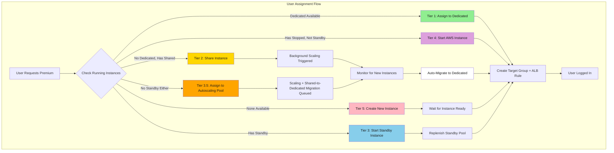
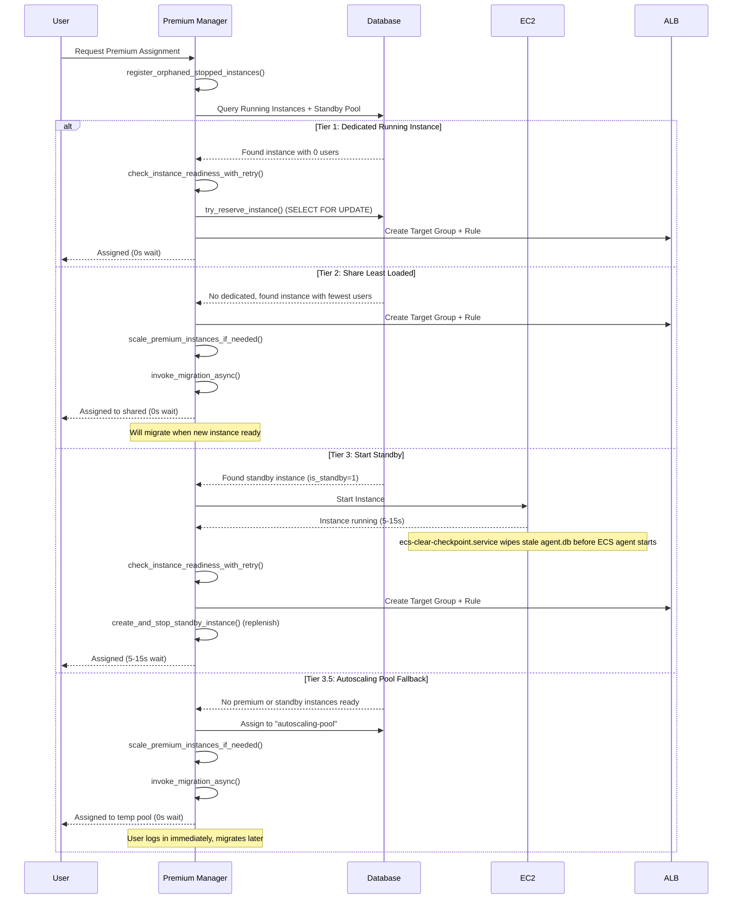
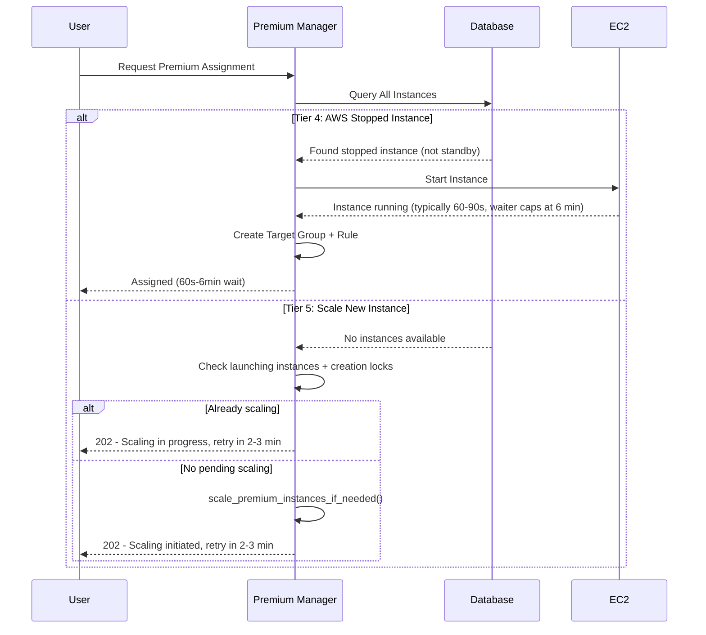
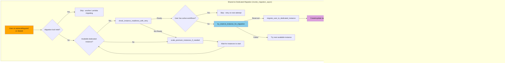
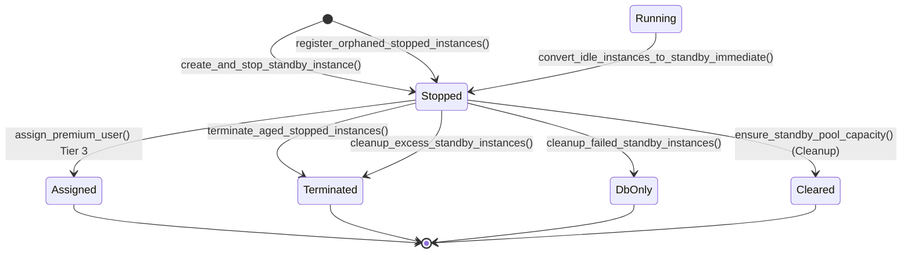

# Premium Manager Provisioning: Multi-Tier Assignment Strategy

## Executive Summary
- **Premium Manager** handles all instance provisioning and user assignment
- **5-tier prioritization** (with a 3.5 sub-tier fallback) optimizes user experience and cost
- **Standby pool** ensures fast cold starts via stopped instances
- **Automatic migration** moves users from shared to dedicated instances, inline when possible and async otherwise
- **Workflow safety** prevents migration of users with active workflows

> **Sister documents:**
> This file focuses on the **assignment flow** — 5-tier priority cascade,
> standby pool, migration, and release paths.
> - For the **system architecture** — Manager / Cleanup Lambda split,
>   frontend lifecycle, and log playbook — see
>   [PREMIUM_MANAGER_ARCHITECTURE.md](./PREMIUM_MANAGER_ARCHITECTURE.md).
> - For the **frontend-backend interaction lifecycle** — auto-assign,
>   polling, re-trigger, inactivity release, concurrent assignment
>   protection, session boundary state management, instance identity
>   verification, and circuit breaker — see
>   [PREMIUM_ROUTING_LIFECYCLE.md](./PREMIUM_ROUTING_LIFECYCLE.md).

## Key Architectural Principles

1. **Priority-Based Assignment**
   - Tier 1: Dedicated running instances (0s wait)
   - Tier 2: Shared instances for immediate login (0s wait)
   - Tier 3: Standby instances (5-15s startup)
   - Tier 3.5: Autoscaling pool as temporary fallback (0s wait, only if no standby)
   - Tier 4: AWS stopped instances fallback (60-90s startup)
   - Tier 5: Scale new instances (4-8 minutes)

2. **User Experience First**
   - Users get dedicated instance from standby pool when available (5-15s)
   - Falls back to autoscaling pool only when no standby instances exist
   - Async migration to dedicated premium instance from shared/pool
   - No user-visible delays or retry loops

3. **Standby Pool Management**
   - Maintains pool of stopped instances for fast startup
   - Tracked via `is_standby = 1` flag in `premium_user_assignments` table
   - Distributed locking (MySQL `GET_LOCK`) prevents duplicate creations
   - Automatic replenishment when standby consumed
   - Orphaned stopped instances auto-registered as standby

4. **Intelligent Scaling**
   - Conservative algorithm: keeps `active_users + 1` instances
   - Shared assignments trigger background scaling
   - Checks distributed locks to avoid duplicate scaling
   - Auto-migration when new instances become ready
   - Workflow-safe: skips users with active workflows

## Architecture Overview



> **Color key:** 🟢 Tier 1 (Dedicated) · 🟡 Tier 2 (Shared) ·
> 🔵 Tier 3 (Standby) · 🟠 Tier 3.5 (Autoscaling) ·
> 🟣 Tier 4 (Stopped) · 🔴 Tier 5 (New) ·
> ⚪ Auto-Migrate

### Assignment Priority Matrix

| Tier | Source | Wait Time | User Experience | Cost | Use Case | Reachability |
|------|--------|-----------|-----------------|------|----------|--------------|
| 1 | Dedicated Running | 0s | Best (exclusive) | Highest | Active user pool | Reachable |
| 2 | Shared Instance | 0s | Good (shared, migrates) | Medium | Burst capacity | Reachable |
| 3 | Standby (Stopped) | 5-15s | Good (warming) | Low | Premium provisioning / re-login | Reachable |
| 3.5 | Autoscaling Pool | 0s | Temporary (migrates) | Low | Last-resort fallback (no standby) | Reachable (always succeeds when reached -- see Precedence & Reachability Notes below) |
| 4 | AWS Stopped | 60s-6min | Acceptable | Low | Defensive fallback | **Unreachable on the happy path** -- `register_orphaned_stopped_instances()` absorbs stopped instances into Tier 3 before the cascade runs |
| 5 | New Instance | 4-8 min | Poor (scaling) | Highest | Last resort | Reachable only when Tier 3.5 is skipped (i.e. no stopped / pending / running capacity at all); returns HTTP 202, client retries from Tier 1 |

#### Precedence & Reachability Notes

The flowchart above shows the six tiers as parallel branches, but the
code evaluates them **sequentially** as a fallthrough cascade. Three
properties of that cascade are not obvious from the diagram alone:

- **Tier 2 wins unconditionally over Tier 3** when both are viable.
  The rationale is **immediacy over exclusivity**: a 0-second shared
  assignment (plus a background scale-up to dedicated) is preferred to
  a 5-15s standby start, because the user is unblocked immediately and
  async migration will move them to a dedicated instance when capacity
  arrives.

- **Tier 4 is unreachable on the happy path.** The pre-cascade call to
  `register_orphaned_stopped_instances()` adopts any AWS-stopped
  instance into the standby pool (Tier 3) before the cascade runs, so
  the Tier 4 candidate list is empty during normal operation. Tier 4
  exists only as a defensive fallback if adoption itself failed.

- **Tier 5 never returns HTTP 200.** It returns HTTP 202 (with
  `retry_after`) when scaling is in progress or was just initiated,
  and HTTP 503 only when scaling is blocked. A 202 directs the client
  to retry, and the retry re-enters the cascade from Tier 1 -- there
  is no server-side wait-queue or reserved slot for the retrying user.

For the code-level walkthrough with line-level references to where each
of these properties is enforced, see **Tier Cascade: Precedence &
Reachability** under *Implementation Details > `assign_premium_user()`*.

### Responsibility Matrix

This document covers one Lambda -- the Premium Manager -- acting across several subsystems. The table below maps each concern to the function family that owns it, to make it clear where to look for a given behavior.

| Concern                              | Owning subsystem                              | Key functions                                                                           |
|--------------------------------------|-----------------------------------------------|-----------------------------------------------------------------------------------------|
| Real-time user assignment            | Assignment handler                            | `assign_premium_user()`, `try_reserve_instance()`, `store_user_assignment()`            |
| Standby pool lifecycle               | Standby pool management                       | `create_and_stop_standby_instance()`, `start_standby_instance()`, `register_orphaned_stopped_instances()` |
| Capacity scaling (up)                | Scaling system                                | `scale_premium_instances_if_needed()`, `_create_running_instances_locked()`             |
| Shared-to-dedicated migration        | Shared-to-dedicated migration                 | `process_shared_instance_optimization()`, `migrate_user_to_dedicated_instance()`, `invoke_migration_async()` |
| Concurrency / race prevention        | Locking                                       | `distributed_lock()` (MySQL `GET_LOCK`), `try_reserve_instance_transaction()` (`SELECT FOR UPDATE`), `is_creation_lock_held()` |
| Scale-down + ghost / orphan cleanup  | Scheduled monitoring (see [PREMIUM_MANAGER_ARCHITECTURE.md](./PREMIUM_MANAGER_ARCHITECTURE.md)) | `handle_scheduled_monitoring()`, [`scale_down_if_possible()`](./PREMIUM_MANAGER_ARCHITECTURE.md#scale-down-scale_down_if_possible) |
| Stale assignment + ALB rule hygiene  | Premium Cleanup Lambda (separate)             | See [PREMIUM_MANAGER_ARCHITECTURE.md](./PREMIUM_MANAGER_ARCHITECTURE.md)               |

## Provisioning Flow Diagrams

### Priority 1-3: Fast Path (< 15 seconds)



### Priority 4-5: Slow Path (> 60 seconds)



### Shared-to-Dedicated Migration Flow



---

## Glossary / Key Concepts

This section is the shared vocabulary used throughout the premium assignment
documentation. Later sections reference these definitions rather than
redefining them. When writing or reading test cases for the assignment
system, each row in the tables below is a candidate test condition.

### Assignment state of a premium user

A premium user who has been through the `/assign` flow ends up in exactly
one of four states. These states differ in infrastructure (real EC2 vs
shared pool) **and** in DB representation, even though the frontend
collapses three of them into a single "please wait" toast.

| State | `instance_id` | `is_shared` | `is_standby` | Meaning |
|---|---|---|---|---|
| **Dedicated** | `i-xxxx` (real EC2) | `false` | `false` | The user is the sole premium assignment on that EC2 instance. Target group is per-user; the ALB rule routes only this user (see [ALB_ROUTING_ARCHITECTURE.md](./ALB_ROUTING_ARCHITECTURE.md) for the routing-ID / ALB-rule binding). |
| **Shared** | `i-xxxx` (real EC2) | `true` | `false` | The user is co-located with one or more other premium users on a real premium EC2 instance. The Lambda picked the least-loaded running instance because no idle dedicated instance was available at assign time. Will migrate to a dedicated instance when one becomes available. |
| **Autoscaling Pool** | `"autoscaling-pool"` (sentinel) | `true` | `false` | Fallback marker used when no running premium instance and no standby were available. Routed via the shared ASG target group (same pool as free tier), **not** a real premium EC2. Will migrate to a real premium instance once one comes up. |
| **Unassigned** | — | — | — | No row exists (either the user is not premium, or `/assign` returned a hard error and `assignmentResult` stayed null on the frontend). |

Uniqueness is enforced per-user (`idx_unique_user_assignment` conditional
UNIQUE on `user_id WHERE user_id IS NOT NULL`), **not** per-instance.
Multiple user rows can share the same `instance_id` (that is exactly what
the Shared state is).

The difference between Shared and Autoscaling Pool is critical when
debugging: Shared runs on a real premium EC2 that the Manager owns, whereas
Autoscaling Pool routes through the free-tier ASG target group. The toast
copy collapses them, but infra-layer behaviour (scaling triggers, migration
paths, routing) differs.

### Shared assignment (`is_shared`)

A **shared assignment** is a premium user assignment where the user is
co-located on a real premium EC2 instance with one or more other premium
users, or routed through the free-tier autoscaling pool. The state is
recorded by `is_shared = true` in `premium_user_assignments` and is
always **temporary** — the Shared-to-Dedicated Migration
(`process_shared_instance_optimization()`) moves the user to a dedicated
instance as soon as one becomes available.

The `is_shared` column records the sharing state at assignment time
(default: `false`). Its transitions are:

| Path | Value | Function | Caller / trigger | Timing |
|---|---|---|---|---|
| Creation (dedicated) | `→ false` | `store_user_assignment()` | Tier 1, 3, 4, 5 assignment | On-demand (user `/assign`) |
| Creation (shared) | `→ true` | `store_user_assignment()` | Tier 2 or Tier 3.5 assignment | On-demand (user `/assign`) |
| Migration | `true → false` | `migrate_user_to_dedicated_instance()` | Migration to dedicated instance completes | Immediately after assign + every 15 min (monitor) |
| Pending-release resume | Preserved | `restore_pending_release()` | Pending-release row resumed | On-demand (user `/assign`) |

> \* For Tier 1, `try_reserve_instance_transaction()` INSERTs a temporary
> reservation row (`is_shared = 0`) before `store_user_assignment()`. This
> row is DELETEd within the same Lambda invocation (see § Atomic Instance
> Reservation).

Unlike `is_standby` (which uses DELETE + INSERT and never updates
in-place), `is_shared` transitions via ordinary UPDATE on the same row.

### Standby pool

The **standby pool** is a set of stopped EC2 instances maintained solely to
shortcut the premium-user startup path. Starting a stopped instance is
~5-15 seconds, whereas creating a new one from the launch template is
4-8 minutes; keeping a small pool of pre-stopped instances therefore trades
storage / EBS cost for startup latency on incoming premium assignments.

A standby instance is represented in `premium_user_assignments` by a
**placeholder row** with `is_standby = 1` and `user_id = NULL`. The pool is
sized by `PREMIUM_STANDBY_POOL_SIZE`, and individual standbys are aged out
by `PREMIUM_STOPPED_MAX_AGE_HOURS`. The full lifecycle (creation,
replenishment, aging, excess trim, failure cleanup) is documented under
[Standby Pool Management](#2-standby-pool-management).

The `is_standby` column discriminates the two row kinds that co-exist in
the `premium_user_assignments` table:

| `is_standby` | `user_id` | Meaning |
|---|---|---|
| `0` (default) | set (FK to `users.id`) | Real user assignment row (Dedicated / Shared / Autoscaling Pool / in-flight reservation) |
| `1` | `NULL` | Standby pool placeholder -- the EC2 instance is stopped waiting to be assigned |

There is **no in-place `1 → 0` UPDATE** on this column. A standby being
assigned to a user is implemented as DELETE of the placeholder followed by
INSERT of a fresh user row; the invariant is enforced by the Tier 3 block
in `assign_premium_user()` and by `try_reserve_instance_for_migration()`.
The `is_standby = 1` row therefore never carries a real user.

The standby pool is primarily owned by Premium Manager (create / start /
stop / terminate). Premium Cleanup does not create, start, or stop
instances, but its `ensure_standby_pool_capacity()` will **demote** excess
standby rows by setting `is_standby = 0` so that Manager's normal
scale-down / idle cleanup path can reclaim the instance on the next cycle.
The full responsibility split is in the
[Manager vs Cleanup responsibility split](#manager-vs-cleanup-responsibility-split-standby)
subsection under Standby Pool Management.

### Idle instance

An **idle instance** is a running premium EC2 instance with zero assigned
real users.

> Formally: an instance `i` is idle when no row exists in
> `premium_user_assignments` satisfying
> `instance_id = i AND is_standby = 0 AND status IN ('active', 'terminating')`.

This matches the query used by `get_assigned_users_for_instance()`
(in `premium_manager.py`), which backs `scale_down_if_possible()` and
the `IdleInstances` CloudWatch metric. Note that `'terminating'` is
the DB encoding of the `pending_release` state (see "Soft release"
below).

**What counts / does not count as occupation:**

| Row shape | Counts as occupation? | Notes |
|---|---|---|
| `is_standby = 0`, `status = 'active'`, real `user_id` | **Yes** | Normal active user |
| `is_standby = 0`, `status = 'terminating'` (pending_release), real `user_id` | **Yes** | Pending_release rows DO keep the instance non-idle during the 120s grace window. A comment in `get_assigned_users_for_instance()` spells this out: *"Include pending_release so instance isn't treated as idle during grace"* |
| `is_standby = 1`, `user_id = NULL` (standby placeholder) | **No** | Standby rows never count as occupation; the instance is stopped, not running |
| `is_standby = 0`, `user_id = <uid>`, `target_group_arn = 'reserving'` | **Yes** | The row has a real `user_id` and `status = 'active'`, so the occupation query matches. The reservation is either promoted to a full assignment within the same Lambda invocation or cleaned up by `release_instance_reservation()` on failure |

**Scale-down threshold.** `scale_down_if_possible()` only stops an idle
instance when
`running_count > max(1, active_users + 1)` **AND** `idle_instances >= 2`.
The `+ 1` safety margin is kept by scale-down; scale-up has no such margin.

### Disambiguation: the four meanings of "idle"

The documentation uses "idle" as shorthand in four distinct senses.
When reading any section, identify the subject before interpreting the
term.

| Term | Subject | Exact condition | Where it appears |
|---|---|---|---|
| **Idle instance** | EC2 instance | Running with 0 qualifying assignment rows (formal definition above) | `scale_down_if_possible()`, `IdleInstances` CloudWatch metric |
| **Idle premium user** | User account | Premium subscriber with no active assignment row -- computed as `total_premium_users − active_users` | `IdlePremiumUsers` CloudWatch metric |
| **Idle assignment** (stale) | DB row | `last_activity < NOW() − PREMIUM_IDLE_TIMEOUT_HOURS` (Terraform: 3 hours) | `cleanup_stale_assignments()` in Premium Cleanup |
| **Idle user (browser)** | Browser tab | No user interaction for the threshold (1h warning surfaces; 2h triggers auto-release) | `PremiumAssignmentContext.tsx` inactivity monitor |

The Free tier uses "idle" with a fifth, unrelated meaning: `FreeUserAssignment.active_workflow_count = 0`
(see [FREE_MANAGER_ARCHITECTURE.md](./FREE_MANAGER_ARCHITECTURE.md)). Premium's
`active_workflow_count` serves the same migration-safety role but is **not**
what "idle instance" or "idle assignment" mean on the premium side.

**Causal chain (browser idle → instance idle → scale-down):**

```
user stops interacting
  → 1h passes: InactivityWarning snackbar surfaces (60-min countdown)
  → 2h passes: frontend DELETE /premium/assign (or sendBeacon on browser close)
      → backend creates pending_release row (status='terminating'), 120s grace
      → 120s later: finalize_expired_pending_releases() DELETEs the row
           and tears down ALB resources
  → [alternate safety-net path if frontend didn't fire] 3h passes:
      → Premium Cleanup cleanup_stale_assignments() DELETEs the stale row
  → Row gone: instance now has 0 qualifying assignments → instance is idle
  → Next 15-min monitor run: scale_down_if_possible() stops the instance if
    running_count > max(1, active_users+1) AND idle_instances >= 2
  → OR, if the last premium user just left on this same release call,
    convert_idle_instances_to_standby_immediate() may stop the instance
    within the same invocation instead of waiting for the 15-min cycle.
```

The exact timing, thresholds, and the full comparison of all four
release paths are expanded in **Inactivity & Release Paths** under
*Implementation Details* below.

### Soft release (`pending_release`)

When a user releases via the **beacon path** (`navigator.sendBeacon` on
browser close, or the frontend auto-release at 2h), the backend does **not**
delete the row immediately. It transitions the row to the `pending_release`
state for a grace period, so that a user who re-opens the tab within the
window can resume on the same instance without a cold reassignment.

| Property | Value |
|---|---|
| DB representation | `status = 'terminating'` (the `pending_release` sentinel reuses the `TERMINATING` enum value -- safe because all status checks go through the `PremiumAssignment` enum constants in `aws_constants.py`, not raw strings) |
| Grace period duration | `PENDING_RELEASE_GRACE_SECONDS = 120` (2 minutes), defined in `aws_constants.py` |
| Effect on idle counting during grace | Instance is **not** idle; the pending_release row counts as occupation (see the `get_assigned_users_for_instance()` query) |
| Grace expiration handler | `finalize_expired_pending_releases()` (step 10a of the 15-min monitor) -- DELETEs the row and tears down ALB resources |
| Resume path | `restore_pending_release()` at the start of `assign_premium_user()` -- UPDATEs `status` back to `'active'` on the same row if the EC2 instance still exists; returns with `assignment_source: "restored_from_pending_release"`. `is_shared` is **not** touched |

Other release paths (hard `DELETE /assign` without beacon token, backend
`release_premium_user()` on logout, `cleanup_stale_assignments()` at 3h)
DELETE the row directly without going through pending_release. The full
comparison of the four release paths is in **Inactivity & Release Paths**
under *Implementation Details* below.

### Ghost ECS container instance

A **ghost ECS container instance** (or simply "ghost instance" in log
messages) is an ECS container-instance registration whose backing EC2
instance is no longer reachable — it has been stopped, terminated, or
has lost its ECS agent connection. The registration remains in the ECS
cluster's capacity pool, consuming a slot in the ECS scheduler's view
of available capacity even though no container can actually be placed
on it.

Ghosts arise when an EC2 instance is stopped or terminated outside the
normal `deregister_from_ecs → stop_instances` ordering — for example,
an AWS health event, a manual console stop, or an error path that
skipped the deregistration step. The scale-down code path deregisters
from ECS **before** stopping to prevent ghosts, but edge cases can
still create them.

`cleanup_ghost_ecs_registrations()` runs as step 10b of the 15-minute
`handle_scheduled_monitoring()` cycle. It lists all premium container
instances (`attribute:tier == premium`), checks each one's EC2 state
and agent connectivity, and force-deregisters any that qualify. For
running EC2 instances with a disconnected agent, a 5-minute grace
period (tagged on first sighting) prevents deregistering instances
that are merely rebooting their agent.

> For the full deregistration rules, grace-period tagging, and
> troubleshooting log strings, see
> [PREMIUM_MANAGER_ARCHITECTURE.md → Ghost ECS Container Instances](./PREMIUM_MANAGER_ARCHITECTURE.md#4-ghost-ecs-container-instances).

---

## Implementation Details

### 1. User Assignment Handler

#### assign_premium_user()

**File:** `infrastructure/terraform/premium_manager_package/premium_manager.py`
**Purpose:** Assign a premium instance using 5-tier priority fallback
**Input:** user_id (int), event (API Gateway dict), optional user_uid (str)
**Output:** Dict with `statusCode` and a body containing `instance_id`, `target_group_arn`, `rule_arn`, `is_shared`, `assignment_source`; or `statusCode: 202` when scaling is in progress
**Calls:** restore_pending_release() -> get_existing_user_assignment() -> register_orphaned_stopped_instances() -> check_instance_readiness_with_retry() -> try_reserve_instance() -> create_or_get_target_group() -> store_user_assignment()

**Pre-assignment Steps:**
1. Restore any `pending_release` assignment (beacon fired but the user is back) -- returns with `assignment_source: "restored_from_pending_release"`
2. Check for existing assignment:
   - If the EC2 is `stopped`/`stopping`, restart it and wait up to 120s for ECS readiness, then return `assignment_source: "restarted_instance"` (the instance's `ecs-clear-checkpoint.service` wipes the stale agent checkpoint on boot so it re-registers)
   - If the EC2 is `terminated`/`shutting-down`/gone, remove the stale DB entry and fall through to fresh assignment
   - If the assignment is on `autoscaling-pool` or a shared instance, attempt an **inline migration** to a ready dedicated instance first (`assignment_source: "inline_migration"`); fall back to `invoke_migration_async()` if no instance is ready
   - Otherwise return the existing assignment (`assignment_source: "existing"`)
3. Register orphaned stopped instances as standby
4. Get comprehensive instance state (running, launching, stopped, standby)

**Priority Evaluation:**

- **Tier 1 (Dedicated):** Loop running instances, check ECS readiness,
  reserve first instance with 0 users via `SELECT FOR UPDATE`
- **Tier 2 (Shared):** Use least-loaded running instance, trigger
  scaling if `launching == 0 and running < active_users + 1`
- **Tier 3 (Standby):** Start a stopped standby instance
  (`is_standby=1`), replenish pool immediately. This runs BEFORE
  autoscaling pool to ensure returning users get a dedicated instance
  instead of being stuck in the shared pool.
- **Tier 3.5 (Autoscaling Pool):** Assign to `"autoscaling-pool"` as
  temporary fallback only when no standby instances exist, always
  trigger scaling
- **Tier 4 (AWS Stopped):** Start non-standby stopped instance,
  wait up to 6 minutes for running state (typical cold start is 60-90s)
- **Tier 5 (Scale New):** If launching instances exist, return 202;
  otherwise call `scale_premium_instances_if_needed()` and return 202.
  The 202 directs the client to retry after `retry_after` seconds; the
  retry re-enters `assign_premium_user()` from the top and re-evaluates
  the cascade starting at Tier 1 -- there is no server-side wait-queue
  or reserved slot for the retrying user. See **Tier Cascade: Precedence
  & Reachability** below for details.

**Tier 3 vs Tier 4 at the DB level.** Both tiers source a stopped EC2
instance but differ in DB representation. Tier 3 (standby stopped) means
the instance is stopped **and** has a placeholder row with
`is_standby = 1, user_id = NULL`; the row is visible to
`get_available_standby_instances()`. Tier 4 (non-standby stopped) means the
instance is stopped but has **no row at all** in `premium_user_assignments`
and is only discovered via EC2 describe calls. The pre-cascade
`register_orphaned_stopped_instances()` adopts any such AWS-only stopped
instance into Tier 3 before the cascade runs, which is the schema-level
basis for the "Tier 4 unreachable on the happy path" property noted below.

**Tier Cascade: Precedence & Reachability**

The bullets above describe each tier's happy path. The cascade in
`assign_premium_user()` (in `premium_manager.py`) has three non-obvious
properties worth calling out.

- **Tier 2 vs Tier 3 (unconditional precedence).** If
  `least_loaded_instance` is non-null after the Tier 1 scan, Tier 2
  captures the user immediately; the Tier 3 block is skipped by its
  `if not instance_to_use` guard. No gate allows the cascade to prefer
  a 5-15 s standby start over a 0 s shared assignment even when both
  are viable. The rationale is *immediacy over exclusivity*;
  `invoke_migration_async()` will move the user to a dedicated
  instance once capacity arrives.

- **Tier 3.5 vs Tier 4 (Tier 4 is unreachable on the happy path).**
  Tier 3.5's gate is
  `no_premium_available = (len(running_instances) == 0 or not available_dedicated)`.
  By the time the cascade reaches Tier 3.5, `available_dedicated` is
  guaranteed to be `None` (otherwise Tier 1 would have captured the
  user), so `not available_dedicated` is always true and Tier 3.5
  always succeeds when reached. The pre-cascade call to
  `register_orphaned_stopped_instances()` adopts any AWS-only stopped
  instance into the standby pool before the cascade runs, so by the
  time the Tier 4 block filters for AWS-only stopped instances the
  filter is empty. Tier 4 only fires if adoption itself failed
  (e.g. DB error during the pre-cascade step).

- **Tier 5 retry semantics.** Tier 5 never returns HTTP 200. If a
  scale-up is already in progress or was freshly initiated, it returns
  HTTP 202 with `retry_after: 180`; only if scaling is blocked does it
  return HTTP 503. A 202 retry re-enters `assign_premium_user()` from
  the top -- the in-progress scale-up does not leave a reservation for
  the retrying user, it just creates instances that Tier 1 or Tier 2
  will pick up on the next attempt. `increment_assignment_attempts()`
  is bookkeeping only; it does not change tier selection.

**Post-assignment Steps:**
1. Create target group (or use autoscaling target group for pool)
2. Generate routing ID via HMAC-SHA256
3. Clean up duplicate ALB rules for this routing ID
4. Create ALB listener rule with routing headers
5. Clean up standby/reservation placeholders from DB
6. If `needs_scaling`: call `scale_premium_instances_if_needed()` + `invoke_migration_async()`
7. Store assignment via `store_user_assignment()`
8. Initialize activity tracking

> For the end-to-end specification of Routing ID (HMAC-SHA256 of UID)
> and ALB listener-rule matching, see
> [ALB_ROUTING_ARCHITECTURE.md](./ALB_ROUTING_ARCHITECTURE.md).
> This subsection covers only the Premium Manager's operations.

**Error Recovery:**
On any failure after partial resource creation, the handler cleans up:
- ALB rule (if created)
- Target group (if created)
- Instance reservation (if held)
- DB assignment (if stored)

### 2. Standby Pool Management

#### Conceptual overview

The standby pool is a small set of **stopped** premium EC2 instances kept
pre-provisioned so that incoming premium `/assign` calls can skip the
4-8 minute "create from launch template" path and instead use the
5-15 second "start a stopped instance" path. See the
[Standby pool](#standby-pool) entry in the Glossary for the conceptual
definition, DB representation, and cross-document disambiguation. This
section is the **operational** reference: lifecycle, entry/exit paths,
responsibility split, and configuration.

#### Lifecycle



States:
- **Stopped** -- standby placeholder row exists with `is_standby = 1, user_id = NULL`, EC2 is stopped.
- **Running** -- real premium EC2 with assigned users (not a standby).
  Shown only as the source of the `convert_idle_instances_to_standby_immediate()` arrow.
- **Assigned** -- standby was picked by Tier 3; placeholder row is DELETEd and a user row is INSERTed.
- **Terminated** -- standby row DELETEd and EC2 terminated (aged or excess).
- **DbOnly** -- DB row DELETEd only; EC2 was already gone.
- **Cleared** -- row remains but `is_standby` set to `0`; reclaimed on a later scale-down.

Each arrow is labelled with the function that drives the transition; the
corresponding DB and EC2 effects are tabulated in the Entry / Exit tables
below.

#### Entry paths: how an `is_standby = 1` row is created

There are **three** ways a standby placeholder row ever gets into
`premium_user_assignments`. All three funnel through `store_user_assignment()`
with `is_standby=True, user_id=NULL`.

| # | Function | Caller / trigger | Timing | EC2 action | DB action |
|---|---|---|---|---|---|
| 1 | `create_and_stop_standby_instance()` | `handle_scheduled_monitoring()` replenish, and Tier 3 backfill immediately after a standby is consumed | Every 15 min (replenish) + immediately (Tier 3 backfill) | `run_instances` → `stop_instances` (waits for stopped) | INSERT `is_standby=1, user_id=NULL, instance_state='stopped', target_group_arn='standby', alb_rule_arn='standby', standby_created_at=NOW()` |
| 2 | `register_orphaned_stopped_instances()` | `handle_scheduled_monitoring()` step that runs after `scale_down_if_possible()` | Every `/assign` call + every 15 min | None (only adopts an existing stopped EC2) | INSERT `is_standby=1, user_id=NULL, instance_state='stopped'` for every AWS-stopped premium instance with zero rows in `premium_user_assignments` |
| 3 | `convert_idle_instances_to_standby_immediate()` | Called from inside `scale_down_if_possible()` -- the scheduled monitor path, and also runs when the last user releases on an instance | Every 15 min (monitor) + immediately (on last-user release) | `deregister_from_ecs` → `stop_instances` (waits for stopped) | INSERT `is_standby=1, user_id=NULL, instance_state='stopped'` on the just-idled instance |

The invariant is that the table never holds more than one `is_standby=1`
row per `instance_id`: (1) and (3) create fresh rows, while (2) only
adopts instances that have no existing row at all.

#### Exit paths: how an `is_standby = 1` row is consumed or removed

| Path | Function | Caller / trigger | Timing | DB action | EC2 action |
|---|---|---|---|---|---|
| **Assigned** (Tier 3 happy path) | inline SQL inside `assign_premium_user()` Tier 3 | User `/assign` picks this standby | On-demand (user `/assign`) | DELETE the `is_standby=1` row, then INSERT a new `is_standby=0` user row (the inline DELETE/INSERT lives in the Tier 3 block of `assign_premium_user()`) | `start_instances` (via `start_standby_instance()`) |
| **Migrated** (displaces a standby for migration) | DELETE inside `try_reserve_instance_for_migration()` | `process_shared_instance_optimization()` picks this instance to relocate a shared / autoscaling-pool user | On-demand (migration) | DELETE the `is_standby=1` row (inline DELETE inside `try_reserve_instance_for_migration()`), reservation row is inserted separately | `start_instances` (via `start_standby_instance()` from the migration path) |
| **Terminated (aged)** | `terminate_aged_stopped_instances()` → `terminate_standby_instance()` | Scheduled monitor, hourly-style check | Every 15 min (monitor); age > `PREMIUM_STOPPED_MAX_AGE_HOURS` | DELETE the row | `terminate_instances` |
| **Terminated (excess)** | `cleanup_excess_standby_instances()` → `terminate_standby_instance()` | Scheduled monitor when `get_standby_count() > PREMIUM_STANDBY_POOL_SIZE`; selects **oldest `standby_created_at` first** | Every 15 min (monitor) | DELETE the row | `terminate_instances` |
| **Cleaned up** | `cleanup_failed_standby_instances()` | Scheduled monitor, first standby step | Every 15 min (monitor) | DELETE the row | None (EC2 already gone from AWS; this is pure DB orphan cleanup) |
| **Cleared** | `ensure_standby_pool_capacity()` [**Cleanup Lambda**] | Hourly cleanup schedule, when `standby_stopped > target_stopped` | Hourly (Cleanup Lambda) | UPDATE `is_standby = 0` on the oldest excess rows (ordered by `last_activity DESC` keep-the-newest) | None (row becomes a normal stopped-instance row; Manager will reclaim via scale-down) |

#### `convert_idle_instances_to_standby_immediate()`

**File:** `infrastructure/terraform/premium_manager_package/premium_manager.py`
**Purpose:** When scale-down detects idle running instances, stop them and
convert each to a standby placeholder **within the same invocation** --
instead of waiting for the next 15-minute monitor cycle. This shortens the
"last user released → instance stopped" latency to ~30-60 s for the common
case where the idle detection and the user release happen on the same
Lambda run.
**Input:** None (enumerates idle running instances itself)
**Output:** None (logs per-instance outcome)
**Calls:** `get_assigned_users_for_instance()` → `convert_running_instance_to_standby()` → `ecs.deregister_container_instance()` → `ec2.stop_instances()` → `store_user_assignment(is_standby=True)`

**Key behaviors:**
- Enumerates **all** idle running instances (no per-call cap; bounded
  implicitly by Lambda timeout and ECS waiter delays)
- Only runs from inside `scale_down_if_possible()`, so it inherits the
  scale-down guard (`running_count > max(1, active_users + 1)` AND
  `idle_instances >= 2`)
- Mutation is INSERT a **new** `is_standby=1` row -- the previous user's
  assignment row must already be gone (DELETE by release / cleanup before
  this point)

#### Manager vs Cleanup responsibility split (standby)

| Capability | Premium Manager | Premium Cleanup |
|---|---|---|
| CREATE standby (new EC2, stop it) | Yes (`create_and_stop_standby_instance()`) | No |
| START a standby (consume) | Yes (`start_standby_instance()`) | No |
| STOP a running instance into the pool | Yes (`convert_idle_instances_to_standby_immediate()`) | No |
| REGISTER an unknown stopped EC2 as standby | Yes (`register_orphaned_stopped_instances()`) | No |
| TERMINATE an aged / excess standby | Yes (`terminate_aged_stopped_instances()`, `cleanup_excess_standby_instances()`) | No |
| DELETE orphan DB rows for vanished EC2s | Yes (`cleanup_failed_standby_instances()`) | No |
| UPDATE `is_standby=0` on excess rows (demote) | No | Yes (`ensure_standby_pool_capacity()`) |
| READ / report pool status | Yes (metrics, status JSON) | Yes (monitoring, alarms) |

The only Cleanup-side mutation on the standby pool is the demotion UPDATE
above; all start/stop/terminate calls live in Manager. The demotion is
deliberate: it turns a misclassified "standby" row back into a normal
stopped-instance row so Manager's existing idle-cleanup machinery (which
only looks at `is_standby=0`) can recycle it without needing a
standby-specific code path.

#### Scheduled-monitor step order (standby-relevant steps)

Within `handle_scheduled_monitoring()` (the 15-minute loop), the standby
touchpoints run in this order:

1. `cleanup_failed_standby_instances()` -- prunes orphan DB rows first so
   later steps see an accurate picture.
2. `scale_down_if_possible()` -- may call
   `convert_idle_instances_to_standby_immediate()` on currently-idle
   running instances.
3. `register_orphaned_stopped_instances()` -- adopts any AWS-stopped
   premium instance that has no row at all.
4. `terminate_aged_stopped_instances()` -- enforces
   `PREMIUM_STOPPED_MAX_AGE_HOURS`.
5. If `get_standby_count() > PREMIUM_STANDBY_POOL_SIZE`, call
   `cleanup_excess_standby_instances(excess)` -- oldest-first trim.

The full 12-step sequence of `handle_scheduled_monitoring()` (including
the non-standby steps) is enumerated in
[PREMIUM_MANAGER_ARCHITECTURE.md](./PREMIUM_MANAGER_ARCHITECTURE.md).

#### Configuration values

| Env var | Code default | Terraform default | Effect |
|---|---|---|---|
| `PREMIUM_STANDBY_POOL_SIZE` | `1` | `1` | Target count of stopped standby EC2s. `create_and_stop_standby_instance()` refuses to add more once this is hit; `cleanup_excess_standby_instances()` trims the oldest above it. Increasing this improves assignment latency for bursts at the cost of steady-state EBS storage. |
| `PREMIUM_STOPPED_MAX_AGE_HOURS` | `4` | `4` | How long an individual stopped standby EC2 may live before `terminate_aged_stopped_instances()` terminates it. Bounds EBS accumulation and forces periodic launch-template refresh. The age source is the EC2 `StateTransitionReason` timestamp, falling back to `standby_created_at` if not parseable. |
| `PREMIUM_EXTRA_CAPACITY` | `2` | `1` | Used by `calculate_max_capacity()` for scale-up ceiling; **not** a standby-pool knob despite the adjacent name. Included here only to disambiguate against `PREMIUM_STANDBY_POOL_SIZE`. |

Terraform overrides take precedence over the code defaults at deploy time;
the code defaults are only used if the env var is missing entirely. The
`PREMIUM_EXTRA_CAPACITY` value actually used in production is therefore
`1`, not the `2` written in the Python fallback.

#### Storage (DB representation)

Standby instances are tracked in the `premium_user_assignments` table with:
- `is_standby = 1`
- `user_id = NULL` (no real user)
- `status = 'active'` (same `status` column used for real assignments; uniqueness is enforced by `idx_unique_user_assignment` being conditional on `user_id IS NOT NULL`, so multiple standby rows can coexist)
- `target_group_arn = 'standby'`
- `alb_rule_arn = 'standby'`
- `instance_state = 'stopped'` (queried by `get_available_standby_instances()`)
- `standby_created_at` = `NOW()` at insert time, used as an age fallback and for oldest-first excess trim

See the [Standby pool](#standby-pool) entry in the Glossary for the
`is_standby` column-value table and the non-UPDATE (DELETE + INSERT)
invariant.

#### create_and_stop_standby_instance()

**File:** `infrastructure/terraform/premium_manager_package/premium_manager.py`
**Purpose:** Create a new EC2 instance and stop it for standby pool
**Input:** None (reads env vars for launch template, subnets, pool size)
**Output:** instance_id (str) or None if pool full / lock not acquired
**Calls:** distributed_lock() -> get_standby_count() -> ec2.run_instances() -> store_user_assignment()

**Key behaviors:**
- Acquires `CREATE_STANDBY_LOCK` via MySQL `GET_LOCK`
- Double-checks pool size after lock acquisition
- Tries each subnet (multi-AZ) until one succeeds
- On `InsufficientInstanceCapacity`, tries next AZ
- Waits for running, then stops, then waits for stopped
- Registers with `is_standby=1` in DB

#### start_standby_instance()

**File:** `infrastructure/terraform/premium_manager_package/premium_manager.py`
**Purpose:** Start a stopped standby instance and prepare for user
assignment. This function only handles the **start** transition; it does
**not** touch the standby placeholder row itself.
**Input:** instance_id (str)
**Output:** True on success, False on failure
**Calls:** `ec2.start_instances()` -> `ec2.get_waiter('instance_running')` -> `check_instance_readiness_with_retry()`

**Key behaviors:**
- Waits for running state (delay=5s, max 24 attempts)
- Stale ECS agent checkpoint is cleared host-side on boot by `ecs-clear-checkpoint.service` (before `ecs.service`), so the restarted agent re-registers instead of resuming a deregistered container instance
- Waits for ECS readiness via `check_instance_readiness_with_retry()` (max 120s) and returns False on timeout, before any DB update
- Updates `instance_state` to `'running'` for any pre-existing **non-standby**
  assignment rows on this instance (there should be none on a true Tier 3
  path; the clause is defensive)

```sql
-- Defensive: only update non-standby rows on this instance
WHERE instance_id = %s AND is_standby = 0
```

**Important:** The `is_standby = 1` placeholder row is **not** deleted
here. Row deletion happens in the caller:
- On a Tier 3 user assignment, the inline DELETE inside the Tier 3
  block of `assign_premium_user()` removes the placeholder just before
  the new user row is inserted.
- On a migration-driven start, the DELETE inside
  `try_reserve_instance_for_migration()` removes it before the
  reservation is written.

In other words, `start_standby_instance()` is shared between both exit
paths ("Assigned" and "Migrated" in the
[Exit paths table](#exit-paths-how-an-is_standby--1-row-is-consumed-or-removed));
only the DB mutation differs between the two callers.

### 3. Orphaned Instance Registration

#### register_orphaned_stopped_instances()

**File:** `infrastructure/terraform/premium_manager_package/premium_manager.py`
**Purpose:** Find stopped EC2 instances not tracked in DB and register as standby
**Input:** None
**Output:** Count of newly registered instances (int)
**Calls:** get_all_premium_instances_with_states() -> get_available_standby_instances() -> get_assigned_users_for_instance() -> store_user_assignment()

Called at the start of every `assign_premium_user()` invocation to
ensure maximum standby availability. Only registers instances that
are both untracked in the standby pool and unassigned to any user.

### 4. Shared-to-Dedicated Migration

Migration moves users from shared assignments (`is_shared = true`) to
dedicated instances (`is_shared = false`). Both Tier 2 (shared EC2) and
Tier 3.5 (autoscaling pool) produce `is_shared = true` rows and are
targets of this migration. It is triggered by three paths:

| # | Path | Trigger | Timing |
|---|---|---|---|
| 1 | Async Lambda | `invoke_migration_async()` fired immediately after a Tier 2 or Tier 3.5 assignment | Immediately after `/assign` |
| 2 | Scheduled monitor | `handle_scheduled_monitoring()` calls `process_shared_instance_optimization()` | Every 15 min |
| 3 | Inline migration | `assign_premium_user()` Pre-assignment Step 2 — when a shared/autoscaling user re-calls `/assign`, an inline migration is attempted before falling back to path 1 | On-demand (user re-login) |

All three paths converge on the same function:
`process_shared_instance_optimization()` (paths 1 and 2) or its inline
equivalent in `assign_premium_user()` (path 3). If no dedicated instance
is ready, migration is deferred to the next trigger.

#### process_shared_instance_optimization()

**File:** `infrastructure/terraform/premium_manager_package/premium_manager.py`
**Purpose:** Find users on shared/autoscaling instances and migrate to dedicated
**Input:** None
**Output:** Dict with migration stats (migrated count, errors)
**Calls:** get_assigned_users_for_instance() -> check_instance_readiness_with_retry() -> migrate_user_to_dedicated_instance() -> scale_premium_instances_if_needed()

**Trigger:** Called by `handle_scheduled_monitoring()` every 15 minutes,
and via `invoke_migration_async()` after shared/autoscaling assignments.

**Flow:**

1. **Identify users needing migration:** Users on autoscaling pool
   (all migrate) and users on shared instances (those with
   `is_shared=1` flag, or all-but-first if no flag set)
2. **Find available instances:** Running instances with 0 real users
   that pass `check_instance_readiness_with_retry()`
3. **Ensure capacity:** If available < needed, call
   `scale_premium_instances_if_needed()`
4. **Perform migration:** Try each available instance until one
   succeeds per user; workflow-safe via `can_migrate_user()`

```sql
-- Key constraint: only migrate idle users
WHERE active_workflow_count = 0
```

#### migrate_user_to_dedicated_instance()

**File:** `infrastructure/terraform/premium_manager_package/premium_manager.py`
**Purpose:** Migrate one user from shared/autoscaling to a dedicated instance
**Input:** user_id (int), new_instance_id (str)
**Output:** True on success, False if blocked or failed
**Calls:** can_migrate_user() -> try_reserve_instance_for_migration() -> create_or_get_target_group() -> trigger_experiment_sync()

**Key behaviors:**
- Checks `can_migrate_user()` from `premium_user_utils` first
- Reserves target with `SELECT FOR UPDATE`
- Double-checks `active_workflow_count` from DB
- Autoscaling-pool migration: creates new target group, modifies
  or creates ALB rule, updates DB
- Normal migration: swaps instance registration in existing
  target group, updates DB with `is_shared=0`
- Triggers experiment metadata sync on new instance

### 5. Scaling System (scale-up and scale-down)

Premium instance capacity is adjusted by two separate functions with
**asymmetric** thresholds. Scale-up (`scale_premium_instances_if_needed()`)
fires when `running_count < active_users` -- no safety margin. Scale-down
(`scale_down_if_possible()`) requires `running_count > max(1, active_users + 1)`
**AND** `idle_instances >= 2` -- a `+ 1` margin plus a minimum-idle guard.
The asymmetry means the system scales up eagerly but scales down
conservatively, avoiding instance churn.

#### scale_premium_instances_if_needed()

**File:** `infrastructure/terraform/premium_manager_package/premium_manager.py`
**Purpose:** Scale up premium instances based on active assignment demand
**Input:** None
**Output:** True if scaling initiated, False if blocked or unnecessary
**Calls:** get_dynamic_max_capacity() -> count_active_premium_users() -> is_creation_lock_held() -> _create_running_instances_locked() -> invoke_migration_async() -> update_premium_service_desired_count()

Scales based on **active assignments** (logged-in users), not total
subscribers.

**Key behaviors:**
- Blocked if launching instances exist or `CREATE_RUNNING_LOCK` held
- No-op if `running_count >= active_users` (sufficient capacity). Note this is distinct from [`scale_down_if_possible()`](#scale-down-scale_down_if_possible), which keeps `max(1, active_users + 1)` -- scale-up has no `+ 1` safety margin, so the scale-down headroom only exists after a full monitor cycle runs
- Prefers starting stopped instances (fastest) over creating new
- Started instances clear their stale ECS agent checkpoint host-side on boot (via `ecs-clear-checkpoint.service`); no Lambda-side action is needed
- Falls back to `_create_running_instances_locked()` under
  distributed lock
- Always calls `invoke_migration_async()` and
  `update_premium_service_desired_count()` after scaling

> For the full specification of `update_premium_service_desired_count()` —
> desired count formula, boot grace period, call sites, and the rationale
> for manual ECS control instead of Auto Scaling — see
> [PREMIUM_MANAGER_ARCHITECTURE.md → ECS Service Desired Count Sync](./PREMIUM_MANAGER_ARCHITECTURE.md#ecs-service-desired-count-sync-update_premium_service_desired_count).

#### Scale-down (`scale_down_if_possible`)

Runs as step 5 of `handle_scheduled_monitoring()` (the 15-minute cycle).
Stops idle running instances subject to **two** guard conditions that must
both be true:

1. `running_count > max(1, active_users + 1)` -- headroom exists beyond
   the `+ 1` safety margin.
2. `idle_instances >= 2` -- at least two instances have zero qualifying
   assignment rows, so one will remain idle after stopping.

For each instance selected for scale-down, the function deregisters the
EC2 from ECS **before** issuing `stop_instances` to prevent ghost
container-instance registrations. It may also call
`convert_idle_instances_to_standby_immediate()` to stop-and-demote
idle instances to standby (`is_standby = 1`) within the same invocation,
shortening the "last user released → instance stopped" latency to
~30-60 s instead of waiting for the next 15-minute cycle.

> Full specification (File / Purpose / Input / Output / Calls and
> detailed guard bullets) is in
> [PREMIUM_MANAGER_ARCHITECTURE.md → Scale-Down](./PREMIUM_MANAGER_ARCHITECTURE.md#scale-down-scale_down_if_possible).

---

### 6. Inactivity & Release Paths

Premium assignments can be released by four distinct paths, reached
under different conditions and with different latencies. This
subsection is the canonical comparison referenced from the Glossary's
*Soft release* and *Disambiguation* entries.

#### Client-side inactivity timer

The frontend runs an inactivity monitor in
`PremiumAssignmentContext.tsx` (the `checkInactivity` effect) that
observes `lastActivity` across tabs and fires on two thresholds
(`INACTIVITY_WARNING_MINUTES = 60` and `INACTIVITY_RELEASE_MINUTES = 120`
in `const/Subscription.ts`):

| Threshold | Effect |
|---|---|
| 1 hour | Surface the `InactivityWarning` snackbar, counting down the remainder to the release threshold |
| 2 hours | Call `autoReleaseOnLogout()`, which issues `DELETE /premium/assign` with a beacon token |

The monitor polls every 30 s and listens for cross-tab activity events
(`onActivityFromOtherTab`) so activity in another tab dismisses the
warning on this one. On tab close / hard navigation,
`navigator.sendBeacon` hits the same endpoint with the same beacon
token -- the auto-release path and the beacon path converge on the
backend.

> **Changing the thresholds.** Both come from `PremiumTiming` in
> `const/Subscription.ts`, and the snackbar countdown is derived as
> `release - warning`, so the two cannot disagree. The backend's own
> idle reclaim is separate and is not moved by them.

#### Server-side grace window (beacon / auto-release path)

When the DELETE request carries a valid beacon token,
`release_premium_user()` takes the soft branch: the assignment row is
not deleted, it is transitioned to `pending_release`
(`status = 'terminating'`). The row still counts as occupation during
the grace window (see the *Soft release* entry in the Glossary).

The grace window has duration `PENDING_RELEASE_GRACE_SECONDS = 120`
(`aws_constants.py`). Expiration is handled by
`finalize_expired_pending_releases()`, which runs as one of the steps
in `handle_scheduled_monitoring()` (the 15-minute Manager loop). So
the observed latency from grace start to row deletion is:

- **Minimum:** ~2 min (grace just expired as a monitor run starts)
- **Maximum:** ~17 min (grace expires just after a monitor run)

If the user re-opens the tab within the grace window,
`restore_pending_release()` (called at the top of
`assign_premium_user()`) flips `status` back to `'active'` on the same
row and returns `assignment_source: "restored_from_pending_release"`.
No new target group, no ALB rule churn; `is_shared` is preserved.

#### The four release paths

| # | Path | Trigger | Backend entry | Uses pending_release? | Row deletion latency |
|---|---|---|---|---|---|
| 1 | Beacon on tab close | `navigator.sendBeacon` on `beforeunload` | `release_premium_user()` (beacon branch) | Yes | 120 s grace + up to ~15 min until finalize |
| 2 | Frontend auto-release | 2 h of measured inactivity | `release_premium_user()` (beacon branch) | Yes | Same as path 1 |
| 3 | Hard release | Manual logout, or explicit `DELETE /premium/assign` without beacon token | `release_premium_user()` (hard branch) | No | Immediate (within the same Lambda invocation) |
| 4 | Stale-assignment safety net | `last_activity` older than `PREMIUM_IDLE_TIMEOUT_HOURS` with no release having fired | `cleanup_stale_assignments()` in the Premium Cleanup Lambda | No | Up to 1 h after the timeout (hourly Cleanup cadence) |

Paths 1 and 2 share the same backend code (they differ only in what
triggered the frontend). Path 3 is the legacy / explicit logout path.
Path 4 is the safety net for missing beacons -- it catches clients
that crashed before `sendBeacon` could fire, or browsers that killed
the tab too hard for the beacon to reach the ALB.

> **`PREMIUM_IDLE_TIMEOUT_HOURS` value in production.** The Terraform
> variable is `3` for both the Manager and the Cleanup Lambda
> (`premium_manager.tf`). The `premium_cleanup_package/README.md` still
> documents it as `2`; treat the Terraform value as the source of
> truth. Path 4 therefore fires no earlier than 3 h after last
> activity, plus up to 1 h of scheduler latency.

#### Automatic re-assignment after auto-release

When the 2-hour auto-release fires (`autoReleaseOnLogout()`), the frontend
now automatically re-assigns the user to a premium instance on the next
user gesture (mouse click or keydown). This was fixed in PR #656 (issue #594).

The mechanism uses `needsReassignAfterReleaseRef` (separate from
`hasAttemptedRef` to prevent duplicate `/assign` calls) and
`autoAssignGeneration` to force the `useEffect` re-fire. Cross-tab
coordination via `PREMIUM_RELEASED` broadcast ensures peer tabs also
prime for gesture-triggered reassignment.

> For the full specification of the reassignment-after-release mechanism,
> including the cross-tab deadlock fix (PR #703) and the `resetForRelease()`
> cleanup method, see
> [PREMIUM_ROUTING_LIFECYCLE.md § Reassignment After Release](./PREMIUM_ROUTING_LIFECYCLE.md#5-reassignment-after-release).

#### Post-release: idle-instance handling

Once a release path removes the last `is_standby = 0` user row from an
instance, the instance meets the Glossary's formal definition of
idle. Two paths can then stop it:

- **Fast path (same invocation).** The hard branch of
  `release_premium_user()` can stop the just-idled instance and flip
  its row to `is_standby = 1` within the same Lambda run via
  `convert_idle_instances_to_standby_immediate()`. This is gated by
  the scale-down criteria (`running_count > max(1, active_users + 1)`
  AND `idle_instances >= 2`), so it only fires when headroom exists.
- **Slow path (next monitor cycle).** The 15-minute
  `handle_scheduled_monitoring()` run calls `scale_down_if_possible()`,
  which applies the same gate on whatever instances became idle since
  the last run.

The beacon / auto-release paths do **not** trigger the fast path
directly -- they only mark `pending_release`. The fast path only
runs when the row is actually DELETEd (by
`finalize_expired_pending_releases()` at grace expiration, or by the
hard-release path on the same call).

#### Subsystem ownership

| Subsystem | Owns |
|---|---|
| Frontend (`PremiumAssignmentContext.tsx`) | Inactivity detection, warning surface, auto-release trigger, `sendBeacon` on tab close |
| Premium Manager (real-time) | `release_premium_user()`, `restore_pending_release()`, `finalize_expired_pending_releases()`, `scale_down_if_possible()`, `convert_idle_instances_to_standby_immediate()` |
| Premium Cleanup (hourly) | `cleanup_stale_assignments()` (path 4 only) |

---

## Edge Case Handling

### 1. Race Condition: Multiple Users Requesting Simultaneously

**Problem:** Two users request premium assignment at the same time,
both see same available instance.

**Solution:** Database-level locking with `SELECT FOR UPDATE`:

#### Atomic Instance Reservation (`try_reserve_instance_transaction`)

**File:** `infrastructure/terraform/premium_manager_package/premium_manager.py`
**Purpose:** Atomically reserve an instance using row-level locking
**Input:** connection, instance_id (str), user_id (int)
**Output:** True if reserved, False if already claimed
**Calls:** Uses `@with_transaction` decorator for auto-commit/rollback

Locks the instance row with `SELECT ... FOR UPDATE`, checks for
existing assignment, and inserts a reservation with marker values
(`PremiumAssignment.RESERVING`) if unclaimed.

### 2. Standby Pool Exhaustion

**Problem:** Multiple users arrive, consume all standby instances.

**Solution:** Automatic replenishment + fallback chain:
- On standby consumption: immediately call
  `create_and_stop_standby_instance()` to replenish
- If standby pool empty: fall back to Tier 3.5
  (autoscaling pool for immediate login)
- Then Tier 4 (start non-standby stopped instances)
- If nothing stopped: fall back to Tier 5
  (`scale_premium_instances_if_needed()`, return 202)

### 3. Instance Fails to Start

**Problem:** Standby instance fails health checks after starting.

**Solution:** Timeout with cleanup and fallback:
- `check_instance_readiness_with_retry()` uses short timeout
  (30s during assignment, 10s retry interval)
- On failure: skip instance, try next priority tier
- `release_instance_reservation()` cleans up the DB
- `cleanup_failed_standby_instances()` handles DB orphans
  (runs every 15 min via scheduled monitoring)

### 4. Migration Loop Prevention

**Problem:** User keeps getting migrated back and forth.

**Solution:** Strict migration direction rules:
- `autoscaling-pool` -> dedicated (always migrate all)
- shared (>1 user or `is_shared=1`) -> dedicated (0 users)
- Single user with incorrect `is_shared` flag -> fix flag
- Never migrate from dedicated to anything

### 5. Scaling Stampede Prevention

**Problem:** Multiple Lambda invocations try to scale simultaneously.

**Solution:** Distributed locks + launch state checks:
- `distributed_lock(CREATE_STANDBY_LOCK)` prevents concurrent
  standby creation
- `is_creation_lock_held(CREATE_RUNNING_LOCK)` checks without
  blocking to detect running creation in progress
- `launching_count > 0` check blocks redundant scaling

### 6. Workflow Safety During Migration

**Problem:** Migrating a user while they have active workflows
could cause data loss.

**Solution:** Two-layer check via `can_migrate_user()` from
`premium_user_utils` plus a DB-level double-check:

```sql
-- Key constraint: only migrate idle users
WHERE active_workflow_count = 0
```

If the user has active workflows, migration is skipped and
retried on the next attempt.

---

## Database Schema

### `premium_user_assignments` Table

The single table that tracks all premium instance assignments,
including standby pool entries.

**Sources:** Created in `studio/alembic/versions/e701e7250019_create_premium_management_system.py`; the conditional `idx_unique_user_assignment` index and nullable `user_id` were added by `h901h9270022_add_standby_sentinel_user.py`; `heartbeat_failures` was added by `j901j9290024_add_alert_fix_tables_and_columns.py`.

| Column | Type | Description |
|--------|------|-------------|
| `id` | BIGINT UNSIGNED | Primary key (auto-increment) |
| `user_id` | BIGINT UNSIGNED | FK to users.id (NULL for standby entries) |
| `instance_id` | VARCHAR(20) | EC2 instance ID or "autoscaling-pool" |
| `target_group_arn` | VARCHAR(512) | ALB target group ARN or "standby"/"reserving" |
| `alb_rule_arn` | VARCHAR(512) | ALB rule ARN or "standby"/"reserving" |
| `assigned_at` | TIMESTAMP | Assignment creation time |
| `status` | ENUM | `'active'`, `'migrating'`, `'terminating'`. The soft-release "pending_release" state reuses `'terminating'` rather than being a distinct ENUM value -- the code-level `PremiumAssignment.PENDING_RELEASE` constant resolves to the string `"terminating"` (see `infrastructure/aws_constants.py`) |
| `last_activity` | TIMESTAMP | Last user activity (auto-updates) |
| `instance_state` | ENUM | 'launching', 'running', 'stopping', 'stopped', 'terminating' |
| `is_shared` | BOOLEAN | Whether instance is shared with other users |
| `assignment_attempts` | INTEGER | Number of assignment retry attempts |
| `last_state_check` | TIMESTAMP | Last instance state verification |
| `is_standby` | BOOLEAN | Standby pool entry (user_id=NULL) |
| `standby_created_at` | TIMESTAMP | When standby entry was created |
| `active_workflow_count` | INTEGER | Active workflows (migration safety) |
| `last_workflow_start` | TIMESTAMP | Last workflow start time |
| `last_workflow_end` | TIMESTAMP | Last workflow completion time |
| `heartbeat_failures` | INTEGER | Consecutive heartbeat failures for grace period tracking (default: 0) |

**Key Indexes:**
- `idx_unique_user_assignment` (conditional UNIQUE on user_id WHERE user_id IS NOT NULL)
- `idx_instance_id`, `idx_status`, `idx_last_activity`
- `idx_instance_state`, `idx_is_shared`, `idx_is_standby`
- `idx_workflow_recovery` (active_workflow_count, last_workflow_start)

**Marker Values:**
- `instance_id = "autoscaling-pool"` -- user on shared autoscaling pool
- `target_group_arn = "standby"` / `alb_rule_arn = "standby"` -- standby pool entry
- `target_group_arn = "reserving"` / `alb_rule_arn = "reserving"` -- in-progress reservation

---

## Monitoring and Metrics

### CloudWatch Metrics Published

**By Premium Manager** (published every 15 minutes by `publish_premium_metrics()`, invoked inside `handle_scheduled_monitoring()`):

| Metric Name | Description | Unit |
|-------------|-------------|------|
| `ActivePremiumUsers` | Users with active assignments | Count |
| `IdlePremiumUsers` | Premium users without assignments | Count |
| `RunningInstances` | EC2 instances in "running" state | Count |
| `IdleInstances` | Running instances with 0 assigned users (see [Idle instance](#idle-instance)) | Count |
| `ScalingInProgress` | Lock to prevent concurrent operations | None (0 or 1) |

**Namespace:** `OptiNiSt/PremiumManager/{env_prefix}` where `env_prefix` is the Terraform `environment` variable (e.g. `staging`, `prod`).

> For the Cleanup Lambda's perspective on these metrics, see
> [PREMIUM_MANAGER_ARCHITECTURE.md → Monitoring and Metrics](./PREMIUM_MANAGER_ARCHITECTURE.md#monitoring-and-metrics).

### Key Log Events

**Premium Manager Logs** (`/aws/lambda/{env_prefix}-premium-manager`):

```
=== PREMIUM USER ASSIGNMENT START ===
Target user: 42
 Assignment context:
- Running instances: 2
- Launching instances: 0
- Active users: 3
- Standby available: 1
- Total instances: 3

PRIORITY 1: Evaluating 2 running instances for immediate assignment
[1/2] Evaluating instance i-abc123
Checking readiness for instance i-abc123...
Readiness result: True
Found 0 assigned users
Reserved dedicated instance: i-abc123
PRIORITY 1 SUCCESS: Using dedicated running instance i-abc123

=== ASSIGNMENT SUCCESS ===
- Instance ID: i-abc123
- Assignment source: dedicated
- Is shared: False
```

**Standby Creation Logs:**

```
Acquired distributed lock '${lock_name}'
Standby pool has capacity (0/1), proceeding with creation
Attempting to launch standby instance in subnet ${subnet_id} (attempt 1/2)
Successfully created standby instance ${instance_id}...
Waiting for instance to start...
Instance running, stopping for standby...
Instance stopped successfully
Registered instance ${instance_id} as standby
```

**Migration Logs:**

```
Checking for shared instance optimization opportunities
Found 1 users on autoscaling pool needing migration
Instance i-ghi789 is available for migration
Migrating ALL 1 users from autoscaling pool
Migrated user 42 from autoscaling-pool to i-ghi789
trigger_experiment_sync called for user 42
Shared instance optimization complete: 1 users migrated
```

---

## Configuration

### Environment Variables

**Premium Manager Lambda:**

| Variable | Purpose | Default |
|----------|---------|---------|
| `ENV_PREFIX` | Terraform `environment` value; used for resource naming and the CloudWatch metric namespace | Required |
| `RDS_HOST` | Database endpoint (via RDS Proxy, format: host:port) | Required |
| `RDS_USER` | Database username | Required |
| `RDS_PASSWORD` | Database password | Required |
| `RDS_DATABASE` | Database name | Required |
| `CLUSTER_NAME` | ECS cluster name | Required |
| `PREMIUM_SERVICE_NAME` | ECS service name for premium tier | Required |
| `VPC_ID` | VPC ID for target groups | Required |
| `SUBNET_IDS` | Comma-separated subnet IDs (for multi-AZ) | Required |
| `SECURITY_GROUP_ID` | ECS security group | Required |
| `ALB_ARN` | Application Load Balancer ARN | Required |
| `ALB_LISTENER_ARN` | ALB HTTPS listener for routing rules | Required |
| `ALB_DNS_NAME` | ALB DNS name (for experiment sync) | Required |
| `AUTOSCALING_TARGET_GROUP_ARN` | Shared pool target group | Required |
| `PREMIUM_INSTANCE_IDS` | Comma-separated base EC2 instance IDs | Required |
| `PREMIUM_LAUNCH_TEMPLATE_ID` | EC2 launch template for dynamic premium instances | Required |
| `PREMIUM_INSTANCE_TYPE` | EC2 instance type for dynamically-created premium instances | Required |
| `PREMIUM_STANDBY_POOL_SIZE` | Desired standby pool size | `1` |
| `PREMIUM_EXTRA_CAPACITY` | Extra capacity buffer for scaling decisions | `1` |
| `PREMIUM_STOPPED_MAX_AGE_HOURS` | Terminate stopped standby instances older than this | `4` |
| `ROUTING_SECRET_KEY` | HMAC secret for generating routing IDs | Required |
| `INTERNAL_API_SECRET` | Secret for internal API authentication | Required |

`PREMIUM_IDLE_TIMEOUT_HOURS` is set in the Manager's Terraform block but is only read by the Cleanup Lambda; it does not influence Manager behavior.

> For the full Manager + Cleanup environment variable set, see
> [PREMIUM_MANAGER_ARCHITECTURE.md → Environment Variables](./PREMIUM_MANAGER_ARCHITECTURE.md#environment-variables).

### Triggers

| Lambda          | Trigger              | Frequency        | EventBridge Rule                       |
|-----------------|----------------------|------------------|----------------------------------------|
| Premium Manager | User assign/release  | On-demand (API)  | N/A                                    |
| Premium Manager | Scheduled monitoring | Every 15 minutes | `{env_prefix}-premium-manager-schedule` |
| Premium Manager | Migration check      | After assignment | N/A (async self-invocation)            |

> For Premium Cleanup Lambda triggers, see
> [PREMIUM_MANAGER_ARCHITECTURE.md → Triggers](./PREMIUM_MANAGER_ARCHITECTURE.md#triggers).

---

## Key Functions Reference

### Assignment & Provisioning

| Function | Purpose |
|----------|---------|
| `assign_premium_user()` | Main 5-tier assignment handler |
| `try_reserve_instance()` | Atomic instance reservation (SELECT FOR UPDATE) |
| `try_reserve_instance_for_migration()` | Reserve instance for migration (WITH TRANSACTION) |
| `check_instance_readiness()` | Check if instance has running ECS task |
| `check_instance_readiness_with_retry()` | Readiness check with configurable retry |
| `get_assigned_users_for_instance()` | Query users assigned to instance |
| `get_existing_user_assignment()` | Get user's current assignment |
| `store_user_assignment()` | Store assignment in DB |
| `release_instance_reservation()` | Clean up failed reservation |

### Standby Pool Management

| Function | Purpose |
|----------|---------|
| `create_and_stop_standby_instance()` | Create instance, stop for pool (distributed lock) |
| `start_standby_instance()` | Start standby + wait for ECS readiness; checkpoint cleared host-side on boot (does NOT delete placeholder row) |
| `convert_idle_instances_to_standby_immediate()` | Stop idle running instances and convert to standby in-line during scale-down (see [spec](#convert_idle_instances_to_standby_immediate)) |
| `get_available_standby_instances()` | Query standby pool (is_standby=1) |
| `register_orphaned_stopped_instances()` | Adopt AWS-stopped / DB-less instances into the standby pool |
| `terminate_aged_stopped_instances()` | Terminate standby EC2 beyond `PREMIUM_STOPPED_MAX_AGE_HOURS` |
| `cleanup_excess_standby_instances()` | Trim oldest standbys when `count > PREMIUM_STANDBY_POOL_SIZE` |
| `cleanup_failed_standby_instances()` | DELETE orphan DB rows for EC2s that no longer exist in AWS |
| `get_standby_count()` | Scalar `COUNT(*)` of `is_standby=1, status='active'` rows |
| `get_standby_pool_count()` | Dict keyed by `instance_state` (e.g. `{stopped: N, running: N}`) |

### Migration & Scaling

| Function | Purpose |
|----------|---------|
| `process_shared_instance_optimization()` | Find and migrate shared/autoscaling users |
| `migrate_user_to_dedicated_instance()` | Migrate single user (workflow-safe) |
| `invoke_migration_async()` | Trigger async migration Lambda invocation |
| `_handle_migrate_shared_users()` | Migration loop under distributed lock |
| `scale_premium_instances_if_needed()` | Start stopped or create new instances |
| `_create_running_instances_locked()` | Create running instances under lock |
| `create_running_instance()` | Create and leave running for assignment |
| `update_premium_service_desired_count()` | Sync ECS `desiredCount` (see [PREMIUM_MANAGER_ARCHITECTURE.md](./PREMIUM_MANAGER_ARCHITECTURE.md#ecs-service-desired-count-sync-update_premium_service_desired_count)) |
| `trigger_experiment_sync()` | Sync experiment metadata after migration |

> For locking primitives (`distributed_lock()`, `try_reserve_instance_transaction()`, etc.)
> and monitoring / cleanup functions (`publish_premium_metrics()`,
> `handle_scheduled_monitoring()`, etc.), see
> [PREMIUM_MANAGER_ARCHITECTURE.md → Key Functions Reference](./PREMIUM_MANAGER_ARCHITECTURE.md#key-functions-reference).

---

## AWS Resources

All resource names are prefixed with the Terraform `environment` variable (shown here as `{env_prefix}`, e.g. `staging-premium-manager`).

- **Premium Manager Lambda:** `{env_prefix}-premium-manager` (timeout: 600s)
- **EventBridge Rules:**
  - `{env_prefix}-premium-manager-schedule` (rate(15 minutes) monitoring)
- **CloudWatch Log Group:** `/aws/lambda/{env_prefix}-premium-manager` (30 day retention)
- **Launch Template:** Defined by `PREMIUM_LAUNCH_TEMPLATE_ID`
- **RDS Table:** `premium_user_assignments` (assignments + standby pool)

> For Premium Cleanup Lambda, its EventBridge rules, and the full
> resource inventory, see
> [PREMIUM_MANAGER_ARCHITECTURE.md → AWS Resources](./PREMIUM_MANAGER_ARCHITECTURE.md#aws-resources).
